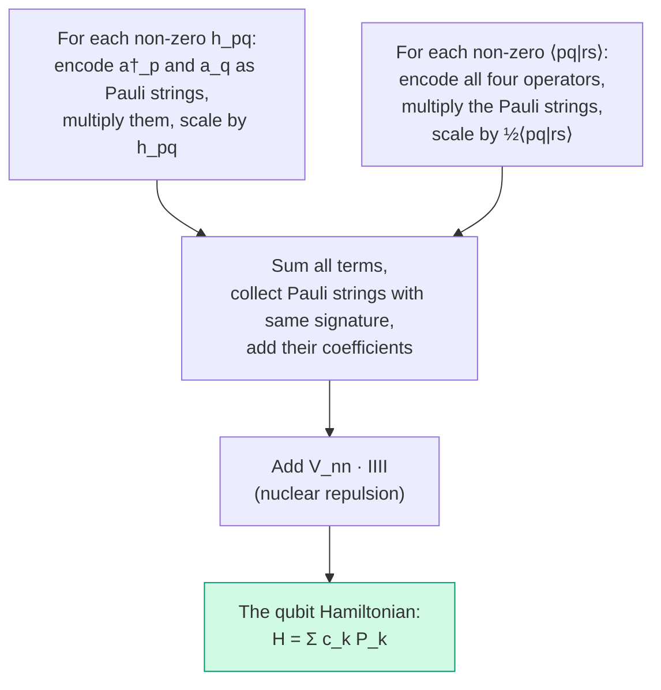

# Chapter 5: Building the Qubit Hamiltonian

_This is where the pipeline pays off. We take the integral tables from Chapter 3, the encoding from Chapter 4, and produce the actual qubit Hamiltonian — the object that a quantum computer will simulate._

## In This Chapter

- **What you'll learn:** How to systematically encode every one-body and two-body fermionic term into Pauli strings, combine like terms, and arrive at the complete 15-term H₂ Hamiltonian.
- **Why this matters:** This is the exact object used by VQE, QPE, and every other quantum simulation algorithm. If you can build this correctly, you can build it for any molecule.
- **Prerequisites:** Chapters 1–4 (integrals, notation, spin-orbitals, encoding concepts).

---

## The Recipe

The procedure is mechanical — no insight required beyond what we've already developed. For a Hamiltonian with $n$ spin-orbitals:



Each step is a pattern: look up the integral, encode the operators, multiply the Pauli strings (using the exact Pauli multiplication table), and accumulate. FockMap does this symbolically — no matrices, no floats in the intermediate algebra.

---

## One-Body Terms: Number Operators

The non-zero one-body integrals for H₂ in STO-3G are all diagonal (Chapter 3): $h_{00} = h_{11} = -1.2563$ Ha and $h_{22} = h_{33} = -0.4719$ Ha. The one-body Hamiltonian is therefore a sum of number operators:

$$\hat{H}_1 = \sum_j h_{jj}\, a_j^\dagger a_j = \sum_j h_{jj}\, \hat{n}_j$$

Under Jordan–Wigner, the number operator has a beautiful simplification. Recall from Chapter 4 that $a_j^\dagger$ carries a Z-chain below position $j$, and $a_j$ carries the same chain. When we multiply them, the chains cancel:

$$\hat{n}_j = a_j^\dagger a_j = \frac{1}{2}(I - Z_j)$$

This is weight 1 — just a single $Z$ on qubit $j$ — regardless of the system size. The Z-chain overhead that makes JW expensive for creation operators simply vanishes for number operators.

Substituting our integral values:

$$\hat{H}_1 = \sum_{j=0}^{3} h_{jj} \cdot \frac{1}{2}(I - Z_j)$$

$$= \frac{1}{2}\bigl(h_{00} + h_{11} + h_{22} + h_{33}\bigr) \cdot IIII - \frac{h_{00}}{2}\,IIIZ - \frac{h_{11}}{2}\,IIZI - \frac{h_{22}}{2}\,IZII - \frac{h_{33}}{2}\,ZIII$$

| Pauli term | Coefficient (Ha) | Origin |
|:---:|:---:|:---|
| $IIII$ | $-1.7282$ | Sum of all orbital energies, halved |
| $IIIZ$ | $+0.6282$ | $-h_{00}/2$ (energy of $\sigma_g, \alpha$) |
| $IIZI$ | $+0.6282$ | $-h_{11}/2$ (energy of $\sigma_g, \beta$) |
| $IZII$ | $+0.2359$ | $-h_{22}/2$ (energy of $\sigma_u, \alpha$) |
| $ZIII$ | $+0.2359$ | $-h_{33}/2$ (energy of $\sigma_u, \beta$) |

Five terms. All diagonal (I and Z only). If the Hamiltonian were only these terms, a classical computer could solve it trivially — just read off the diagonal entries. The interesting physics comes from the two-body terms.

---

## Two-Body Terms: Where It Gets Real

The two-body contribution is:

$$\hat{H}_2 = \frac{1}{2}\sum_{pqrs} \langle pq \mid rs\rangle\, a_p^\dagger a_q^\dagger a_s a_r$$

For H₂ with 4 spin-orbitals, this sum has $4^4 = 256$ index combinations, of which 32 have non-zero integrals (Chapter 3). Each non-zero term requires encoding four operators, multiplying four Pauli strings, and scaling by the integral value. FockMap does all 32 in parallel; here, we'll work through one representative term by hand.

### One term, fully expanded

Consider the Coulomb repulsion between two electrons in $\sigma_g$ with opposite spins:

$$\frac{1}{2}\langle 0\alpha,\, 0\beta \mid 0\alpha,\, 0\beta\rangle\; a_0^\dagger a_1^\dagger a_1 a_0$$

In our spin-orbital indexing: $p=0, q=1, r=0, s=1$, with integral value $\langle 01 \mid 01\rangle = 0.6745$ Ha.

**Step 1: Encode the operators under Jordan–Wigner.**

$$a_0^\dagger = \frac{1}{2}(X_0 - iY_0) \otimes I_1 \otimes I_2 \otimes I_3$$

$$a_1^\dagger = \frac{1}{2}\,Z_0 \otimes (X_1 - iY_1) \otimes I_2 \otimes I_3$$

$$a_1 = \frac{1}{2}\,Z_0 \otimes (X_1 + iY_1) \otimes I_2 \otimes I_3$$

$$a_0 = \frac{1}{2}(X_0 + iY_0) \otimes I_1 \otimes I_2 \otimes I_3$$

Note the $Z_0$ on $a_1^\dagger$ and $a_1$ — that's the Z-chain from JW, tracking the parity of orbital 0.

**Step 2: Multiply the four operators.**

$$a_0^\dagger a_1^\dagger a_1 a_0 = \frac{1}{16}(X_0 - iY_0)\; Z_0(X_1 - iY_1)\; Z_0(X_1 + iY_1)\; (X_0 + iY_0)$$

**Step 3: Simplify using the Pauli multiplication table.**

This looks like a wall of algebra, but three observations make it tractable:

1. **$Z_0 \cdot Z_0 = I_0$** — the two Z-chains cancel.
2. **$(X_1 - iY_1)(X_1 + iY_1) = X_1^2 + Y_1^2 + iX_1Y_1 - iY_1X_1 = 2I_1 - 2Z_1$** — using $X^2 = I$, $Y^2 = I$, and $XY - YX = 2iZ$.
3. **$(X_0 - iY_0)(X_0 + iY_0) = 2I_0 - 2Z_0$** — same identity on qubit 0.

Therefore:

$$a_0^\dagger a_1^\dagger a_1 a_0 = \frac{1}{16} \cdot (2I_0 - 2Z_0)(2I_1 - 2Z_1) = \frac{1}{4}(I - Z_0)(I - Z_1)$$

$$= \frac{1}{4}(IIII - IIIZ - IIZI + IIZZ)$$

**Step 4: Scale by the integral.**

$$\frac{1}{2} \cdot 0.6745 \cdot \frac{1}{4}(IIII - IIIZ - IIZI + IIZZ)$$

$$= 0.08431 \cdot IIII - 0.08431 \cdot IIIZ - 0.08431 \cdot IIZI + 0.08431 \cdot IIZZ$$

This one term contributes to four Pauli strings: $IIII$, $IIIZ$, $IIZI$, and $IIZZ$.

> **What we just saw:** The product $a_0^\dagger a_1^\dagger a_1 a_0$ is a number-number interaction ($\hat{n}_0 \hat{n}_1$). It produces only diagonal (I, Z) Pauli terms. The off-diagonal XX/YY terms come from *exchange* integrals — terms like $a_0^\dagger a_2^\dagger a_0 a_2$ where electrons swap orbitals.

### Where the XX and YY terms come from

The exchange integrals $\langle 02 \mid 20\rangle$ produce terms like $a_0^\dagger a_2^\dagger a_0 a_2$, where electron 1 moves from orbital 2 to orbital 0 and electron 2 moves from orbital 0 to orbital 2. Under JW, these generate products that *don't* simplify to pure Z — they leave XX and YY Pauli operators on the qubits involved.

These are the terms that create **entanglement** between computational basis states. Without them, the Hamiltonian would be classical and any configuration-interaction calculation would be trivial. Their presence is why quantum simulation is necessary — and why their correct treatment is the essential test of any encoding implementation.

---

## The Complete 15-Term Hamiltonian

After processing all 32 non-zero two-body integrals, combining like terms, and adding the nuclear repulsion $V_{nn} = 0.7151$ Ha as a contribution to $IIII$:

| # | Pauli String | Coefficient (Ha) | Character |
|:---:|:---:|:---:|:---|
| 1 | $IIII$ | $-1.0704$ | Energy offset |
| 2 | $IIIZ$ | $-0.0958$ | $\sigma_g\alpha$ energy |
| 3 | $IIZI$ | $-0.0958$ | $\sigma_g\beta$ energy |
| 4 | $IZII$ | $+0.3021$ | $\sigma_u\alpha$ energy |
| 5 | $ZIII$ | $+0.3021$ | $\sigma_u\beta$ energy |
| 6 | $IIZZ$ | $+0.1743$ | Coulomb: $\sigma_g\alpha$–$\sigma_g\beta$ |
| 7 | $IZIZ$ | $-0.0085$ | Coulomb: $\sigma_g\alpha$–$\sigma_u\alpha$ |
| 8 | $IZZI$ | $+0.1659$ | Coulomb: $\sigma_g\beta$–$\sigma_u\alpha$ |
| 9 | $ZIIZ$ | $+0.1659$ | Coulomb: $\sigma_g\alpha$–$\sigma_u\beta$ |
| 10 | $ZIZI$ | $-0.0085$ | Coulomb: $\sigma_g\beta$–$\sigma_u\beta$ |
| 11 | $ZZII$ | $+0.1686$ | Coulomb: $\sigma_u\alpha$–$\sigma_u\beta$ |
| 12 | $XXYY$ | $-0.1744$ | Exchange |
| 13 | $XYYX$ | $+0.1744$ | Exchange |
| 14 | $YXXY$ | $+0.1744$ | Exchange |
| 15 | $YYXX$ | $-0.1744$ | Exchange |

This is the H₂ qubit Hamiltonian. Fifteen Pauli strings with real coefficients. Every quantum simulation of H₂ in the STO-3G basis starts with this object.

### What the table tells us

**Terms 1–5** (weight 0–1, I and Z only): the "classical" part — orbital energies and a constant offset. Together they account for the Hartree–Fock energy.

**Terms 6–11** (weight 2, ZZ pairs): Coulomb repulsion between pairs of orbitals. Still diagonal — measurable without entanglement.

**Terms 12–15** (weight 4, XXYY-type): quantum exchange. These four terms are the entire reason we need a quantum computer. They couple different electron configurations and produce the correlation energy that Hartree–Fock misses.

Note the structure of the exchange terms: they come in two pairs with equal magnitude and opposite sign ($\pm 0.1744$). This is a consequence of the antisymmetry of fermionic wavefunctions — the exchange integral changes sign when you swap electrons.

---

## Reproducing This with FockMap

The library computes the entire Hamiltonian from the integral tables in Chapter 3:

```fsharp
open System.Numerics
open Encodings

// Coefficient factory (from Chapter 3)
let h2Factory key = h2Integrals |> Map.tryFind key

// Build the JW Hamiltonian on 4 qubits
let hamiltonian = computeHamiltonianWith jordanWignerTerms h2Factory 4u

// Print all terms
for t in hamiltonian.DistributeCoefficient.SummandTerms do
    printfn "%+.4f  %s" t.Coefficient.Real t.Signature
```

Output:

```
-1.0704  IIII
-0.0958  IIIZ
-0.0958  IIZI
+0.3021  IZII
+0.3021  ZIII
+0.1743  IIZZ
-0.0085  IZIZ
+0.1659  IZZI
+0.1659  ZIIZ
-0.0085  ZIZI
+0.1686  ZZII
-0.1744  XXYY
+0.1744  XYYX
+0.1744  YXXY
-0.1744  YYXX
```

Every coefficient matches the table. The library performed the same procedure we did by hand — encode, multiply, combine — but for all 32 two-body integrals simultaneously.

### Trying a different encoding

Changing the encoding is one function name:

```fsharp
let h2_bk  = computeHamiltonianWith bravyiKitaevTerms  h2Factory 4u
let h2_tt  = computeHamiltonianWith ternaryTreeTerms    h2Factory 4u
let h2_par = computeHamiltonianWith parityTerms         h2Factory 4u
```

All four Hamiltonians have different Pauli strings but the **same eigenvalues** — the same physics. We'll verify this in Chapter 7.

---

## Key Takeaways

- **One-body terms** produce diagonal (I, Z) Pauli operators via the number operator $\hat{n}_j = \frac{1}{2}(I - Z_j)$. The Z-chain cancels in the product.
- **Two-body Coulomb terms** produce ZZ-type diagonal operators — still classical, no entanglement.
- **Two-body exchange terms** produce XX/YY operators — the quantum part that creates entanglement and captures correlation energy.
- The complete H₂ Hamiltonian has 15 Pauli terms: 1 identity, 4 single-Z, 6 double-Z, and 4 exchange (XXYY-type).
- All encodings produce the same eigenvalues. The choice of encoding affects only the Pauli weight (circuit cost), not the physics.

## Common Mistakes

1. **Forgetting $V_{nn}$.** The nuclear repulsion contributes to the $IIII$ coefficient. Without it, the ground-state energy will be off by 0.7151 Ha — unmistakably wrong, but if you're not checking against a known value you won't notice.

2. **Wrong operator ordering.** The second-quantized Hamiltonian has $a_p^\dagger a_q^\dagger a_s a_r$ — annihilation operators in *reverse* order. Writing $a_r a_s$ instead of $a_s a_r$ flips signs on exchange terms.

3. **Not combining like terms.** Before combination, the 32 two-body integrals produce many duplicate Pauli signatures. The Hamiltonian construction must sum their coefficients. Missing this step gives too many terms with wrong individual coefficients (but the sum would accidentally be correct if computed term by term — a very confusing bug to diagnose).

## Exercises

1. **Number operator by hand.** Verify that $a_2^\dagger a_2 = \frac{1}{2}(I - Z_2)$ by expanding the JW-encoded operators and using the Pauli multiplication table.

2. **Exchange term sign.** The coefficient of $XXYY$ is $-0.1744$ and the coefficient of $XYYX$ is $+0.1744$. Explain why these have opposite signs in terms of the antisymmetry of the electron wavefunction.

3. **Term count prediction.** For H₂O with 12 spin-orbitals (after frozen core), how many Pauli terms would you expect in the JW Hamiltonian? (Hint: it's much more than 15. The scaling is roughly $O(n^4)$ before combination and $O(n^4)$ after, but with significant cancellation.)

4. **Encoding comparison.** Run the FockMap code above with all five encodings. Verify that they all produce the same number of terms (15) for H₂. Do they always have the same number of terms for larger molecules?

## Further Reading

- Whitfield, J. D., Biamonte, J., and Aspuru-Guzik, A. "Simulation of electronic structure Hamiltonians using quantum computers." *Mol. Phys.* 109, 735 (2011). A thorough treatment of the Hamiltonian construction procedure for JW, including explicit Pauli string derivations.
- McArdle, S. et al. "Quantum computational chemistry." *Rev. Mod. Phys.* 92, 015003 (2020). Section III covers Hamiltonian encoding with a comparison of JW and BK term structures.

---

**Previous:** [Chapter 4 — A Visual Guide to Encodings](04-visual-encodings.html)

**Next:** [Chapter 6 — Five Encodings, One Interface](06-five-encodings.html)
