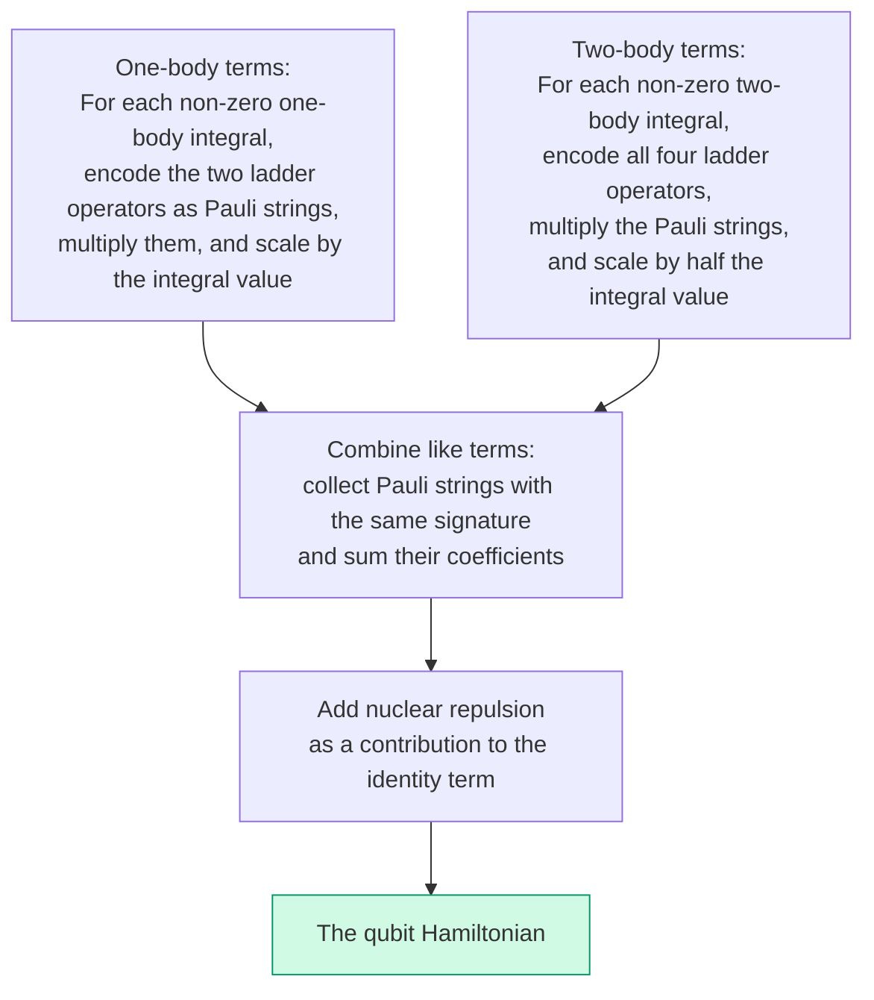

# Chapter 5: Building the Qubit Hamiltonian

_This is where the pipeline pays off. We take the integral tables from Chapter 3, the encoding from Chapter 4, and produce the actual qubit Hamiltonian — the object that a quantum computer will simulate._

## In This Chapter

- **What you'll learn:** Why the distinction between diagonal and off-diagonal Hamiltonian terms is the central idea of quantum simulation, how to systematically encode fermionic terms into Pauli strings, and how to read the resulting 15-term H₂ Hamiltonian as a map of classical vs quantum physics.
- **Why this matters:** This is the exact object used by VQE, QPE, and every other quantum simulation algorithm. Understanding its structure — which parts are classical, which parts are quantum — is the key to understanding why quantum computing matters for chemistry.
- **Prerequisites:** Chapters 1–4 (integrals, notation, spin-orbitals, encoding concepts).

---

## The Density Matrix: Where Classical Ends and Quantum Begins

Before we compute anything, we need to understand what we're looking for — because the structure of the qubit Hamiltonian will tell us exactly where classical physics ends and quantum physics begins.

### Classical: a probability distribution

If electrons were classical particles, we could describe their state as a **probability distribution** over configurations:

$$\text{Prob}(\lvert 1100\rangle) = 0.95, \quad \text{Prob}(\lvert 0011\rangle) = 0.03, \quad \text{Prob}(\lvert 1010\rangle) = 0.02, \quad \ldots$$

This tells us: "if we look, there's a 95% chance both electrons are in the bonding orbital, a 3% chance both are in the antibonding orbital," and so on. The expected energy is just a weighted average: $E_{\text{classical}} = \sum_i p_i \, E_i$.

Mathematically, this is a **diagonal** density matrix — numbers along the diagonal (the probabilities) and zeros everywhere else:

$$\rho_{\text{classical}} = \begin{pmatrix}
0.95 & 0 & 0 & \cdots \\
0 & 0.03 & 0 & \cdots \\
0 & 0 & 0.02 & \cdots \\
\vdots & \vdots & \vdots & \ddots
\end{pmatrix}$$

Hartree–Fock is essentially this picture: the electrons are in $\lvert 1100\rangle$ with probability 1. One non-zero diagonal entry. No mixing, no uncertainty beyond what's already baked into the orbital structure.

### Quantum: coherences change everything

A quantum state is fundamentally different. The ground state of H₂ is not "95% chance of $\lvert 1100\rangle$." It is a **superposition**:

$$\lvert\Psi\rangle = c_1\lvert 1100\rangle + c_2\lvert 0011\rangle + \cdots$$

The density matrix $\rho = \lvert\Psi\rangle\langle\Psi\rvert$ now has off-diagonal elements:

$$\rho_{\text{quantum}} = \begin{pmatrix}
\lvert c_1\rvert^2 & c_1 c_2^* & \cdots \\
c_2 c_1^* & \lvert c_2\rvert^2 & \cdots \\
\vdots & \vdots & \ddots
\end{pmatrix}$$

The diagonal entries $\lvert c_i\rvert^2$ are probabilities — same as the classical case. But the off-diagonal entries $c_i c_j^*$ are **coherences**. They have no classical analogue. They encode the *phase relationships* between configurations — the interference patterns that allow the quantum state to have a lower energy than any classical mixture of the same configurations.

> **The off-diagonal elements of the density matrix are the quantum difference.**

A classical mixture with the same occupation probabilities would have a *higher* energy. The coherences destructively interfere with high-energy contributions and constructively interfere with low-energy ones. The energy difference between the quantum ground state and the best classical approximation is the **correlation energy** — the ~1% that Hartree–Fock misses, the ~12 kcal/mol that determines whether a reaction happens.

### What generates coherences?

**Diagonal Hamiltonian terms** (built from I and Z only) do not mix configurations. They assign energies — "configuration $\lvert 1100\rangle$ costs this much, configuration $\lvert 0011\rangle$ costs that much." Under time evolution, they rotate phases but never create superpositions. A diagonal Hamiltonian cannot generate off-diagonal density matrix elements. Its ground state is always a single configuration.

**Off-diagonal Hamiltonian terms** (containing X or Y) *mix* configurations. They connect $\lvert 1100\rangle$ to $\lvert 0011\rangle$, creating the superposition — the coherences — that lower the energy below the classical minimum.

The chain of implications is absolute:

$$\text{No off-diagonal } H \;\Rightarrow\; \text{no coherences in } \rho \;\Rightarrow\; \text{no correlation energy} \;\Rightarrow\; \text{HF is exact} \;\Rightarrow\; \text{no quantum computer needed}$$

### What this means for encoding

Now we can state precisely what the encoding must accomplish:

The **diagonal part** of the Hamiltonian (orbital energies, Coulomb repulsion) is cheap. It maps to I and Z Pauli operators, diagonal in the computational basis. Measuring them is trivial. Simulating their time evolution requires only single-qubit Z-rotations. No entanglement, no deep circuits.

The **off-diagonal part** (exchange interactions) is expensive. It maps to X and Y Pauli operators, which flip qubits and create entanglement. Simulating these terms requires multi-qubit gates — CNOT staircases, as we'll see in Stage 4. The Pauli weight of these off-diagonal terms directly determines the circuit depth.

**The encoding choice determines the cost of the off-diagonal terms.** JW, BK, and tree encodings all produce the same diagonal terms — they differ only in how they handle the Z-chains that accompany the off-diagonal X/Y operators.

**This is the thesis of the entire book:** the correlation energy lives in the off-diagonal coherences of the density matrix, and the encoding determines how expensive it is to create and maintain those coherences on quantum hardware.

With this lens in place, let's build the Hamiltonian and see the structure emerge.

---

## What We Have and What We'll Do

Chapters 1–4 gave us everything we need:

- **The chemistry** (Chapter 1): H₂ in STO-3G, 4 spin-orbitals, the second-quantized Hamiltonian.
- **The notation** (Chapter 2): physicist's convention, the conversion rule, the traps to avoid.
- **The numbers** (Chapter 3): complete spin-orbital integral tables and a coefficient factory in F#.
- **The encoding** (Chapter 4): Jordan–Wigner's Z-chain mechanism for translating fermionic operators to Pauli strings.

The procedure from here is mechanical. Once you see it done for one term, you can do it for any term, for any molecule, in any encoding. The insight is behind us; what remains is careful bookkeeping.

---

## The Recipe



FockMap does this symbolically — no matrices, no floats in the intermediate algebra. We'll work through one representative term by hand, then show the complete result.

### One-body terms: number operators

The non-zero one-body integrals for H₂ are all diagonal (Chapter 3): $h_{00} = h_{11} = -1.2563$ Ha and $h_{22} = h_{33} = -0.4719$ Ha. Under Jordan–Wigner, the number operator simplifies — the Z-chains cancel:

$$\hat{n}_j = a_j^\dagger a_j = \frac{1}{2}(I - Z_j)$$

Weight 1, regardless of system size. The one-body Hamiltonian produces five terms — all diagonal, all classical:

| Pauli term | Coefficient (Ha) | Origin |
|:---:|:---:|:---|
| $IIII$ | $-1.7282$ | Sum of all orbital energies, halved |
| $IIIZ$ | $+0.6282$ | $-h_{00}/2$ (energy of $\sigma_g, \alpha$) |
| $IIZI$ | $+0.6282$ | $-h_{11}/2$ (energy of $\sigma_g, \beta$) |
| $IZII$ | $+0.2359$ | $-h_{22}/2$ (energy of $\sigma_u, \alpha$) |
| $ZIII$ | $+0.2359$ | $-h_{33}/2$ (energy of $\sigma_u, \beta$) |

All I and Z. No off-diagonal terms. No coherences generated. If this were the whole Hamiltonian, a laptop would suffice.

### Two-body terms: one by hand

Consider the Coulomb repulsion between two electrons in $\sigma_g$ with opposite spins: $\frac{1}{2}\langle 01 \mid 01\rangle\; a_0^\dagger a_1^\dagger a_1 a_0$, with integral value $0.6745$ Ha.

Encode each operator under JW, multiply the four Pauli strings, and simplify. Three observations make the algebra tractable: the Z-chains cancel ($Z_0 \cdot Z_0 = I$), and each raising-lowering pair simplifies via $(X - iY)(X + iY) = 2(I - Z)$.

$$a_0^\dagger a_1^\dagger a_1 a_0 = \frac{1}{4}(IIII - IIIZ - IIZI + IIZZ)$$

Scaled by the integral: four diagonal Pauli contributions. This is a Coulomb term — pure classical electrostatics, no off-diagonal structure. Exactly as the density matrix framework predicted.

The **exchange** integrals $\langle 02 \mid 20\rangle$ tell a different story. They produce terms like $a_0^\dagger a_2^\dagger a_0 a_2$, where electrons swap orbitals. Under JW, these don't simplify to pure Z — they leave XX and YY Pauli operators. These are the off-diagonal terms. They generate coherences. They produce the correlation energy.

---

## The Complete 15-Term Hamiltonian

After processing all 32 non-zero two-body integrals, combining like terms, and adding $V_{nn} = 0.7151$ Ha:

| # | Pauli String | Coefficient (Ha) | Character |
|:---:|:---:|:---:|:---|
| 1 | $IIII$ | $-1.0704$ | Energy offset |
| 2 | $IIIZ$ | $-0.0958$ | Orbital energy |
| 3 | $IIZI$ | $-0.0958$ | Orbital energy |
| 4 | $IZII$ | $+0.3021$ | Orbital energy |
| 5 | $ZIII$ | $+0.3021$ | Orbital energy |
| 6 | $IIZZ$ | $+0.1743$ | Coulomb repulsion |
| 7 | $IZIZ$ | $-0.0085$ | Coulomb repulsion |
| 8 | $IZZI$ | $+0.1659$ | Coulomb repulsion |
| 9 | $ZIIZ$ | $+0.1659$ | Coulomb repulsion |
| 10 | $ZIZI$ | $-0.0085$ | Coulomb repulsion |
| 11 | $ZZII$ | $+0.1686$ | Coulomb repulsion |
| 12 | $XXYY$ | $-0.1744$ | **Exchange** |
| 13 | $XYYX$ | $+0.1744$ | **Exchange** |
| 14 | $YXXY$ | $+0.1744$ | **Exchange** |
| 15 | $YYXX$ | $-0.1744$ | **Exchange** |

---

## Reading the Hamiltonian: What's Hartree–Fock, What's Quantum

Now we read this table through the density matrix lens.

**Terms 1–5** (weight 0–1, I and Z only): orbital energies and a constant offset. These are eigenvalues of the number operators — the energy cost of occupying each orbital. Purely diagonal. This is the one-body part of Hartree–Fock.

**Terms 6–11** (weight 2, ZZ pairs): Coulomb repulsion between pairs of orbitals. Still diagonal — they refine the classical energy by accounting for pairwise electron-electron repulsion. Measurable by reading qubit values, no entanglement needed. This is the two-body part of Hartree–Fock.

**Terms 12–15** (weight 4, XXYY-type): **quantum exchange**. These are the off-diagonal terms — the ones that mix configurations, generate coherences in $\rho$, and produce the correlation energy.

Four terms out of fifteen. They come in two pairs with equal magnitude and opposite sign ($\pm 0.1744$) — a consequence of fermionic antisymmetry.

**Delete terms 12–15** and the ground state would be $\lvert 1100\rangle$ with a purely diagonal density matrix — a classical probability distribution, not a quantum state. The quantum advantage vanishes.

**Keep them** and the ground state becomes a superposition with coherences. The energy drops by ~12 kcal/mol — the correlation energy that no classical single-reference method can capture. This is the energy that determines whether a bond breaks, whether a reaction goes forward, whether a drug binds.

Four Pauli strings. That's where quantum computing earns its keep.

---

## Reproducing This with FockMap

The library computes the entire Hamiltonian from the integral tables in Chapter 3:

```fsharp
open System.Numerics
open Encodings

// Coefficient factory (from Chapter 3)
let h2Factory key = h2Integrals |> Map.tryFind key

// Build the JW Hamiltonian on 4 qubits
let hamiltonian = computeHamiltonianWith jordanWignerTerms h2Factory 4u

// Print all terms
for t in hamiltonian.DistributeCoefficient.SummandTerms do
    printfn "%+.4f  %s" t.Coefficient.Real t.Signature
```

Output:

```
-1.0704  IIII
-0.0958  IIIZ
-0.0958  IIZI
+0.3021  IZII
+0.3021  ZIII
+0.1743  IIZZ
-0.0085  IZIZ
+0.1659  IZZI
+0.1659  ZIIZ
-0.0085  ZIZI
+0.1686  ZZII
-0.1744  XXYY
+0.1744  XYYX
+0.1744  YXXY
-0.1744  YYXX
```

Every coefficient matches the table.

### Trying a different encoding

Changing the encoding is one function name:

```fsharp
let h2_bk  = computeHamiltonianWith bravyiKitaevTerms  h2Factory 4u
let h2_tt  = computeHamiltonianWith ternaryTreeTerms    h2Factory 4u
let h2_par = computeHamiltonianWith parityTerms         h2Factory 4u
```

All four produce different Pauli strings but the **same eigenvalues**. We'll verify this in Chapter 7.

---

## Key Takeaways

- The **density matrix** distinguishes classical from quantum: diagonal entries are probabilities (classical); off-diagonal entries are coherences (quantum).
- Off-diagonal Hamiltonian terms **generate** those coherences. No off-diagonal terms → no correlation energy → no quantum advantage.
- The H₂ Hamiltonian has 11 diagonal terms (Hartree–Fock) and 4 off-diagonal terms (quantum exchange). The correlation energy lives entirely in those 4 terms.
- The encoding determines how many qubits each off-diagonal term touches — and therefore the circuit cost of quantum simulation.

## Common Mistakes

1. **Forgetting $V_{nn}$.** The nuclear repulsion contributes to the $IIII$ coefficient. Without it, the ground-state energy will be off by 0.7151 Ha.

2. **Wrong operator ordering.** The annihilation operators in $a_p^\dagger a_q^\dagger a_s a_r$ are in *reverse* order. Writing $a_r a_s$ instead of $a_s a_r$ flips signs on exchange terms.

3. **Not combining like terms.** The 32 two-body integrals produce many duplicate Pauli signatures that must be summed.

## Exercises

1. **Number operator by hand.** Verify that $a_2^\dagger a_2 = \frac{1}{2}(I - Z_2)$ by expanding the JW-encoded operators.

2. **Exchange term sign.** Explain why $XXYY$ has coefficient $-0.1744$ and $XYYX$ has $+0.1744$ in terms of fermionic antisymmetry.

3. **Diagonal-only energy.** Delete terms 12–15. What is the ground-state energy of the remaining diagonal Hamiltonian? Compare with $E_{\text{HF}} = -1.1168$ Ha.

4. **Encoding comparison.** Run the code with all five encodings. Do they all produce the same number of terms for H₂?

## Further Reading

- Whitfield, J. D., Biamonte, J., and Aspuru-Guzik, A. "Simulation of electronic structure Hamiltonians using quantum computers." *Mol. Phys.* 109, 735 (2011).
- McArdle, S. et al. "Quantum computational chemistry." *Rev. Mod. Phys.* 92, 015003 (2020). Section III.

---

**Previous:** [Chapter 4 — A Visual Guide to Encodings](04-visual-encodings.html)

**Next:** [Chapter 6 — Five Encodings, One Interface](06-five-encodings.html)
