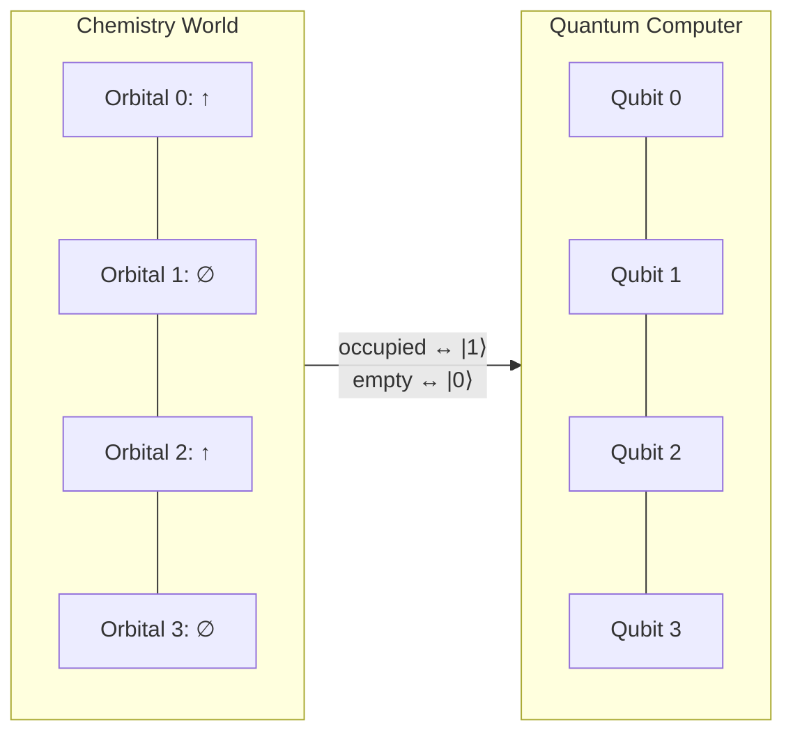
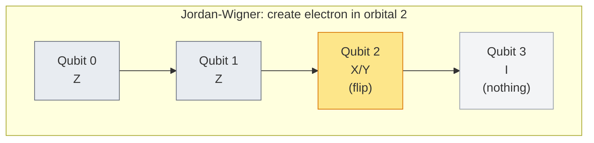
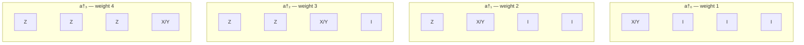
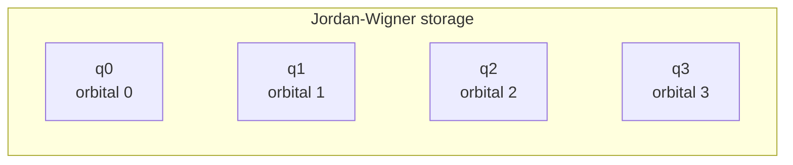
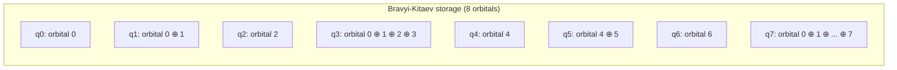
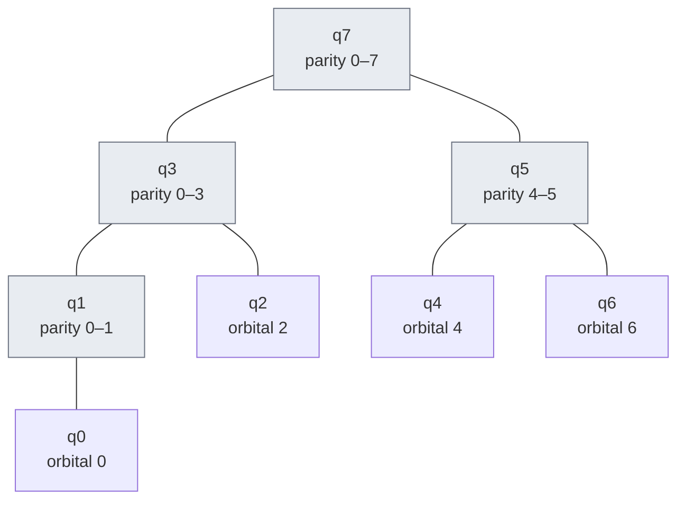
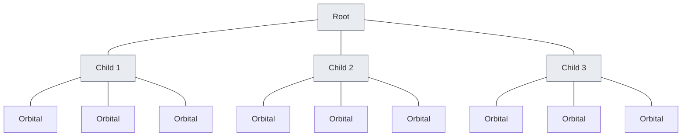
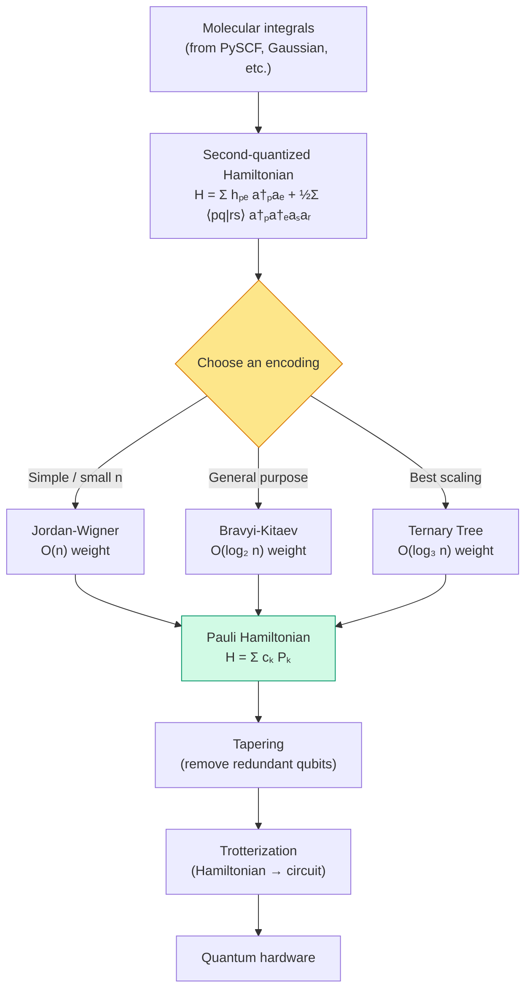

# Chapter 4: A Visual Guide to Encodings

_We have a Hamiltonian written in terms of electrons and orbitals. A quantum computer only has qubits. This chapter explains why the translation is not as obvious as it looks, and introduces three ways to do it._

## In This Chapter

- **What you'll learn:** Why occupation vectors cannot be mapped directly to qubits, how the Jordan–Wigner encoding solves the problem but at a cost, and how Bravyi–Kitaev and tree-based encodings reduce that cost.
- **Why this matters:** The encoding choice directly determines circuit depth, CNOT count, and measurement cost — and therefore whether a quantum simulation is feasible on a given device.
- **Prerequisites:** Chapters 1–3 (you know the second-quantized Hamiltonian and the spin-orbital integral tables).

---

## Where We Stand

Let's take stock of what the first three chapters gave us.

**Chapter 1** told us the chemistry: a molecule is a collection of charged particles, and its ground-state energy is the lowest eigenvalue of the electronic Hamiltonian. We introduced a finite basis set (STO-3G) that turned the continuous problem into a finite one: 2 spatial orbitals, 4 spin-orbitals, 6 two-electron configurations.

**Chapters 2–3** told us the numbers: one-body integrals $h_{pq}$, two-body integrals $\langle pq \mid rs\rangle$, and the nuclear repulsion constant $V_{nn}$. We navigated the notation minefield, expanded to spin-orbitals, and ended up with a complete set of tables.

But we glossed over something important. Let's go back and address it now.

### The problem with wavefunctions

The *natural* way to describe the quantum state of two electrons in four spin-orbitals is as a superposition of configurations:

$$\lvert \Psi \rangle = c_{1100}\lvert 1100\rangle + c_{1010}\lvert 1010\rangle + c_{1001}\lvert 1001\rangle + \cdots$$

where each $\lvert n_0 n_1 n_2 n_3\rangle$ is an **occupation vector** — a list of 0s and 1s telling us which spin-orbitals have an electron and which don't. The $c$ coefficients are complex amplitudes. Finding the ground state means finding the $c$ values that minimize the energy.

For H₂ with 4 spin-orbitals, this is a vector with 6 components (the 6 two-electron configurations from Chapter 1). We could write down the $6 \times 6$ Hamiltonian matrix, plug in our integrals, and diagonalize it. Done. No quantum computer needed.

For H₂O with 14 spin-orbitals and 10 electrons, the number of configurations is $\binom{14}{10} = 1{,}001$. A $1{,}001 \times 1{,}001$ matrix is trivial for a laptop.

For a modest catalyst with 50 electrons in 100 spin-orbitals: $\binom{100}{50} \approx 10^{29}$ configurations. That matrix will not fit in any computer that will ever be built.

This is the **exponential wall**: the dimension of the configuration space grows combinatorially with the number of orbitals. Classical methods (Hartree–Fock, DFT, coupled cluster) get around this by approximating — they never build the full matrix. But those approximations break down for strongly correlated systems, which are precisely the systems where quantum simulation promises an advantage.

### Why operators instead of wavefunctions

Rather than tracking the full wavefunction vector (exponentially many coefficients), **second quantization** lets us write the Hamiltonian as a polynomial in creation and annihilation operators:

$$\hat{H} = \sum_{pq} h_{pq}\, a_p^\dagger a_q + \frac{1}{2}\sum_{pqrs} \langle pq \mid rs\rangle\, a_p^\dagger a_q^\dagger a_s a_r$$

The operators $a_p^\dagger$ (create an electron in spin-orbital $p$) and $a_p$ (remove one) obey the **canonical anti-commutation relations**:

$$\{a_p^\dagger, a_q\} = \delta_{pq}, \qquad \{a_p^\dagger, a_q^\dagger\} = 0, \qquad \{a_p, a_q\} = 0$$

These three rules encode the Pauli exclusion principle algebraically: you can't create two electrons in the same orbital ($a_p^\dagger a_p^\dagger = 0$), and swapping the order of two creation operators flips a sign ($a_p^\dagger a_q^\dagger = -a_q^\dagger a_p^\dagger$).

The beauty of this formulation is that the Hamiltonian is written as a sum of $O(n^4)$ terms — polynomial in the number of orbitals, not exponential. A classical computer can *write down* the Hamiltonian easily. The hard part is *solving* it — finding the eigenvalues of the operator that this polynomial represents.

### Why quantum computing

A quantum computer can represent the exponentially large state vector $\lvert \Psi \rangle$ using only $n$ qubits — one per spin-orbital. The $2^n$-dimensional Hilbert space of $n$ qubits matches the $\binom{n}{N_e}$-dimensional configuration space (embedded in the full $2^n$-dimensional space). Superpositions of configurations are *native* to quantum hardware.

But there's a catch: the operators $a_p^\dagger$ and $a_p$ anti-commute, and qubit operations don't. We need a **translation** — an encoding — that maps the fermionic operators to qubit operators while preserving the anti-commutation relations.

That's what this chapter is about.

---

## The Tempting (Wrong) Idea

At the end of Chapter 1, we noticed something suggestive: the occupation vector $\lvert 1010\rangle$ looks exactly like a 4-qubit computational basis state. Four spin-orbitals, four qubits, each qubit storing the occupation of one orbital. Simple.

This mapping is correct for the **basis states**. But it is wrong for the **operators**.

The creation operator $a_2^\dagger$ does not simply flip qubit 2 from $\lvert 0\rangle$ to $\lvert 1\rangle$. It must also check how many electrons are in orbitals 0 and 1, and apply a minus sign if that count is odd. This is the **fermion sign** — the physical consequence of the anti-commutation relations from Chapter 1.

Qubits don't anti-commute. If we flip qubit 2 without tracking the fermion sign, we get the wrong quantum state. The encoding exists to inject those signs.

---

## What Makes Electrons Different from Qubits

When we swap two electrons, the quantum state picks up a factor of $-1$:

$$\lvert A, B\rangle_{\text{fermion}} = -\lvert B, A\rangle_{\text{fermion}}$$

When we swap two qubits, nothing happens to the sign:

$$\lvert 0, 1\rangle_{\text{qubit}} = +\lvert 0, 1\rangle_{\text{qubit}}$$

This minus sign is not optional bookkeeping. It affects interference patterns, bonding energies, and reaction rates. A faithful encoding must reproduce it.

The mathematical statement is the anti-commutation relation:

$$a_p^\dagger a_q^\dagger = -a_q^\dagger a_p^\dagger$$

Creating an electron in orbital $p$ and then orbital $q$ gives the opposite sign from creating in $q$ then $p$. On a qubit register, flipping qubit $p$ then qubit $q$ gives the *same* result as flipping $q$ then $p$. The encoding must bridge this gap.

---

## Jordan–Wigner: The Z-Chain

The Jordan–Wigner encoding (1928) is the oldest and simplest solution. Each qubit directly stores the occupation of one orbital — same as the "tempting idea" — but every creation or annihilation operator carries a **chain of Z gates** that enforces the fermion sign.

### How the Z-chain works

The $Z$ gate acts on a qubit as a parity detector:
- On $\lvert 0\rangle$ (empty orbital): $Z$ gives $+1$
- On $\lvert 1\rangle$ (occupied orbital): $Z$ gives $-1$

To create an electron in orbital $j$, we apply $Z$ to every qubit below $j$ and then flip qubit $j$. The product of all those $Z$ values gives $(-1)^{\text{count of occupied orbitals below } j}$ — exactly the fermion sign.

The Z-chain grows linearly: for orbital $j$, we need $j$ extra Z operations. This is the **Pauli weight** of the encoded operator — the number of qubits it touches.

### JW Pauli weight for all four orbitals

For a molecule with $n$ spin-orbitals, the worst-case Pauli weight under JW is $n$. For FeMo-co (the iron-molybdenum cofactor of nitrogenase — the enzyme that fixes atmospheric nitrogen) with ~100 spin-orbitals, that's a chain of 99 Z gates for the last orbital — a very deep circuit on quantum hardware.

### When JW is the right choice

Despite the linear scaling, JW excels when interactions are **local** — between neighboring orbitals. A hopping term $a_2^\dagger a_3 + a_3^\dagger a_2$ only needs a short Z-chain because the two orbitals are adjacent. For 1D molecular chains or systems with sequential orbital numbering, JW often has the lowest *average* weight even if its worst case is high.

---

## Bravyi–Kitaev: Partial Parity Sums

### The key insight

The JW Z-chain answers the question: "what is the parity (odd/even count) of electrons in orbitals $0, 1, \ldots, j-1$?" It answers this by checking every orbital individually — an $O(n)$ scan.

What if some qubits pre-computed **partial parity sums**? Then we could answer the question by reading $O(\log n)$ qubits instead of $O(n)$.

This is the Bravyi–Kitaev (BK) encoding. It uses a data structure from computer science — the **Fenwick tree** (binary indexed tree) — to organize partial sums.

### How BK stores information

In JW, each qubit stores one orbital's occupation:

In BK, some qubits store **cumulative parity** — the XOR of multiple orbital occupations:

The pattern comes from a Fenwick tree. Each node stores the parity of the orbitals in its subtree:

To find the parity of orbitals $0$ through $j-1$, you read the nodes on the *path* from node $j$ up to the root — at most $\log_2 n$ nodes.

### The three questions every encoding answers

For each orbital $j$, the encoding must answer three questions:

| Question | JW answer | BK answer |
|:---|:---|:---|
| **Parity:** which qubits encode the fermion sign? | All qubits $0 \ldots j-1$ ($O(n)$) | $\leq \log_2 n$ qubits on the Fenwick path |
| **Update:** which qubits must change when orbital $j$ is filled/emptied? | Just qubit $j$ | $\leq \log_2 n$ ancestor qubits |
| **Occupation:** which qubits reveal whether orbital $j$ is occupied? | Just qubit $j$ | $\leq \log_2 n$ descendant qubits |

Every answer in BK involves at most $\log_2 n$ qubits. That's the advantage.

### Weight comparison at scale

| Spin-orbitals ($n$) | JW worst-case weight | BK worst-case weight | Ratio |
|:---:|:---:|:---:|:---:|
| 4 | 4 | 3 | 1.3× |
| 8 | 8 | 4 | 2× |
| 16 | 16 | 5 | 3.2× |
| 64 | 64 | 7 | 9× |
| 100 | 100 | 7 | 14× |

At 100 spin-orbitals, BK's worst-case operator touches 7 qubits while JW's touches 100. On noisy hardware, this is the difference between a feasible and an infeasible circuit.

---

## Tree Encodings: Going Below $\log_2 n$

### Beyond binary

The Fenwick tree is a *binary* tree — each node has at most two children. What if we used a **ternary** tree instead? Each internal node would have three children, the tree would be shallower, and the path lengths (and hence Pauli weights) would be shorter.

This is the insight behind the ternary tree encoding (Jiang et al., 2020). It achieves worst-case Pauli weight $O(\log_3 n)$ — the best known asymptotic scaling for any fermion-to-qubit encoding.

The three edges emerging from each node are labelled with the three non-identity Pauli operators: X, Y, and Z. This labelling is what gives the encoding its structure — the Pauli string for each orbital is read off by collecting edge labels on the path from root to leaf.

FockMap supports both balanced binary and balanced ternary tree encodings, plus **arbitrary** tree topologies — you can define your own tree shape and derive a valid encoding from it.

---

## The Complete Picture

All five encodings in FockMap (JW, BK, Parity, balanced binary tree, balanced ternary tree) produce the same output type: a `PauliRegisterSequence`. They all give the same eigenvalues — the same physics. They differ only in how many qubits each Pauli string touches, which determines circuit depth and measurement cost.

---

## One More Thing: Number Operators Stay Cheap

A reassuring fact: the **number operator** $n_j = a_j^\dagger a_j$ (which tests whether orbital $j$ is occupied) simplifies to just two terms under *every* encoding:

$$n_j \;\mapsto\; \frac{1}{2}(I - Z_j) \quad \text{under JW}$$

That's Pauli weight 1 — regardless of $n$, regardless of encoding. The Z-chains from the creation and annihilation operators cancel in the product.

So while *creating* or *moving* electrons gets expensive under JW (the Z-chains grow), simply *counting* them stays cheap in all encodings. The overhead only hits terms that change the electron configuration — and those are precisely the terms that represent quantum correlations.

---

## Choosing an Encoding: A Decision Guide

| If your situation is... | Use... | Why |
|:---|:---|:---|
| Small molecule ($n \leq 20$) | Jordan–Wigner | Simplest, and the weight overhead is manageable |
| 1D chain / local Hamiltonian | Jordan–Wigner | Adjacent orbitals have short Z-chains |
| Medium molecule ($20 < n \leq 100$) | Bravyi–Kitaev | $O(\log_2 n)$ weight saves significant circuit depth |
| Large molecule / all-to-all interactions | Ternary Tree | $O(\log_3 n)$ — the best known scaling |
| Research / exploring custom topologies | Custom tree | FockMap supports arbitrary tree shapes |

In the next chapter, we will use all five encodings to build the complete 15-term H₂ Hamiltonian — and see that they all agree.

---

## Key Takeaways

- Electrons anti-commute; qubits don't. An encoding bridges this gap by injecting fermion signs into the qubit representation.
- **Jordan–Wigner** uses a linear Z-chain: simple but $O(n)$ weight.
- **Bravyi–Kitaev** uses a Fenwick tree to pre-compute partial parities: $O(\log_2 n)$ weight.
- **Ternary tree** encodings go further: $O(\log_3 n)$ weight — the best known scaling.
- All encodings produce the same physics (same eigenvalues). The choice affects only circuit cost.
- Number operators are cheap ($O(1)$) in all encodings.

## Common Mistakes

1. **Forgetting fermion signs entirely.** Mapping occupation directly to qubits without an encoding gives classical (Hartree–Fock) results, not quantum results. The encoding is not optional — it *is* the quantum part.

2. **Assuming JW is always the worst.** For small systems and local interactions, JW often has the lowest *average* weight. The $O(n)$ scaling only becomes problematic at larger $n$.

3. **Comparing raw term counts instead of Pauli weight.** All encodings produce the same number of Hamiltonian terms. The difference is in the weight (number of non-identity Paulis) per term, which determines CNOT count.

## Exercises

1. **Z-chain length.** For a system with 10 spin-orbitals, what is the JW Pauli weight of $a_7^\dagger$? What is the BK worst-case weight? (Use $\lfloor \log_2 10 \rfloor + 1$.)

2. **Number operator.** Verify that the JW number operator $n_j = \frac{1}{2}(I - Z_j)$ has eigenvalues 0 and 1 by applying it to $\lvert 0 \rangle$ and $\lvert 1 \rangle$.

3. **Tree branching.** If you used a 4-ary (quaternary) tree instead of ternary, what would the worst-case weight scaling be? Would it be better or worse than ternary, and why might it not work as easily?

## Further Reading

- Jordan, P. and Wigner, E. "Über das Paulische Äquivalenzverbot." *Z. Physik* 47, 631 (1928). The original encoding — a mathematical trick for mapping spin chains that found its second life in quantum computing 77 years later.
- Aspuru-Guzik, A., Dutoi, A. D., Love, P. J., and Head-Gordon, M. "Simulated Quantum Computation of Molecular Energies." *Science* 309, 1704 (2005). The paper that launched quantum computational chemistry: showed that the Jordan–Wigner encoding could be plugged into a quantum phase estimation algorithm to compute molecular ground-state energies. Before this work, JW was a mathematical curiosity; after it, an entire field was born.
- Seeley, J. T., Richard, M. J., and Love, P. J. "The Bravyi–Kitaev transformation for quantum computation of electronic structure." *J. Chem. Phys.* 137, 224109 (2012). Formalized the **index-set framework** — the three set-valued functions (Update, Parity, Occupation) that unify JW, BK, and Parity under a single abstraction. This is the framework that FockMap's `EncodingScheme` type directly implements.
- Bravyi, S. B. and Kitaev, A. Yu. "Fermionic Quantum Computation." *Ann. Phys.* 298, 210 (2002). The logarithmic-weight encoding using Fenwick trees.
- Jiang, Z. et al. "Optimal fermion-to-qubit mapping via ternary trees." *PRX Quantum* 1, 010306 (2020). The ternary tree encoding with optimal asymptotic scaling.

---

**Previous:** [Chapter 4 — The Quantum Computer's Vocabulary](04-qubits-gates-circuits.html)

**Next:** [Chapter 6 — Building the Qubit Hamiltonian](06-building-hamiltonian.html)
