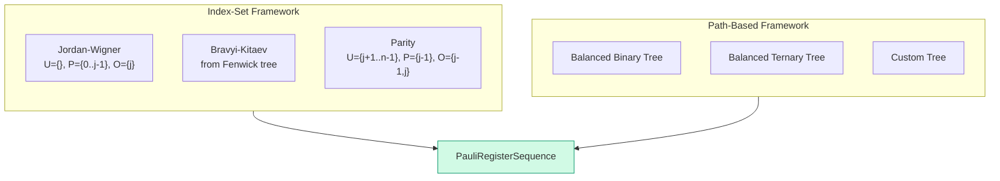

# Chapter 6: Five Encodings, One Interface

_We built the H₂ Hamiltonian with Jordan–Wigner. Now we build it with four more encodings — and discover they all agree on the physics but disagree on the cost._

## In This Chapter

- **What you'll learn:** How to use FockMap's five built-in encodings interchangeably, compare their Pauli weight and structure, and understand why the differences matter for quantum hardware.
- **Why this matters:** Encoding choice is the single biggest lever you have for reducing circuit depth before you write a single gate. This chapter gives you the data to make that choice.
- **Prerequisites:** Chapters 1–5 (you have the 15-term JW Hamiltonian and understand what each term represents).

---

## The Beautiful Fact

Here is the most important property of fermion-to-qubit encodings, stated plainly:

> **All valid encodings produce Hamiltonians with the same eigenvalues.**

The Pauli strings are different. The coefficients are different. The number of non-identity Paulis per term (the "weight") is different. But when you diagonalize the resulting $2^n \times 2^n$ matrix — or, more practically, when you run VQE or QPE — you get the same ground-state energy, the same excited-state spectrum, the same physics.

This is not obvious. It is a theorem, and it follows from the fact that every valid encoding preserves the canonical anti-commutation relations: $\{a_i, a_j^\dagger\} = \delta_{ij}$. If the algebra is preserved, the physics is preserved. FockMap's test suite verifies this algebraically for every encoding — not by comparing eigenvalues, but by checking anti-commutation at the Pauli string level.

What this means practically: you can pick the encoding that minimizes your circuit cost, knowing you are not sacrificing accuracy. Encoding choice is a **free optimization**.

Recall from Chapter 5 that the H₂ Hamiltonian splits into 11 diagonal terms (classical) and 4 off-diagonal exchange terms (quantum). It is those 4 terms — the ones that generate coherences in the density matrix — whose Pauli weight the encoding controls. All encodings produce the same diagonal terms; they differ only in how they handle the off-diagonal ones. This chapter shows you the differences and when they matter.

---

## Five Encodings in Five Lines

FockMap provides five encoder functions, all with the same signature:

```fsharp
// Every encoder has type: LadderOperatorUnit -> uint32 -> uint32 -> PauliRegisterSequence
let encoders = [
    ("Jordan-Wigner",       jordanWignerTerms)
    ("Bravyi-Kitaev",       bravyiKitaevTerms)
    ("Parity",              parityTerms)
    ("Balanced Binary Tree", balancedBinaryTreeTerms)
    ("Balanced Ternary Tree", ternaryTreeTerms)
]
```

Building the H₂ Hamiltonian with each:

```fsharp
let h2Factory key = h2Integrals |> Map.tryFind key

for (name, encoder) in encoders do
    let ham = computeHamiltonianWith encoder h2Factory 4u
    let terms = ham.DistributeCoefficient.SummandTerms
    printfn "%-25s  %d terms" name terms.Length
```

Output:

```
Jordan-Wigner              15 terms
Bravyi-Kitaev              15 terms
Parity                     15 terms
Balanced Binary Tree       15 terms
Balanced Ternary Tree      15 terms
```

Same number of terms. Same physics. But are the Pauli strings the same?

---

## Comparing the Pauli Strings

Let's look at how the exchange terms (the quantum part) appear under each encoding. Recall that under JW, the exchange terms are $XXYY$, $XYYX$, $YXXY$, $YYXX$ — all weight 4.

| Encoding | Exchange Pauli strings | Max weight |
|:---|:---|:---:|
| Jordan–Wigner | XXYY, XYYX, YXXY, YYXX | 4 |
| Bravyi–Kitaev | XXYY, XYYX, YXXY, YYXX | 4 |
| Parity | XXYY, XYYX, YXXY, YYXX | 4 |
| Balanced Binary Tree | XXYY, XYYX, YXXY, YYXX | 4 |
| Balanced Ternary Tree | XXYY, XYYX, YXXY, YYXX | 4 |

Wait — they're all the same? For H₂, yes! With only 4 qubits, there isn't enough room for the different encodings to diverge significantly. The Z-chain in JW is at most length 3, and BK's Fenwick tree on 4 nodes provides at most a factor-of-2 improvement (Chapter 4).

This is an important lesson: **for small molecules, encoding choice barely matters.** The differences emerge at scale.

---

## Where the Differences Emerge: Scaling

Let's expand beyond H₂ and look at how Pauli weight scales with system size. For each encoding, we compute the worst-case weight of a single creation operator $a_j^\dagger$ as a function of the number of spin-orbitals $n$:

```fsharp
let maxWeight encoder n =
    [| for j in 0u .. n - 1u ->
           let terms = encoder Raise j n
           terms.SummandTerms
           |> Array.map (fun t ->
               t.Signature |> Seq.filter (fun c -> c <> 'I') |> Seq.length)
           |> Array.max |]
    |> Array.max

for n in [| 4u; 8u; 16u; 32u |] do
    printfn "n = %2d:  JW=%d  BK=%d  TT=%d"
        n
        (maxWeight jordanWignerTerms n)
        (maxWeight bravyiKitaevTerms n)
        (maxWeight ternaryTreeTerms n)
```

| $n$ | JW | BK | Ternary Tree | JW/TT ratio |
|:---:|:---:|:---:|:---:|:---:|
| 4 | 4 | 3 | 3 | 1.3× |
| 8 | 8 | 4 | 4 | 2× |
| 16 | 16 | 5 | 5 | 3.2× |
| 32 | 32 | 6 | 5 | 6.4× |

At 32 spin-orbitals (a typical small organic molecule), the ternary tree operator touches 5 qubits while JW touches 32. Since each Pauli rotation costs $2(w-1)$ CNOT gates, this is the difference between 8 CNOTs and 62 CNOTs *per term* — compounded across every term in the Hamiltonian and every Trotter step.

---

## The Three Frameworks

FockMap implements encodings through two complementary frameworks (plus one special case):



**Index-set framework** (MajoranaEncoding.fs): An encoding is defined by three set-valued functions — Update($j$), Parity($j$), and Occupation($j$) — that specify which qubits to modify when creating/annihilating an electron in orbital $j$. JW, BK, and Parity are each defined in 3–5 lines of F# as instances of `EncodingScheme`.

**Path-based framework** (TreeEncoding.fs): An encoding is derived from a labelled rooted tree. The Majorana string for each orbital is read off the root-to-leaf path, with each edge contributing an X, Y, or Z Pauli. Any tree topology works. This framework is strictly more general than the index-set framework.

**Fenwick-specific** (BravyiKitaev.fs): The BK encoding uses hand-derived bit-manipulation formulas specific to the Fenwick tree structure. It is implemented separately because these formulas are faster than the generic tree traversal, even though the result is the same.

> **Design note:** The index-set framework was introduced by Seeley, Richard, and Love (2012) as a unifying abstraction. Our investigation showed that it produces correct encodings *only* for star-shaped (depth-1) trees — a previously undocumented constraint. The path-based framework, introduced by Jiang et al. (2020), removes this restriction and works for arbitrary trees. FockMap provides both because the index-set framework is simpler and faster when it applies.

---

## Defining Your Own Encoding

Because encodings are *values* (not classes), defining a new one is trivial:

```fsharp
// A custom encoding: the "reverse JW" scheme
let reverseJW : EncodingScheme =
    { Update     = fun j n -> set [ j + 1 .. n - 1 ]
      Parity     = fun j   -> Set.empty
      Occupation = fun j   -> Set.singleton j }

let ham = computeHamiltonianWith (encodeOperator reverseJW) h2Factory 4u
```

> **Warning:** Not every set of three functions produces a valid encoding. A valid encoding must preserve the canonical anti-commutation relations $\{a_i, a_j^\dagger\} = \delta_{ij}$. The example above is illustrative — to verify correctness, use FockMap's anti-commutation test infrastructure before trusting results from a custom scheme.

---

## A Decision Framework

| Situation | Recommended encoding | Reasoning |
|:---|:---|:---|
| Learning / prototyping | Jordan–Wigner | Simplest to understand and debug |
| Small system ($n \leq 16$) | Jordan–Wigner | Weight overhead is manageable |
| 1D chain / local interactions | Jordan–Wigner | Adjacent-orbital terms have short Z-chains |
| General-purpose ($n \leq 100$) | Bravyi–Kitaev | $O(\log_2 n)$ weight, well-studied |
| Minimum circuit depth | Ternary Tree | $O(\log_3 n)$ — best known asymptotic scaling |
| Exploring custom topologies | Path-based | Arbitrary tree shapes supported |
| Comparing multiple encodings | All five | FockMap's interchangeable interface makes this trivial |

---

## Key Takeaways

- All five encodings produce Hamiltonians with the **same eigenvalues** — encoding choice does not affect physics, only circuit cost.
- For H₂ (4 qubits), the encodings produce identical Pauli strings. The differences emerge at larger $n$.
- The scaling advantage of tree-based encodings ($O(\log n)$ vs $O(n)$) becomes dramatic above ~16 spin-orbitals.
- FockMap implements two frameworks (index-set and path-based) plus custom tree support. All produce the same output type (`PauliRegisterSequence`).
- Defining a custom encoding is 3–5 lines of F#.

## Common Mistakes

1. **Assuming different Pauli strings mean different physics.** They don't — eigenvalues are preserved. The strings differ, the coefficients differ, but the physical predictions are identical.

2. **Choosing an encoding by term count.** All encodings produce the same number of Hamiltonian terms for the same molecule. The difference is Pauli *weight* per term, not term count.

3. **Applying the index-set framework to arbitrary trees.** The SRL framework's index-set formulation only works for star-shaped trees. For general trees, use the path-based framework.

## Exercises

1. **Weight table.** Run the scaling code above for $n = 64$ and $n = 128$. At what point does the ternary tree's maximum weight exceed 10? (This matters because weight-10 operators require 18 CNOTs per rotation.)

2. **Custom encoding.** Define an encoding where the Parity set is $\{0\}$ for all $j$ (constant parity reference). Does it satisfy the anti-commutation relations? Use FockMap's test infrastructure to check.

3. **Encoding comparison for H₂O.** Build the H₂O/STO-3G Hamiltonian (12 spin-orbitals) with all five encodings. Compare the maximum and average Pauli weight. Which encoding would you recommend for a 12-qubit quantum processor?

## Further Reading

- Seeley, J. T., Richard, M. J., and Love, P. J. "The Bravyi–Kitaev transformation for quantum computation of electronic structure." *J. Chem. Phys.* 137, 224109 (2012). The index-set framework that FockMap's `EncodingScheme` implements.
- Jiang, Z. et al. "Optimal fermion-to-qubit mapping via ternary trees." *PRX Quantum* 1, 010306 (2020). The path-based ternary tree encoding with provably optimal asymptotic scaling.
- Tranter, A. et al. "The Bravyi–Kitaev transformation: Properties and applications." *Int. J. Quantum Chem.* 115, 1431 (2015). Practical comparison of JW vs BK for molecular Hamiltonians.

---

**Previous:** [Chapter 5 — Building the Qubit Hamiltonian](05-building-hamiltonian.html)

**Next:** [Chapter 7 — Checking Our Answer](07-verification.html)
