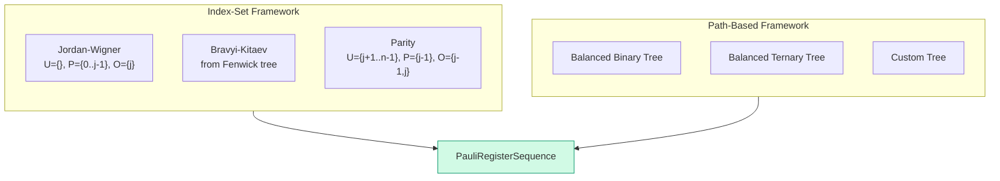

# Chapter 7: Five Encodings, One Interface

_We built the H₂ Hamiltonian with Jordan–Wigner. But JW has a problem — its Z-chains grow linearly with system size. This chapter asks: can we do better? And if we use a different encoding, do we get the same physics?_

## In This Chapter

- **What you'll learn:** Why we need alternatives to Jordan–Wigner, whether different encodings give the same answer (they do — and we'll see why), and how to compare their costs.
- **Why this matters:** Encoding choice is the single biggest lever you have for reducing circuit depth before you write a single gate. But only if you trust that all encodings produce the same physics.
- **Prerequisites:** Chapters 1–6 (you have the 15-term JW Hamiltonian and understand the diagonal/off-diagonal structure).

---

## Why Would We Want a Different Encoding?

In Chapter 6, we saw that 4 of the 15 Pauli terms — the exchange terms XXYY, XYYX, YXXY, YYXX — are off-diagonal. These are the terms that generate coherences in the density matrix and produce the correlation energy. They are also the terms that are expensive to simulate on a quantum computer, because each one requires a CNOT staircase proportional to its Pauli weight.

Under Jordan–Wigner, the worst-case Pauli weight of an operator grows linearly with system size: $O(n)$. For H₂ with 4 qubits, the maximum weight is 4 — manageable. But for H₂O with 12 qubits, it's 12. For the FeMo-co nitrogen-fixation catalyst with ~100 qubits, it's ~100. Each off-diagonal term would require ~200 CNOT gates.

This is the motivation for alternative encodings: **can we represent the same physics with shorter Pauli strings?**

Chapter 5 showed that Bravyi–Kitaev achieves $O(\log_2 n)$ weight using a Fenwick tree, and ternary tree encodings achieve $O(\log_3 n)$. But a natural question arises: if the Pauli strings are different, how do we know we're still computing the same molecule?

---

## Do Different Encodings Give the Same Answer?

Let's find out empirically. Build the H₂ Hamiltonian with all five encodings and compare:

```fsharp
let h2Factory key = h2Integrals |> Map.tryFind key

for (name, encoder) in encoders do
    let ham = computeHamiltonianWith encoder h2Factory 4u
    let terms = ham.DistributeCoefficient.SummandTerms
    printfn "%-25s  %d terms" name terms.Length
```

```
Jordan-Wigner              15 terms
Bravyi-Kitaev              15 terms
Parity                     15 terms
Balanced Binary Tree       15 terms
Balanced Ternary Tree      15 terms
```

Same number of terms. Same identity coefficient ($-1.0704$ Ha in every case). And if we diagonalize each — as we'll do in Chapter 8 — the eigenvalues agree to machine precision ($< 5 \times 10^{-16}$ Ha).

For H₂ with 4 qubits, the Pauli strings are actually identical across all five encodings. With only 4 qubits, there isn't enough room for the different encodings to diverge — the Z-chain is at most length 3, and BK's tree structure on 4 nodes provides at most a marginal improvement.

This is an important lesson: **for small molecules, encoding choice barely matters.** The differences emerge at scale. But the equivalence — the fact that they all give the same answer — holds at every scale. Let's understand why.

---

## Why Equivalence Holds: The CAR Theorem

An encoding maps fermionic operators $a_p^\dagger$, $a_p$ to qubit operators (Pauli strings). Different encodings produce different Pauli strings for the same ladder operator. But the second-quantized Hamiltonian

$$\hat{H} = \sum_{pq} h_{pq}\, a_p^\dagger a_q + \frac{1}{2}\sum_{pqrs} \langle pq \mid rs\rangle\, a_p^\dagger a_q^\dagger a_s a_r$$

is defined in terms of the *algebra* of the operators — their products and commutation relations — not their specific matrix representations.

The key property that any valid encoding must preserve is the **canonical anti-commutation relations (CAR)**:

$$\{a_p^\dagger, a_q\} = \delta_{pq}, \qquad \{a_p^\dagger, a_q^\dagger\} = 0, \qquad \{a_p, a_q\} = 0$$

Here is the theorem:

> **If an encoding preserves the CAR, then the encoded Hamiltonian has the same eigenvalues as the original fermionic Hamiltonian.**

Why? Because the Hamiltonian is a polynomial in the operators $a_p^\dagger$ and $a_p$. If two representations of these operators satisfy the same algebraic relations (the CAR), then any polynomial in them produces the same algebraic object — and therefore the same eigenvalues. This is a standard result in operator algebra: the CAR define the algebra up to unitary equivalence.

In practice, this means the encoding is a **unitary change of basis** on the qubit Hilbert space. The eigenvalues of a matrix are invariant under unitary conjugation — the spectrum is preserved exactly.

FockMap's test suite verifies the CAR at the Pauli string level for every encoding: it checks that

$$(\text{encoded } a_i^\dagger)(\text{encoded } a_j) + (\text{encoded } a_j)(\text{encoded } a_i^\dagger) = \delta_{ij} \cdot I$$

for all pairs $(i, j)$, using symbolic Pauli multiplication. If this check passes, the encoding is valid and the eigenvalues are guaranteed to match. No numerical eigenvalue comparison is needed — the algebraic verification is sufficient.

This is not just a theoretical nicety. It is what makes encoding choice a **free optimization**: you can pick the encoding that minimizes circuit cost, knowing — with mathematical certainty, not just empirical evidence — that the physics is preserved.

---

## Five Encodings in Five Lines

With equivalence established, let's see all five:

```fsharp
let encoders = [
    ("Jordan-Wigner",         jordanWignerTerms)
    ("Bravyi-Kitaev",         bravyiKitaevTerms)
    ("Parity",                parityTerms)
    ("Balanced Binary Tree",  balancedBinaryTreeTerms)
    ("Balanced Ternary Tree", ternaryTreeTerms)
]
```

All five have the same function signature. All five produce `PauliRegisterSequence`. Swapping one for another is a one-word change.

---

## Where the Differences Emerge: Scaling

The differences show up in Pauli weight at larger system sizes:

| $n$ | JW | BK | Ternary Tree | JW/TT ratio |
|:---:|:---:|:---:|:---:|:---:|
| 4 | 4 | 3 | 3 | 1.3× |
| 8 | 8 | 4 | 4 | 2× |
| 16 | 16 | 5 | 5 | 3.2× |
| 32 | 32 | 6 | 5 | 6.4× |

At 32 spin-orbitals, JW's worst-case operator touches 32 qubits. The ternary tree touches 5. Since each Pauli rotation costs $2(w-1)$ CNOT gates (Chapter 4), this is the difference between 62 CNOTs and 8 CNOTs *per term* — compounded across every term and every Trotter step.

Recall from Chapter 6 that the off-diagonal terms are the expensive ones. The encoding determines how many qubits those off-diagonal terms touch — and therefore the circuit depth required to create and maintain the coherences that capture the correlation energy.

---

## The Three Frameworks

FockMap implements encodings through two complementary frameworks (plus one special case):



**Index-set framework** (MajoranaEncoding.fs): An encoding is defined by three set-valued functions — Update($j$), Parity($j$), and Occupation($j$). JW, BK, and Parity are each defined in 3–5 lines of F#.

**Path-based framework** (TreeEncoding.fs): An encoding is derived from a labelled rooted tree. Any tree topology works — strictly more general than the index-set framework.

**Fenwick-specific** (BravyiKitaev.fs): BK uses hand-derived bit-manipulation formulas specific to the Fenwick tree. Faster than generic tree traversal, same result.

> **Design note:** The index-set framework was introduced by Seeley, Richard, and Love (2012) as a unifying abstraction. Our investigation showed that it produces correct encodings *only* for star-shaped (depth-1) trees — a previously undocumented constraint. The path-based framework (Jiang et al., 2020) removes this restriction. FockMap provides both because the index-set framework is simpler and faster when it applies.

---

## Defining Your Own Encoding

Because encodings are *values* (not classes), defining a new one is concise:

```fsharp
let myScheme : EncodingScheme =
    { Update     = fun j n -> set [ j + 1 .. n - 1 ]
      Parity     = fun j   -> Set.empty
      Occupation = fun j   -> Set.singleton j }

let ham = computeHamiltonianWith (encodeOperator myScheme) h2Factory 4u
```

> **Warning:** Not every set of three functions produces a valid encoding. A valid encoding must preserve the CAR: $\{a_i, a_j^\dagger\} = \delta_{ij}$. Use FockMap's anti-commutation test infrastructure to verify correctness before trusting results from a custom scheme. An encoding that fails the CAR check will produce a Hamiltonian with wrong eigenvalues — and the error will be silent.

---

## A Decision Framework

| Situation | Recommended encoding | Reasoning |
|:---|:---|:---|
| Learning / prototyping | Jordan–Wigner | Simplest to understand and debug |
| Small system ($n \leq 16$) | Jordan–Wigner | Weight overhead is manageable |
| 1D chain / local interactions | Jordan–Wigner | Adjacent-orbital terms have short Z-chains |
| General-purpose ($n \leq 100$) | Bravyi–Kitaev | $O(\log_2 n)$ weight, well-studied |
| Minimum circuit depth | Ternary Tree | $O(\log_3 n)$ — best known asymptotic scaling |
| Exploring custom topologies | Path-based | Arbitrary tree shapes supported |
| Comparing multiple encodings | All five | FockMap's interchangeable interface makes this trivial |

---

## Key Takeaways

- JW's $O(n)$ Pauli weight motivates the search for alternative encodings.
- All valid encodings produce Hamiltonians with the **same eigenvalues** — this follows from CAR preservation, not just empirical observation.
- For H₂ (4 qubits), the encodings produce identical Pauli strings. The differences emerge at larger $n$.
- The scaling advantage of tree-based encodings becomes dramatic above ~16 spin-orbitals.
- Defining a custom encoding is 3–5 lines of F# — but verify CAR before trusting it.

## Common Mistakes

1. **Assuming different Pauli strings mean different physics.** They don't — if the CAR is preserved, eigenvalues are preserved. Different strings, same physics.

2. **Choosing an encoding by term count.** All encodings produce the same number of Hamiltonian terms. The difference is Pauli *weight* per term, which determines CNOT count.

3. **Using a custom encoding without verifying CAR.** An encoding that violates anti-commutation will produce plausible but wrong Hamiltonians. Always test.

## Exercises

1. **Weight table.** Run the scaling comparison for $n = 64$ and $n = 128$. At what point does the ternary tree's maximum weight exceed 10?

2. **CAR verification.** Define a custom encoding and use FockMap's test infrastructure to check whether it satisfies anti-commutation. What happens if it doesn't?

3. **Encoding comparison for H₂O.** Build the H₂O/STO-3G Hamiltonian (12 spin-orbitals) with all five encodings. Compare maximum and average Pauli weight.

## Further Reading

- Seeley, J. T., Richard, M. J., and Love, P. J. "The Bravyi–Kitaev transformation for quantum computation of electronic structure." *J. Chem. Phys.* 137, 224109 (2012). The index-set framework.
- Jiang, Z. et al. "Optimal fermion-to-qubit mapping via ternary trees." *PRX Quantum* 1, 010306 (2020). The path-based ternary tree encoding.
- Tranter, A. et al. "The Bravyi–Kitaev transformation: Properties and applications." *Int. J. Quantum Chem.* 115, 1431 (2015). Practical JW vs BK comparison.

---

**Previous:** [Chapter 6 — Building the Qubit Hamiltonian](06-building-hamiltonian.html)

**Next:** [Chapter 8 — Checking Our Answer](08-verification.html)
