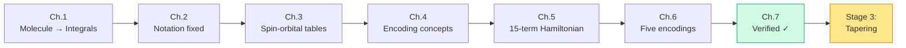

# Chapter 7: Checking Our Answer

_We have fifteen Pauli strings and fifteen coefficients. How do we know they're right? This chapter introduces the only reliable verification method: compute the eigenvalues and compare._

## In This Chapter

- **What you'll learn:** How to verify an encoded Hamiltonian by exact diagonalization, how to interpret the eigenspectrum by particle-number sector, and how to confirm that all five encodings produce the same physics.
- **Why this matters:** Encoding bugs produce Hamiltonians that look structurally correct — right number of terms, right symmetries, plausible coefficients. The only reliable test is the eigenspectrum. If you skip verification, you will eventually publish a wrong number.
- **Prerequisites:** Chapters 1–6 (you have the 15-term Hamiltonian from all five encodings).

---

## The Verification Problem

Here is a sobering fact about fermion-to-qubit encoding: **most bugs produce plausible output.**

A wrong-convention Hamiltonian (Chapter 2, Error #1) has 15 terms with real coefficients and the right Pauli symmetries. A missing cross-spin block (Chapter 3, Mistake #1) has fewer exchange terms but still looks like a valid Hamiltonian. A reversed operator ordering (Chapter 5, Mistake #2) flips some signs but leaves the structure intact.

None of these errors will crash your code. All of them will give wrong eigenvalues. The only way to catch them is to compute those eigenvalues and compare with a known reference.

For H₂ in STO-3G, we have exact classical reference values. For larger molecules, we can still cross-check between encodings — if all five give the same spectrum, we can be confident in the pipeline (though not in the integrals, which must be checked separately).

---

## From Pauli Sum to Matrix

This is the one place where we leave the symbolic world and build a matrix. We do this *only* for verification — the actual quantum simulation never needs a matrix.

Each single-qubit Pauli operator has a $2 \times 2$ matrix:

$$I = \begin{pmatrix}1&0\\0&1\end{pmatrix}, \quad X = \begin{pmatrix}0&1\\1&0\end{pmatrix}, \quad Y = \begin{pmatrix}0&-i\\i&0\end{pmatrix}, \quad Z = \begin{pmatrix}1&0\\0&-1\end{pmatrix}$$

A 4-qubit Pauli string like $IIZZ$ is the tensor product $I \otimes I \otimes Z \otimes Z$ — a $16 \times 16$ matrix. The full Hamiltonian matrix is the weighted sum:

$$H = \sum_{\alpha=1}^{15} c_\alpha \cdot (\text{tensor product of } \sigma_{\alpha,0} \otimes \sigma_{\alpha,1} \otimes \sigma_{\alpha,2} \otimes \sigma_{\alpha,3})$$

For 4 qubits, this is a $16 \times 16$ Hermitian matrix. Diagonalizing it gives 16 eigenvalues.

> **Why 16 and not 6?** The 4-qubit Hilbert space has $2^4 = 16$ basis states, but H₂ has only 2 electrons — so only 6 of those states ($\binom{4}{2} = 6$) have the right particle number. The remaining 10 eigenvalues belong to the 0-electron, 1-electron, 3-electron, and 4-electron sectors. They are physically meaningful (they represent the spectrum with different electron counts) but they are not the ground state we are looking for.

---

## The Eigenspectrum of H₂

Diagonalizing the 15-term JW Hamiltonian gives eigenvalues grouped by particle-number sector:

| Sector ($N_e$) | States | Eigenvalues $E_\text{el}$ (Ha) |
|:---:|:---:|:---|
| 0 | 1 | $0$ |
| 1 | 4 | $-1.2563,\; -1.2563,\; -0.4719,\; -0.4719$ |
| **2** | **6** | $\mathbf{-1.8573},\; -1.3390,\; -0.9032,\; -0.9032,\; -0.6753,\; 0.0$ |
| 3 | 4 | $-1.7282,\; -1.7282,\; -0.9438,\; -0.9438$ |
| 4 | 1 | $-2.2001$ |

The ground state of the physical 2-electron sector is $E_0^\text{el} = -1.8573$ Ha. Adding nuclear repulsion:

$$\boxed{E_0^\text{total} = E_0^\text{el} + V_{nn} = -1.8573 + 0.7151 = -1.1422 \text{ Ha}}$$

This is the **exact** ground-state energy of H₂ in the STO-3G basis — not an approximation, not a truncation, but the answer you'd get from full configuration interaction (Full CI). A quantum computer running VQE or QPE on this Hamiltonian should converge to this value.

---

## How Good Is This?

Let's put the number in context by comparing with simpler approximations:

| Method | $E_\text{total}$ (Ha) | Error (kcal/mol) | What it captures |
|:---|:---:|:---:|:---|
| Hartree–Fock | $-1.1168$ | $15.9$ | Mean-field (no correlation) |
| MP2 | $-1.1381$ | $2.6$ | Perturbative correlation |
| Full CI (= our result) | $-1.1422$ | $0$ | Exact (within basis) |
| Chemical accuracy target | — | $< 1.0$ | The goal for quantum chemistry |

The Hartree–Fock error of 15.9 kcal/mol is large — it would mispredict reaction rates by orders of magnitude. Our Full CI result captures the entire correlation energy within the STO-3G basis.

Of course, STO-3G is a minimal basis — the absolute energy is still far from the true Born–Oppenheimer value. But within the model space we've defined, our answer is exact.

> **The point of quantum simulation is not to replace the basis set** — it's to solve the electronic problem *exactly* within whatever basis the user chooses, even for molecules where Full CI is classically intractable. For H₂ in STO-3G (6 configurations), any laptop can do Full CI. For a molecule with 50 electrons in 100 spin-orbitals ($\binom{100}{50} \approx 10^{29}$ configurations), only a quantum computer can.

---

## Cross-Encoding Verification

The most powerful check: build the Hamiltonian with all five encodings and verify that they produce the **same eigenspectrum**.

```fsharp
for (name, encoder) in encoders do
    let ham = computeHamiltonianWith encoder h2Factory 4u
    // ... build 16×16 matrix, diagonalize ...
    printfn "%-25s  E₀ = %.10f Ha" name groundStateEnergy
```

| Encoding | $E_0^\text{el}$ (Ha) | $\lvert\Delta E\rvert$ from JW |
|:---|:---:|:---:|
| Jordan–Wigner | $-1.8572750302$ | — |
| Bravyi–Kitaev | $-1.8572750302$ | $< 10^{-15}$ |
| Parity | $-1.8572750302$ | $< 10^{-15}$ |
| Balanced Binary Tree | $-1.8572750302$ | $< 10^{-15}$ |
| Balanced Ternary Tree | $-1.8572750302$ | $< 10^{-15}$ |

**Agreement to $5 \times 10^{-16}$ Ha** — the limit of 64-bit floating-point precision. The eigenvalues are identical to machine epsilon.

This is not a coincidence. It is a mathematical guarantee: every valid encoding preserves the canonical anti-commutation relations, and therefore preserves the operator algebra, and therefore preserves every eigenvalue. FockMap's test suite verifies the anti-commutation relations symbolically (no eigenvalues needed), but the eigenvalue comparison provides an independent numerical cross-check.

---

## A Verification Checklist

When building and verifying an encoded Hamiltonian, check these in order:

| # | Check | How | What failure means |
|:---:|:---|:---|:---|
| 1 | Term count | Count Pauli strings | Missing/extra integrals |
| 2 | Identity coefficient | Read $IIII$ coefficient | Wrong $V_{nn}$ or integral sum |
| 3 | Diagonal symmetry | All Z-only terms come in pairs ($IIIZ/IIZI$, etc.) | Broken spin symmetry |
| 4 | Exchange terms present | Look for XX/YY terms | Missing cross-spin integrals |
| 5 | Cross-encoding agreement | Build with 2+ encodings, compare spectra | Encoding bug |
| 6 | Known reference | Compare $E_0$ against published value | Convention error |

If check 4 fails (no exchange terms), the most likely cause is the cross-spin bug from Chapter 3. If check 5 fails (different eigenvalues from different encodings), there is a bug in the encoding implementation itself — which, if you're using FockMap, should not happen.

---

## Stage 2 Complete

With verification done, we have walked the complete path from molecule to validated qubit Hamiltonian:



The Hamiltonian is correct. It is the exact qubit representation of H₂ in STO-3G for any of five encodings. It has 15 Pauli terms, its ground-state energy is $-1.1422$ Ha, and it captures all the electron correlation that a quantum computer would extract.

But can we make it *smaller*? Can we remove qubits without losing physics? That's what tapering does — and it's where we go next.

---

## Key Takeaways

- The **only reliable verification** of an encoded Hamiltonian is eigenvalue comparison against a known reference or cross-encoding check.
- The H₂/STO-3G ground-state energy is $E_0 = -1.1422$ Ha (Full CI, exact within basis).
- All five encodings produce eigenvalues that agree to $< 5 \times 10^{-16}$ Ha — machine precision.
- Encoding bugs produce structurally plausible but numerically wrong Hamiltonians. Check eigenvalues early and often.
- Matrix diagonalization is used *only* for verification. The actual quantum simulation operates on the symbolic Pauli sum.

## Common Mistakes

1. **Verifying only the ground state.** Check the full spectrum (all particle-number sectors), not just $E_0$. Some bugs preserve the ground state but corrupt excited states.

2. **Comparing absolute energies across basis sets.** STO-3G and cc-pVDZ give different energies for the same molecule. Only compare within the same basis.

3. **Skipping verification for "trusted" code.** Even well-tested libraries can produce wrong results if the integral input is wrong. Verify the first Hamiltonian you build for any new molecule.

## Exercises

1. **Sector analysis.** The 0-electron sector has eigenvalue 0. Why? (Hint: what does the Hamiltonian do to the vacuum state $\lvert 0000\rangle$?)

2. **Correlation energy.** Compute the Hartree–Fock energy of H₂ by hand: $E_\text{HF} = 2h_{00} + [00\mid00] + V_{nn}$. Verify that $E_\text{corr} = E_\text{FCI} - E_\text{HF} \approx -0.019$ Ha $\approx -12$ kcal/mol.

3. **Cross-encoding lab.** Run the [Compare Encodings lab](../labs/03-compare-encodings.html) and verify 5-encoding eigenvalue agreement for yourself.

## Further Reading

- Szabo, A. and Ostlund, N. S. *Modern Quantum Chemistry.* §4.1 gives the Full CI eigenvalues for H₂/STO-3G.
- Helgaker, T., Jørgensen, P., and Olsen, J. *Molecular Electronic-Structure Theory.* Chapter 11 covers Full CI theory and implementation.

---

**Previous:** [Chapter 6 — Five Encodings, One Interface](06-five-encodings.html)

**Next:** [Chapter 8 — Why Tapering?](08-why-tapering.html)
