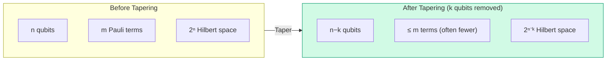

# Chapter 9: Why Tapering?

_The Hamiltonian is correct and verified. But it may be bigger than it needs to be. This chapter shows why encoded Hamiltonians often contain redundant qubits — and how to detect them._

## In This Chapter

- **What you'll learn:** How fermion-to-qubit encoding creates Z₂ symmetries that allow safe qubit removal, and why this is one of the highest-leverage optimizations in the entire pipeline.
- **Why this matters:** Removing even one qubit halves the Hilbert space. For near-term quantum hardware with limited qubit counts and high error rates, tapering can mean the difference between a feasible and an infeasible simulation.
- **Prerequisites:** Chapters 1–7 (you have a verified qubit Hamiltonian and understand Pauli strings).

---

## The Observation

Look again at the 15-term H₂ Hamiltonian from Chapter 5. Focus on the Pauli operators at each qubit position:

| Qubit 0 | Qubit 1 | Qubit 2 | Qubit 3 |
|:---:|:---:|:---:|:---:|
| I, I, I, I, I, I, I, I, I, Z, Z, X, X, Y, Y | I, I, I, Z, Z, I, Z, Z, I, I, Z, X, Y, X, Y | I, I, I, I, I, Z, I, Z, Z, Z, I, Y, Y, X, X | I, Z, Z, I, I, Z, Z, I, Z, I, I, Y, X, Y, X |

Every qubit has at least some terms with X or Y — no qubit is purely diagonal (I/Z only) across all 15 terms. So H₂ under JW has **no diagonal Z₂ symmetries** at first glance.

But this is specific to H₂'s structure and the JW encoding. Many molecular Hamiltonians — especially larger ones — *do* have qubits where every term is I or Z. And even when no single qubit is diagonal, there may be **multi-qubit** Z₂ symmetries (like $Z_0 Z_1$) that a Clifford rotation can exploit.

### Where diagonal symmetries come from

Particle-number conservation is the most common source. In many encodings, the total electron number operator $\hat{N} = \sum_j \hat{n}_j$ commutes with the Hamiltonian. Under JW, $\hat{N}$ maps to a sum of $Z$ operators. If certain linear combinations of these $Z$ operators commute with every Hamiltonian term, the corresponding qubits can be fixed and removed.

The Parity encoding makes this especially transparent: the last qubit often stores the total parity of the electron number, which is conserved — making it immediately taperable.

---

## What Tapering Gains You

The benefits are concrete and multiplicative:

| What shrinks | Factor | Example (12 → 9 qubits) |
|:---|:---:|:---|
| Qubit count | $-k$ | 3 fewer physical qubits needed |
| Hilbert space | $2^{-k}$ | $4096 \to 512$ (8× smaller) |
| Circuit width | $-k$ | 3 fewer wires in every gate layer |
| Pauli weight | often reduces | Shorter Z-chains after qubit removal |
| Term count | often reduces | Some terms collapse to identity |

And these savings **compound** with encoding choice. A ternary-tree encoding on a tapered Hamiltonian gets both the $O(\log_3 n)$ weight advantage *and* the reduced qubit count.

---

## The Two Levels of Tapering

FockMap implements two levels of increasing generality:

### Level 1: Diagonal Z₂

A qubit $j$ is *diagonally taperable* if every term in the Hamiltonian has only I or Z at position $j$ — never X or Y. This means qubit $j$'s value is determined by symmetry: it is always $+1$ or always $-1$ in the sector we care about, and it never gets flipped during the simulation. We can fix it to that value and remove it from the problem entirely.

**How you detect it:** Look at each qubit position across all Pauli terms. If you never see X or Y in that column, the qubit is taperable. It's a simple scan — FockMap checks this in one pass over the Hamiltonian.

### Level 2: General Clifford

Sometimes no *single* qubit is purely diagonal, but a *combination* of qubits is. For example, $Z_0 Z_1$ might commute with every Hamiltonian term even though $Z_0$ alone does not. This means the *product* of qubits 0 and 1 is conserved, even though neither one is individually.

In this case, we can apply a small rotation circuit (built from Hadamard, S, and CNOT gates — the same gates from Chapter 4) that rearranges the Hamiltonian so that the conserved combination ends up on a single qubit. After the rotation, that qubit is diagonally taperable, and we remove it just like in Level 1.

**How you detect it:** FockMap searches for Pauli operators that commute with every term in the Hamiltonian — these are the symmetry generators. The mathematical machinery behind this search involves binary linear algebra, which we'll develop step by step in Chapter 11.

The important thing at this stage is the *idea*: even when the symmetry isn't visible on a single qubit, it may be hiding in a combination of qubits, and a rotation can expose it.

We'll work through the diagonal case in Chapter 10, the Clifford generalization in Chapter 11, and concrete benchmarks in Chapter 12.

---

## Why Tapering Is Free

It's worth emphasizing: tapering does not approximate. It does not truncate. It does not discard information.

When we remove a tapered qubit, we are removing a degree of freedom whose value was *already determined* — fixed by a conservation law (like particle number or spin parity) that the Hamiltonian respects. The qubit was never free to vary in the first place; it was constrained by symmetry to a single eigenvalue in the sector we're studying. Removing it simply acknowledges this constraint explicitly.

The eigenvalues of the tapered Hamiltonian are a *subset* of the eigenvalues of the original — specifically, the eigenvalues in the chosen symmetry sector. No eigenvalue is lost; we just stop tracking the ones that belong to other sectors.

This is why we taper *before* Trotterization, not after: the circuit should operate on the physically relevant Hilbert space from the start, not carry redundant qubits through every gate layer.

---

## Key Takeaways

- Encoded Hamiltonians often have Z₂ symmetries — qubits whose value is determined by conservation laws rather than dynamics.
- Removing these qubits is free: it preserves the physics exactly while reducing every downstream cost.
- Diagonal Z₂ symmetries (single-qubit Z generators) are the simplest case. General Z₂ symmetries require Clifford rotation.
- Tapering compounds with encoding choice: taper first, then the encoding operates on a smaller system.

## Common Mistakes

1. **Assuming H₂ has taperable qubits under JW.** It doesn't — the exchange terms (XXYY) put X/Y on every qubit. Tapering is most effective for larger molecules with more conservation laws.

2. **Confusing tapering with truncation.** Truncation (e.g., active-space reduction) discards orbitals and loses information. Tapering removes redundant *qubits* without losing any information — the eigenvalues are exactly preserved.

3. **Tapering after circuit compilation.** Taper before Trotterization, not after. The circuit should be built on the smaller Hamiltonian.

## Exercises

1. **Conservation laws.** For a molecule with $N$ electrons, what conservation laws might produce Z₂ symmetries? (Hint: total electron number, spin projection $S_z$, point-group symmetry.)

2. **Parity encoding advantage.** Under the Parity encoding, the last qubit stores the total electron-number parity. Show that this qubit is always diagonally taperable for any Hamiltonian that conserves particle number.

3. **Scaling impact.** If tapering removes 3 qubits from a 14-qubit H₂O system, by what factor does the Hilbert space shrink? How many fewer CNOT gates does each Trotter step require (approximately)?

## Further Reading

- Bravyi, S., Gambetta, J. M., Mezzacapo, A., and Temme, K. "Tapering off qubits to simulate fermionic Hamiltonians." arXiv:1701.08213 (2017). The foundational paper on qubit tapering.

---

**Previous:** [Chapter 7 — Checking Our Answer](07-verification.html)

**Next:** [Chapter 9 — Diagonal Z₂ Symmetries](09-diagonal-z2.html)
