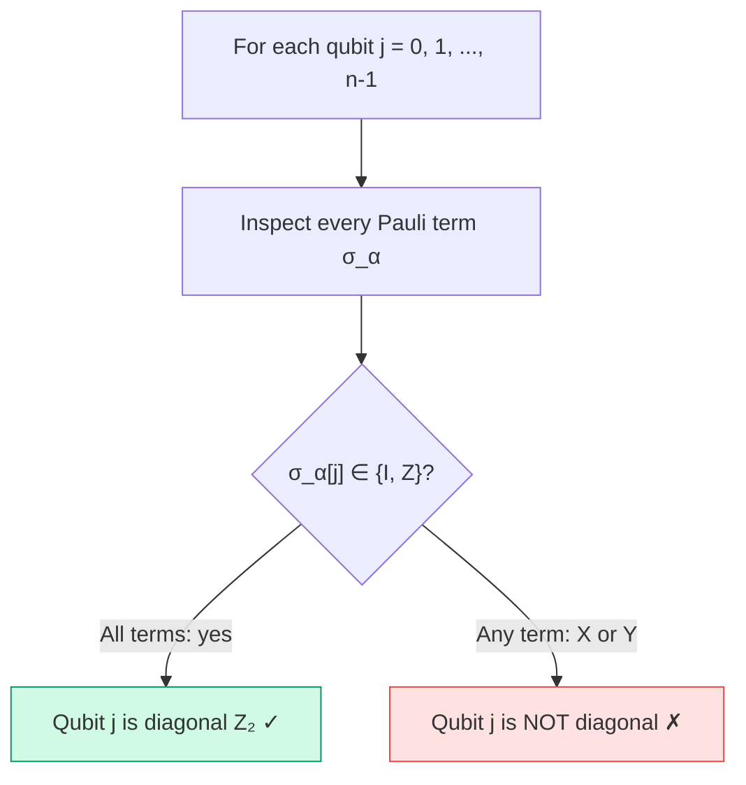

# Chapter 10: Diagonal Z₂ Symmetries

_The simplest form of tapering: find qubits that are always I or Z, fix their eigenvalue, and remove them._

## In This Chapter

- **What you'll learn:** The algorithm for detecting diagonal Z₂ symmetries, how sector choice works, and how fixing a sector modifies each Pauli term.
- **Why this matters:** Diagonal tapering is fast, easy to implement, and often removes 1–3 qubits from molecular Hamiltonians with zero information loss.
- **Prerequisites:** Chapter 8 (you understand why tapering is valuable and what Z₂ symmetries are).

---

## The Detection Algorithm

Given a Hamiltonian $\hat{H} = \sum_\alpha c_\alpha \sigma_\alpha$, we say qubit $j$ is **diagonal Z₂ symmetric** if:

$$\forall \alpha:\; \sigma_\alpha[j] \in \{I, Z\}$$

The algorithm is a single scan:



**Complexity:** $O(n \times m)$ where $n$ is the qubit count and $m$ is the number of terms. For H₂O with 12 qubits and ~600 terms, this takes microseconds.

### In FockMap

```fsharp
let symQubits = diagonalZ2SymmetryQubits hamiltonian
// Returns int[] of taperable qubit indices
```

For our toy example from Chapters 8:

```fsharp
let h =
    [| PauliRegister("ZIZI", Complex(0.8, 0.0))
       PauliRegister("ZZII", Complex(-0.4, 0.0))
       PauliRegister("IIZZ", Complex(0.3, 0.0))
       PauliRegister("IZIZ", Complex(0.2, 0.0)) |]
    |> PauliRegisterSequence

diagonalZ2SymmetryQubits h
// → [| 0; 1; 2; 3 |]  — all four qubits are diagonal!
```

Every term has only I or Z at every position. This is a fully diagonal Hamiltonian — entirely classical. It's a toy, but it illustrates the detection perfectly.

---

## Sectors: Choosing Eigenvalues

For each diagonal Z₂ qubit, we **choose** whether to fix its $Z$ eigenvalue to $+1$ or $-1$. This choice is called a **sector**.

A sector is a list of (qubit, eigenvalue) pairs:

```fsharp
let sector = [ (1, +1); (3, -1) ]
// Fix qubit 1 to eigenvalue +1, qubit 3 to eigenvalue -1
```

**Physical interpretation:** Different sectors correspond to different quantum numbers. If the diagonal qubits encode particle-number parity or spin projection, then sector $+1$ vs $-1$ selects different electron counts or spin states.

For $k$ diagonal qubits, there are $2^k$ possible sectors. Each gives a valid tapered Hamiltonian with the correct eigenvalues for that sector — but different sectors may have different ground-state energies. To find the global ground state, you must check all sectors and take the minimum.

---

## How Sector Fixing Modifies Terms

The modification rule is simple:

For each term $c_\alpha \sigma_\alpha$ and each tapered qubit $(j, \lambda)$:

1. If $\sigma_\alpha[j] = I$: no change to the coefficient
2. If $\sigma_\alpha[j] = Z$: multiply the coefficient by $\lambda$ (the eigenvalue: $+1$ or $-1$)
3. Remove position $j$ from the Pauli string

### Worked Example

Start with:

$$\hat{H} = 0.8\,\text{ZIZI} - 0.4\,\text{ZZII} + 0.3\,\text{IIZZ} + 0.2\,\text{IZIZ}$$

Fix sector $[(1, +1),\; (3, -1)]$:

| Original term | Qubit 1 | Factor | Qubit 3 | Factor | New coeff | Remaining Pauli |
|:---:|:---:|:---:|:---:|:---:|:---:|:---:|
| $0.8\,\text{ZIZI}$ | I | $\times 1$ | I | $\times 1$ | $0.8$ | ZZ |
| $-0.4\,\text{ZZII}$ | Z | $\times (+1)$ | I | $\times 1$ | $-0.4$ | ZI |
| $0.3\,\text{IIZZ}$ | I | $\times 1$ | Z | $\times (-1)$ | $-0.3$ | IZ |
| $0.2\,\text{IZIZ}$ | Z | $\times (+1)$ | Z | $\times (-1)$ | $-0.2$ | II |

**Result:** $\hat{H}' = 0.8\,\text{ZZ} - 0.4\,\text{ZI} - 0.3\,\text{IZ} - 0.2\,\text{II}$

Four qubits → two qubits. The eigenvalues of $\hat{H}'$ are exactly the eigenvalues of $\hat{H}$ in the $(+1, -1)$ sector.

### In FockMap

```fsharp
let result = taperDiagonalZ2 [ (1, 1); (3, -1) ] h

printfn "%d → %d qubits" result.OriginalQubitCount result.TaperedQubitCount
// 4 → 2 qubits

printfn "Removed: %A" result.RemovedQubits
// [| 1; 3 |]
```

---

## The Convenience Helper

For quick exploration, taper all detected qubits in the $+1$ sector:

```fsharp
let auto = taperAllDiagonalZ2WithPositiveSector hamiltonian

// Equivalent to:
// let qs = diagonalZ2SymmetryQubits hamiltonian
// let sector = qs |> Array.map (fun q -> (q, 1)) |> Array.toList
// let auto = taperDiagonalZ2 sector hamiltonian
```

This is fine for exploration but not for production: the $+1$ sector may not contain the ground state. For a rigorous calculation, sweep all $2^k$ sectors.

---

## Validation

FockMap validates all inputs:

```fsharp
// Non-diagonal qubit → error
taperDiagonalZ2 [(0, 1)] (prs [("XI", Complex.One)])
// → ArgumentException: "Qubit 0 is not a diagonal Z2 symmetry"

// Invalid eigenvalue → error
taperDiagonalZ2 [(0, 0)] hamiltonian
// → ArgumentException: "Sector eigenvalues must be +1 or -1"
```

These guards prevent the two most common tapering bugs: applying tapering to a qubit that has X or Y terms (which would silently drop those terms), and using an eigenvalue other than $\pm 1$ (which would corrupt the coefficients).

---

## Key Takeaways

- Detection is a single scan: $O(n \times m)$.
- Sector choice selects which quantum-number subspace to project into.
- Each term's coefficient is multiplied by $\pm 1$ per tapered qubit (depending on I vs Z), then the qubit position is removed.
- For the global ground state, sweep all $2^k$ sectors.
- FockMap validates inputs to prevent silent errors.

## Common Mistakes

1. **Assuming the $+1$ sector always contains the ground state.** It may not — the ground state could be in any sector.

2. **Tapering a non-diagonal qubit.** FockMap catches this, but if you're implementing by hand, silently dropping X/Y terms is the most dangerous bug.

3. **Forgetting to combine like terms after tapering.** Removing qubits can make previously distinct Pauli strings identical. The terms must be re-accumulated.

---

**Previous:** [Chapter 8 — Why Tapering?](08-why-tapering.html)

**Next:** [Chapter 10 — General Clifford Tapering](10-clifford-tapering.html)
