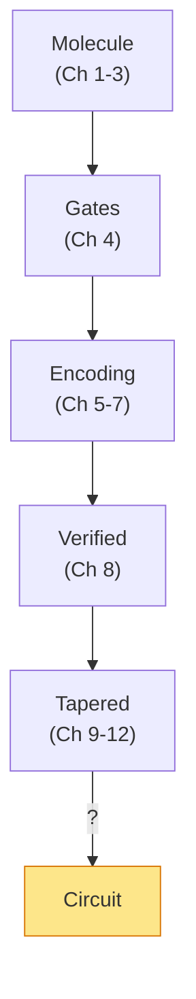
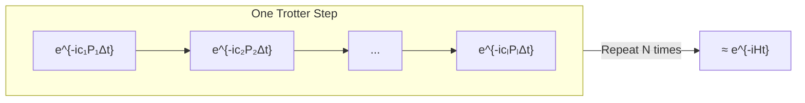

# Chapter 13: From Hamiltonian to Time Evolution

_We have a Hamiltonian — a complete description of the molecule's physics. But a quantum computer can't execute a description. It needs instructions. This chapter is about turning the description into instructions._

## In This Chapter

- **What you'll learn:** Why quantum simulation boils down to implementing time evolution $e^{-iHt}$, what this operator physically represents, why it's hard to implement when the Hamiltonian has many non-commuting terms, and how Trotterization provides the practical bridge.
- **Why this matters:** Without this bridge, the pipeline from molecule to circuit is incomplete. This is the chapter that turns a symbolic object into something a quantum processor can actually run.
- **Prerequisites:** Chapters 1–12 (you have a verified, optionally tapered, Pauli-sum Hamiltonian and understand gates from Chapter 4).

---

## What We Have, and What We Need

After twelve chapters, our pipeline has produced a remarkable object: a symbolic Pauli-sum Hamiltonian

$$\hat{H} = \sum_{k=1}^{L} c_k P_k$$

verified to give the correct eigenvalues, potentially tapered to use fewer qubits, with encoding choice optimizing the Pauli weight. This object captures *everything* about the molecule's electronic structure — every orbital energy, every Coulomb repulsion, every quantum exchange interaction.

But it is a *description*, not a *program*. A quantum computer doesn't accept descriptions. It accepts a sequence of gates — Hadamard, CNOT, $R_z$ — applied to specific qubits in a specific order. The Hamiltonian tells us *what* to compute; the circuit tells the machine *how* to compute it.

To cross this gap, we need to understand a deep idea: the connection between the Hamiltonian (which describes energy) and time evolution (which describes change).

---

## Energy and Time: Two Sides of the Same Operator

Here is a fact that physics students learn early but whose implications take years to fully appreciate:

> **The Hamiltonian does double duty.** It tells you the energy of a system *and* it tells you how the system evolves in time. The same operator. Both roles.

The Schrödinger equation makes this precise:

$$i\hbar \frac{d}{dt}\lvert\psi(t)\rangle = \hat{H}\lvert\psi(t)\rangle$$

Read it as: "the rate at which the quantum state changes equals the Hamiltonian applied to that state." The Hamiltonian is both the *energy observable* (its eigenvalues are the energies) and the *generator of time evolution* (it drives the dynamics).

The formal solution for a time-independent Hamiltonian is:

$$\lvert\psi(t)\rangle = e^{-i\hat{H}t/\hbar}\lvert\psi(0)\rangle$$

Setting $\hbar = 1$ (as is standard in atomic units), the **time-evolution operator** is:

$$U(t) = e^{-i\hat{H}t}$$

This operator is unitary — it preserves probabilities, as any physical evolution must. Its eigenvalues are $e^{-iE_k t}$, where $E_k$ are the energy eigenvalues. The energies are *encoded as phases* of the time-evolution operator.

This dual role is what makes quantum simulation work: if you can implement $U(t)$ on a quantum computer, you can extract the energies by reading the phases. That's the core idea behind both QPE (which reads the phases directly) and VQE (which estimates $\langle H \rangle$ by measuring individual Pauli terms).

---

## The Gap in Our Pipeline

Let's pause and take stock. Here's the complete pipeline so far:

We have a verified, optionally tapered Hamiltonian:

$$\hat{H} = \sum_{k=1}^{L} c_k P_k$$

where each $P_k$ is a Pauli string (like $XXYY$) and $c_k$ is a real coefficient. This is a complete, exact symbolic description of the molecule's physics.

But a quantum computer doesn't accept a Hamiltonian as input. It accepts a sequence of **quantum gates**. We need to cross the last gap:

$$\text{Hamiltonian } \hat{H} \;\xrightarrow{\;?\;}\; \text{Gate sequence}$$

### An important clarification

The phrase "quantum simulation" is misleading. We are **not** watching electrons move in real time, like a molecular dynamics animation. We are not running the chemistry forward. Instead, we are using time evolution as a *mathematical tool*: implement $U(t) = e^{-iHt}$, then extract the energies from its phases.

- **QPE** (Quantum Phase Estimation) applies controlled-$U(t)$ and reads the energy eigenvalue directly as a binary phase, written into an ancilla register.
- **VQE** (Variational Quantum Eigensolver) doesn't use $U(t)$ as a whole, but measures $\langle\hat{H}\rangle = \sum_k c_k \langle P_k\rangle$ term by term — and each measurement involves a Pauli rotation $e^{-i\theta P_k}$, which is a single-term slice of the time-evolution operator.

In both cases, the primitive operation is a **Pauli rotation**: $e^{-i\theta P}$ for a single Pauli string $P$. The question is: how do we implement the full $e^{-i\hat{H}t}$ when $\hat{H}$ is a sum of many such terms that don't commute with each other?

---

## The Problem: Non-Commuting Terms

If the Hamiltonian had a single term, $\hat{H} = cP$, then:

$$e^{-i\hat{H}t} = e^{-ictP}$$

This is a single Pauli rotation — easy to implement (Chapter 14 will show exactly how). But our Hamiltonian has $L$ terms:

$$\hat{H} = c_1 P_1 + c_2 P_2 + \cdots + c_L P_L$$

and the terms generally **do not commute**: $P_j P_k \neq P_k P_j$. This means:

$$e^{-i(c_1 P_1 + c_2 P_2)t} \neq e^{-ic_1 P_1 t} \cdot e^{-ic_2 P_2 t}$$

The exponential of a sum is *not* the product of exponentials for non-commuting operators. This is where Trotterization enters.

---

## The Trotter Idea

The Trotter–Suzuki product formula says that for small $\Delta t$:

$$e^{-i(A + B)\Delta t} \approx e^{-iA\Delta t} \cdot e^{-iB\Delta t} + O(\Delta t^2)$$

The error is proportional to $\Delta t^2$ — so if we break the total time $t$ into $N$ small steps of size $\Delta t = t/N$:

$$e^{-i\hat{H}t} = \left(e^{-i\hat{H}\Delta t}\right)^N \approx \left(\prod_{k=1}^{L} e^{-ic_k P_k \Delta t}\right)^N$$

Each factor $e^{-ic_k P_k \Delta t}$ is a single Pauli rotation — implementable as a gate sequence. The full circuit is just $N$ repetitions of $L$ rotations.

**Trade-off:** More Trotter steps ($N$) → better approximation but deeper circuit. Fewer steps → shallower circuit but larger error. The choice of $N$ depends on the target precision and the commutator structure of $\hat{H}$.

---

## First vs Second Order

The formula above is **first-order Trotter**: error $O(\Delta t^2)$ per step, $O(t^2/N)$ total.

**Second-order Trotter** (Suzuki) cuts the error to $O(\Delta t^3)$ by symmetrizing:

$$e^{-i\hat{H}\Delta t} \approx \prod_{k=1}^{L} e^{-ic_k P_k \Delta t/2} \cdot \prod_{k=L}^{1} e^{-ic_k P_k \Delta t/2}$$

The forward pass uses half-angles, the reverse pass mirrors the sequence. The cost is $2L$ rotations per step instead of $L$, but the error decreases faster, so you need fewer steps for the same precision.

| Order | Rotations per step | Error per step | Error for $N$ steps |
|:---:|:---:|:---:|:---:|
| First | $L$ | $O(\Delta t^2)$ | $O(t^2/N)$ |
| Second | $2L$ | $O(\Delta t^3)$ | $O(t^3/N^2)$ |

For most molecular simulations, second-order Trotter with a moderate $N$ is the standard choice.

---

## Beyond Trotterization: Qubitization

Trotterization is the workhorse of Hamiltonian simulation — simple, well-understood, and the approach we develop in this book. But it is not the only method, and intellectual honesty requires us to mention the alternative.

In 2016, Dr Guang Hao Low and Isaac Chuang introduced **qubitization** — a fundamentally different approach to Hamiltonian simulation that achieves optimal query complexity. Where Trotterization approximates $e^{-iHt}$ as a product of easy rotations (with error that shrinks as you add more steps), qubitization encodes the Hamiltonian directly into a quantum walk operator using a technique called the **Linear Combination of Unitaries (LCU)**. The result: instead of error scaling as $O(t^2/N)$ or $O(t^3/N^2)$, qubitization achieves error that scales *linearly* in the number of queries to the Hamiltonian — provably optimal.

The catch: qubitization requires additional ancilla qubits and a more complex circuit structure (the "PREPARE" and "SELECT" oracles). It is harder to implement and harder to optimize for near-term hardware. For the molecules in this book (H₂, H₂O), Trotterization is more than adequate. For the grand-challenge molecules (FeMo-co, cytochrome P450), qubitization may be the only method that achieves chemical accuracy within a reasonable circuit depth.

We will not develop qubitization in this book — it deserves its own treatment — but we mention it here so that the reader understands where Trotterization sits in the landscape:

| Method | Error scaling | Circuit structure | Best for |
|:---|:---|:---|:---|
| First-order Trotter | $O(t^2/N)$ | Simple: $L$ rotations per step | Learning, small systems |
| Second-order Trotter | $O(t^3/N^2)$ | Symmetric: $2L$ rotations per step | Most molecular simulations |
| Qubitization (LCU) | $O(\log(1/\epsilon))$ | Complex: ancilla + walk operator | Large systems, optimal scaling |

> The qubitization paper — G. H. Low and I. L. Chuang, "Hamiltonian Simulation by Qubitization," *Quantum* 3, 163 (2019); original arXiv:1610.06546 (2016) — is one of the foundational results of quantum algorithms for chemistry. It is dedicated, with gratitude, as part of the intellectual lineage that inspired this book.

---

## What Comes Next

The Trotter decomposition converts our Hamiltonian into a list of Pauli rotations:

$$\text{Hamiltonian } \hat{H} \;\xrightarrow{\text{Trotter}}\; [e^{-i\theta_1 P_1},\; e^{-i\theta_2 P_2},\; \ldots]$$

Each rotation $e^{-i\theta P}$ must then be decomposed into elementary gates (H, CNOT, Rz). That's the **CNOT staircase** — Chapter 14. But first, Chapter 13 will show how FockMap computes the rotation list.

---

## Key Takeaways

- Quantum computers execute gates, not Hamiltonians. The bridge is time evolution $e^{-i\hat{H}t}$.
- Non-commuting Pauli terms prevent direct exponentiation. The Trotter–Suzuki formula approximates $e^{-i(A+B)t}$ as a product of individual rotations.
- First-order Trotter: $L$ rotations, $O(t^2/N)$ error. Second-order: $2L$ rotations, $O(t^3/N^2)$ error.
- The quality of the Trotter approximation depends on the time step size and the commutator norm $\lVert[P_j, P_k]\rVert$ — smaller commutators mean smaller errors.

## Further Reading

- Trotter, H. F. "On the product of semi-groups of operators." *Proc. Am. Math. Soc.* 10, 545 (1959). The original product formula.
- Suzuki, M. "General theory of fractal path integrals with applications to many-body theories and statistical physics." *J. Math. Phys.* 32, 400 (1991). Higher-order product formulas.
- Childs, A. M. and Su, Y. "Nearly optimal lattice simulation by product formulas." *Phys. Rev. Lett.* 123, 050503 (2019). Modern error bounds for Trotter formulas.
- Low, G. H. and Chuang, I. L. "Hamiltonian Simulation by Qubitization." *Quantum* 3, 163 (2019); arXiv:1610.06546 (2016). The optimal-complexity alternative to Trotterization, encoding the Hamiltonian directly into a quantum walk operator.

---

**Previous:** [Chapter 12 — Tapering Benchmarks](12-tapering-benchmarks.html)

**Next:** [Chapter 14 — Trotterization in Practice](14-trotter-formulas.html)
