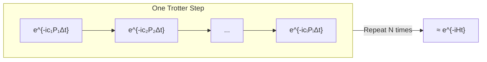

# Chapter 13: From Hamiltonian to Time Evolution

_We have a Pauli-sum Hamiltonian. A quantum computer doesn't execute Hamiltonians — it executes gates. This chapter bridges the gap._

## In This Chapter

- **What you'll learn:** Why quantum simulation requires time evolution $e^{-iHt}$, why this is hard to implement directly, and how product formulas (Trotterization) provide a practical approximation.
- **Why this matters:** Trotterization is the standard method for converting a Hamiltonian into a gate sequence. Without it, the entire pipeline from molecule to circuit is incomplete.
- **Prerequisites:** Chapters 1–11 (you have a verified, optionally tapered, Pauli-sum Hamiltonian).

---

## The Gap in Our Pipeline

So far, our pipeline produces a symbolic object:

$$\hat{H} = \sum_{k=1}^{L} c_k P_k$$

where each $P_k$ is a Pauli string (like $XXYY$) and $c_k$ is a real coefficient. This is the qubit Hamiltonian — verified in Chapter 7, optionally tapered in Chapters 8–11.

But a quantum computer doesn't accept a Hamiltonian as input. It accepts a sequence of **quantum gates** — unitary operations that act on specific qubits. The gap is:

$$\text{Hamiltonian } \hat{H} \;\xrightarrow{\;?\;}\; \text{Gate sequence}$$

The bridge is **Hamiltonian simulation**: implementing the time-evolution operator $e^{-i\hat{H}t}$ as a circuit of elementary gates.

---

## Why Time Evolution?

The Schrödinger equation governs how a quantum state evolves:

$$i\hbar \frac{d}{dt}\lvert\psi(t)\rangle = \hat{H}\lvert\psi(t)\rangle$$

The solution for time-independent $\hat{H}$ is:

$$\lvert\psi(t)\rangle = e^{-i\hat{H}t/\hbar}\lvert\psi(0)\rangle$$

The operator $U(t) = e^{-i\hat{H}t}$ (setting $\hbar = 1$) is the **time-evolution operator**. It is unitary, and implementing it as a quantum circuit is the fundamental task of Hamiltonian simulation.

Both major quantum chemistry algorithms use this:
- **VQE** measures $\langle\psi\rvert\hat{H}\lvert\psi\rangle$ by measuring each Pauli term separately — each measurement requires a basis rotation that involves a Pauli rotation $e^{-i\theta P_k}$.
- **QPE** applies controlled-$U(t)$ to extract eigenvalues by phase kickback.

In both cases, the primitive operation is a **Pauli rotation**: $e^{-i\theta P}$ for a single Pauli string $P$.

---

## The Problem: Non-Commuting Terms

If the Hamiltonian had a single term, $\hat{H} = cP$, then:

$$e^{-i\hat{H}t} = e^{-ictP}$$

This is a single Pauli rotation — easy to implement (Chapter 14 will show exactly how). But our Hamiltonian has $L$ terms:

$$\hat{H} = c_1 P_1 + c_2 P_2 + \cdots + c_L P_L$$

and the terms generally **do not commute**: $P_j P_k \neq P_k P_j$. This means:

$$e^{-i(c_1 P_1 + c_2 P_2)t} \neq e^{-ic_1 P_1 t} \cdot e^{-ic_2 P_2 t}$$

The exponential of a sum is *not* the product of exponentials for non-commuting operators. This is where Trotterization enters.

---

## The Trotter Idea

The Trotter–Suzuki product formula says that for small $\Delta t$:

$$e^{-i(A + B)\Delta t} \approx e^{-iA\Delta t} \cdot e^{-iB\Delta t} + O(\Delta t^2)$$

The error is proportional to $\Delta t^2$ — so if we break the total time $t$ into $N$ small steps of size $\Delta t = t/N$:

$$e^{-i\hat{H}t} = \left(e^{-i\hat{H}\Delta t}\right)^N \approx \left(\prod_{k=1}^{L} e^{-ic_k P_k \Delta t}\right)^N$$

Each factor $e^{-ic_k P_k \Delta t}$ is a single Pauli rotation — implementable as a gate sequence. The full circuit is just $N$ repetitions of $L$ rotations.

**Trade-off:** More Trotter steps ($N$) → better approximation but deeper circuit. Fewer steps → shallower circuit but larger error. The choice of $N$ depends on the target precision and the commutator structure of $\hat{H}$.

---

## First vs Second Order

The formula above is **first-order Trotter**: error $O(\Delta t^2)$ per step, $O(t^2/N)$ total.

**Second-order Trotter** (Suzuki) cuts the error to $O(\Delta t^3)$ by symmetrizing:

$$e^{-i\hat{H}\Delta t} \approx \prod_{k=1}^{L} e^{-ic_k P_k \Delta t/2} \cdot \prod_{k=L}^{1} e^{-ic_k P_k \Delta t/2}$$

The forward pass uses half-angles, the reverse pass mirrors the sequence. The cost is $2L$ rotations per step instead of $L$, but the error decreases faster, so you need fewer steps for the same precision.

| Order | Rotations per step | Error per step | Error for $N$ steps |
|:---:|:---:|:---:|:---:|
| First | $L$ | $O(\Delta t^2)$ | $O(t^2/N)$ |
| Second | $2L$ | $O(\Delta t^3)$ | $O(t^3/N^2)$ |

For most molecular simulations, second-order Trotter with a moderate $N$ is the standard choice.

---

## Beyond Trotterization: Qubitization

Trotterization is the workhorse of Hamiltonian simulation — simple, well-understood, and the approach we develop in this book. But it is not the only method, and intellectual honesty requires us to mention the alternative.

In 2016, Dr Guang Hao Low and Isaac Chuang introduced **qubitization** — a fundamentally different approach to Hamiltonian simulation that achieves optimal query complexity. Where Trotterization approximates $e^{-iHt}$ as a product of easy rotations (with error that shrinks as you add more steps), qubitization encodes the Hamiltonian directly into a quantum walk operator using a technique called the **Linear Combination of Unitaries (LCU)**. The result: instead of error scaling as $O(t^2/N)$ or $O(t^3/N^2)$, qubitization achieves error that scales *linearly* in the number of queries to the Hamiltonian — provably optimal.

The catch: qubitization requires additional ancilla qubits and a more complex circuit structure (the "PREPARE" and "SELECT" oracles). It is harder to implement and harder to optimize for near-term hardware. For the molecules in this book (H₂, H₂O), Trotterization is more than adequate. For the grand-challenge molecules (FeMo-co, cytochrome P450), qubitization may be the only method that achieves chemical accuracy within a reasonable circuit depth.

We will not develop qubitization in this book — it deserves its own treatment — but we mention it here so that the reader understands where Trotterization sits in the landscape:

| Method | Error scaling | Circuit structure | Best for |
|:---|:---|:---|:---|
| First-order Trotter | $O(t^2/N)$ | Simple: $L$ rotations per step | Learning, small systems |
| Second-order Trotter | $O(t^3/N^2)$ | Symmetric: $2L$ rotations per step | Most molecular simulations |
| Qubitization (LCU) | $O(\log(1/\epsilon))$ | Complex: ancilla + walk operator | Large systems, optimal scaling |

> The qubitization paper — G. H. Low and I. L. Chuang, "Hamiltonian Simulation by Qubitization," *Quantum* 3, 163 (2019); original arXiv:1610.06546 (2016) — is one of the foundational results of quantum algorithms for chemistry. It is dedicated, with gratitude, as part of the intellectual lineage that inspired this book.

---

## What Comes Next

The Trotter decomposition converts our Hamiltonian into a list of Pauli rotations:

$$\text{Hamiltonian } \hat{H} \;\xrightarrow{\text{Trotter}}\; [e^{-i\theta_1 P_1},\; e^{-i\theta_2 P_2},\; \ldots]$$

Each rotation $e^{-i\theta P}$ must then be decomposed into elementary gates (H, CNOT, Rz). That's the **CNOT staircase** — Chapter 14. But first, Chapter 13 will show how FockMap computes the rotation list.

---

## Key Takeaways

- Quantum computers execute gates, not Hamiltonians. The bridge is time evolution $e^{-i\hat{H}t}$.
- Non-commuting Pauli terms prevent direct exponentiation. The Trotter–Suzuki formula approximates $e^{-i(A+B)t}$ as a product of individual rotations.
- First-order Trotter: $L$ rotations, $O(t^2/N)$ error. Second-order: $2L$ rotations, $O(t^3/N^2)$ error.
- The quality of the Trotter approximation depends on the time step size and the commutator norm $\lVert[P_j, P_k]\rVert$ — smaller commutators mean smaller errors.

## Further Reading

- Trotter, H. F. "On the product of semi-groups of operators." *Proc. Am. Math. Soc.* 10, 545 (1959). The original product formula.
- Suzuki, M. "General theory of fractal path integrals with applications to many-body theories and statistical physics." *J. Math. Phys.* 32, 400 (1991). Higher-order product formulas.
- Childs, A. M. and Su, Y. "Nearly optimal lattice simulation by product formulas." *Phys. Rev. Lett.* 123, 050503 (2019). Modern error bounds for Trotter formulas.

---

**Previous:** [Chapter 11 — Tapering Benchmarks](11-tapering-benchmarks.html)

**Next:** [Chapter 13 — First and Second Order Trotter](13-trotter-formulas.html)
