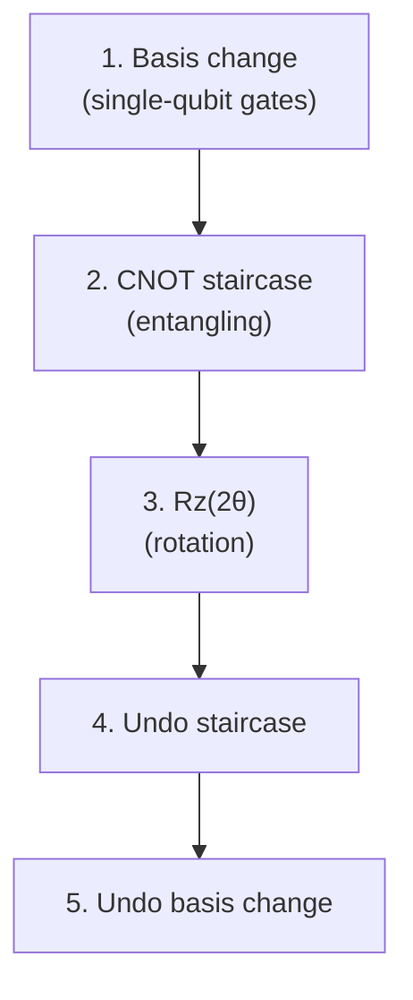
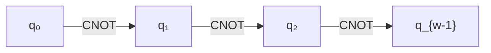

# Chapter 15: The CNOT Staircase

_Every Pauli rotation becomes a sequence of elementary gates. This chapter shows exactly how — and connects the dots from encoding choice to circuit cost._

## In This Chapter

- **What you'll learn:** How $e^{-i\theta P}$ decomposes into basis-change gates, a CNOT chain, and an $R_z$ rotation. Why the cost is exactly $2(w-1)$ CNOTs. How to trace a complete decomposition for the $XXYY$ exchange term.
- **Why this matters:** This is where everything converges. Encoding choice (Chapter 7), tapering (Chapters 9–12), and Trotterization (Chapters 13–14) all reduce to one question: how many times do we run this staircase, and how tall is it?
- **Prerequisites:** Chapters 4 (gates), 13–14 (Trotter decomposition).

---

## The Big Picture

Recall from Chapter 4 the CNOT staircase formula: a Pauli rotation with weight $w$ costs $2(w-1)$ CNOT gates. We stated this without proof. Now let's see *why* — by building the decomposition step by step.

The intuition: a weight-$w$ Pauli rotation $e^{-i\theta P}$ applies a phase rotation that depends on the *collective parity* of $w$ qubits. No single qubit carries enough information — we need to temporarily entangle the $w$ qubits (using CNOTs) so that their joint parity lives on one qubit, apply the rotation there, and then disentangle. The "staircase" is the entangling chain.

---

## The Decomposition Recipe

A Pauli rotation $e^{-i\theta P}$ for a weight-$w$ Pauli string $P$ is implemented in three phases:

### Phase 1: Basis change

For each qubit position in $P$:
- If $P_j = X$: apply Hadamard ($H$) to convert X-basis to Z-basis
- If $P_j = Y$: apply $R_x(\pi/2)$ to convert Y-basis to Z-basis
- If $P_j = Z$ or $I$: no gate needed

After this step, all non-identity Pauli operators have been converted to $Z$.

### Phase 2: CNOT staircase

Chain CNOTs between the $w$ non-identity qubits:

This creates a parity computation: qubit $q_{w-1}$ now holds the XOR of all $w$ qubits' Z-values.

### Phase 3: Rz rotation

Apply $R_z(2\theta)$ to the last qubit in the chain. This imprints the rotation angle, conditioned on the collective parity.

### Phases 4–5: Uncompute

Reverse the CNOT staircase (same gates, reversed order), then reverse the basis-change gates. The total circuit is self-inverse up to the rotation.

---

## Gate Counts

| Component | Gates |
|:---|:---:|
| Basis change | $\leq w$ single-qubit gates |
| Forward CNOT staircase | $w - 1$ CNOTs |
| $R_z$ rotation | 1 single-qubit gate |
| Reverse CNOT staircase | $w - 1$ CNOTs |
| Undo basis change | $\leq w$ single-qubit gates |
| **Total CNOTs** | **$2(w-1)$** |
| **Total single-qubit** | **$\leq 2w + 1$** |

### Examples

| Pauli string | Weight $w$ | CNOTs | Single-qubit |
|:---:|:---:|:---:|:---:|
| $Z$ (single qubit) | 1 | 0 | 1 ($R_z$ only) |
| $ZZ$ | 2 | 2 | 1 |
| $XXYY$ | 4 | 6 | 9 |
| $ZZZZZZZZZ$ (weight 9) | 9 | 16 | 1 |

**Key insight:** CNOTs scale linearly with weight. This is why encoding choice matters — reducing the maximum Pauli weight from 100 (JW) to 5 (ternary tree) saves 190 CNOTs *per rotation*.

---

## Worked Example: XXYY Rotation

Decompose $e^{-i\theta\, X_0 X_1 Y_2 Y_3}$:

**Basis change:**
- Qubit 0: $X \to Z$ via Hadamard
- Qubit 1: $X \to Z$ via Hadamard
- Qubit 2: $Y \to Z$ via $R_x(\pi/2)$
- Qubit 3: $Y \to Z$ via $R_x(\pi/2)$

**After basis change:** the operation is now $e^{-i\theta\, Z_0 Z_1 Z_2 Z_3}$

**CNOT staircase:** CNOT(0→1), CNOT(1→2), CNOT(2→3)

**Rz:** $R_z(2\theta)$ on qubit 3

**Reverse CNOT staircase:** CNOT(2→3), CNOT(1→2), CNOT(0→1)

**Undo basis change:** $R_x(-\pi/2)$ on qubits 2,3; Hadamard on qubits 0,1

**Total:** 6 CNOTs + 9 single-qubit gates.

---

## Why This Makes Encoding Choice Concrete

The CNOT staircase turns the abstract concept of "Pauli weight" into a concrete gate count:

$$\text{CNOTs per Trotter step} = \sum_{k=1}^{L} 2(w_k - 1)$$

For the same molecule encoded differently:

| Encoding | Max $w_k$ | Typical CNOT cost/step |
|:---|:---:|:---:|
| Jordan–Wigner ($n=32$) | 32 | ~2000 |
| Bravyi–Kitaev ($n=32$) | 6 | ~500 |
| Ternary Tree ($n=32$) | 5 | ~400 |
| Tapered + TT ($n=29$) | 5 | ~340 |

The 6× ratio between JW and TT at $n=32$ is entirely due to the CNOT staircase — the same formula, the same chemistry, but dramatically different circuit depth.

---

## Key Takeaways

- Each Pauli rotation decomposes into basis change → CNOT staircase → $R_z$ → reverse.
- The CNOT count is exactly $2(w-1)$ per rotation, where $w$ is the Pauli weight.
- Total CNOTs per Trotter step: $\sum_k 2(w_k - 1)$ — the single most important number for circuit feasibility.
- Encoding choice and tapering both reduce $w_k$ and therefore CNOT cost.

---

**Previous:** [Chapter 14 — Trotterization in Practice](14-trotter-formulas.html)

**Next:** [Chapter 16 — Cost Analysis Across Encodings](16-cost-analysis.html)
