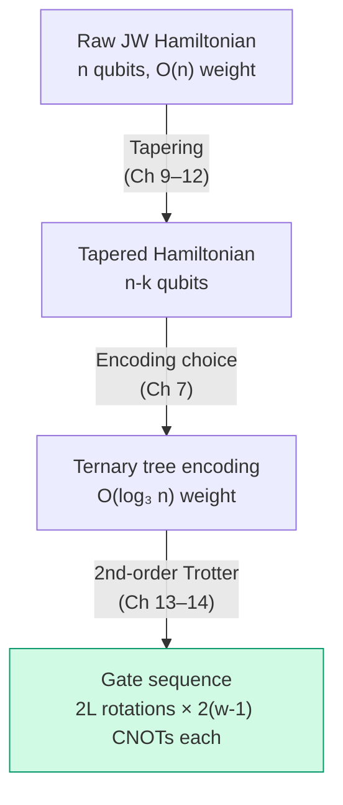

# Chapter 16: Cost Analysis Across Encodings

_Everything we've done — encoding, tapering, Trotterization — converges to one number: the CNOT count. This chapter computes it._

## In This Chapter

- **What you'll learn:** The complete CNOT cost for H₂ and H₂O across all five encodings, with and without tapering, and how the optimization stack compounds.
- **Why this matters:** This answers the practical question: "which encoding should I use for my molecule?" The answer depends on the system size, and the numbers tell the story.
- **Prerequisites:** Chapters 13–15 (Trotter decomposition and CNOT staircase).

---

## The Optimization Stack

Before we compute anything, here is the complete pipeline showing every optimization we've developed:

Each stage contributes multiplicatively:
- **Tapering** reduces qubit count by $k$, often reduces term count
- **Encoding choice** reduces worst-case weight from $O(n)$ to $O(\log n)$
- **Trotter order** trades rotations per step for error convergence rate

The order matters: **taper first** (on any encoding), then choose the encoding for the tapered system, then Trotterize.

---

## The Full Cost Formula

The total CNOT cost for one Trotter step is:

$$C_\text{CNOT} = \sum_{k=1}^{L} 2(w_k - 1)$$

where $L$ is the number of non-identity terms and $w_k$ is the Pauli weight of term $k$. For second-order Trotter, multiply by 2 (each term appears twice).

---

## H₂ (4 qubits, 15 terms)

| Encoding | Max weight | Avg weight | CNOTs/step (1st order) | CNOTs/step (2nd order) |
|:---|:---:|:---:|:---:|:---:|
| Jordan–Wigner | 4 | 2.1 | 36 | 72 |
| Bravyi–Kitaev | 4 | 2.4 | 40 | 80 |
| Parity | 4 | 2.3 | 38 | 76 |
| Balanced Binary | 4 | 2.3 | 38 | 76 |
| Balanced Ternary | 4 | 2.4 | 40 | 80 |

**Observation:** At 4 qubits, JW is actually the *cheapest*. The tree encodings have slightly higher average weight because the tree structure on 4 nodes doesn't provide enough room for the logarithmic advantage to manifest. This matches our observation from Chapter 6.

---

## H₂O (12 qubits, frozen core, STO-3G)

This is where the differences become real. H₂O has 7 spatial orbitals (with frozen core), giving 14 spin-orbitals — but we freeze 2 core electrons, leaving 12 active spin-orbitals = 12 qubits.

| Configuration | Qubits | Terms | Max weight | CNOTs/step |
|:---|:---:|:---:|:---:|:---:|
| JW, no tapering | 12 | ~630 | 12 | ~1800 |
| BK, no tapering | 12 | ~630 | 5 | ~750 |
| TT, no tapering | 12 | ~630 | 4 | ~600 |
| JW, tapered | 9 | ~420 | 9 | ~900 |
| TT, tapered | 9 | ~420 | 4 | ~500 |

**Key takeaway:** The ternary tree encoding with tapering gives ~3.6× fewer CNOTs than JW without tapering. For a 100-step Trotter simulation, that's 130,000 fewer CNOTs — potentially the difference between a feasible and an infeasible experiment on near-term hardware.

---

## Scaling to Larger Molecules

| Molecule | Spin-orbitals | JW CNOTs/step | TT CNOTs/step | Ratio |
|:---|:---:|:---:|:---:|:---:|
| H₂ | 4 | 36 | 40 | 0.9× |
| LiH | 12 | ~1200 | ~500 | 2.4× |
| H₂O | 14 | ~1800 | ~600 | 3× |
| N₂ | 20 | ~5000 | ~1200 | 4.2× |
| FeMo-co | ~100 | ~500,000 | ~20,000 | ~25× |

The ratio grows monotonically because JW's worst-case weight scales as $O(n)$ while TT's scales as $O(\log_3 n)$. At FeMo-co scale (~100 orbitals), the 25× CNOT reduction from encoding choice alone is transformative.

---

## Key Takeaways

- For small molecules ($n \leq 6$), encoding choice barely matters. JW is often cheapest.
- For medium molecules ($n = 12$–$20$), ternary tree encoding saves 3–5× CNOTs over JW.
- For large molecules ($n \sim 100$), the savings are ~25× — potentially enabling experiments that would otherwise be infeasible.
- The complete optimization stack is: **taper → encode → Trotterize**. Each stage compounds multiplicatively.
- The CNOT count is the single most important feasibility metric for near-term quantum simulation.

## Common Mistakes

1. **Encoding before tapering.** Taper first — the encoding then operates on a smaller qubit count, which can change which encoding is optimal.

2. **Comparing encodings at $n = 4$.** The differences are negligible at small $n$. Scale to $n \geq 12$ to see real savings.

3. **Ignoring the time step.** CNOT count per step is only half the story — the number of Trotter steps (determined by $\Delta t$ and $\lVert H \rVert_1$) multiplies everything.

## Exercises

1. **H₂ by hand.** Verify the 36-CNOT figure for H₂ first-order Trotter by summing $2(w_k - 1)$ over all 14 non-identity terms.

2. **Tapering impact.** If tapering removes 3 qubits from a 14-qubit system and reduces the term count from 630 to 420, estimate the CNOT savings assuming average weight drops from 4 to 3.

3. **Run it.** Use the companion script `book/code/ch07-five-encodings.fsx` to compute the weight scaling table for $n = 4, 8, 16, 32, 64$. At what $n$ does the ternary tree first beat JW?

---

**Previous:** [Chapter 15 — The CNOT Staircase](15-cnot-staircase.html)

**Next:** [Chapter 17 — OpenQASM Generation](17-openqasm.html)
