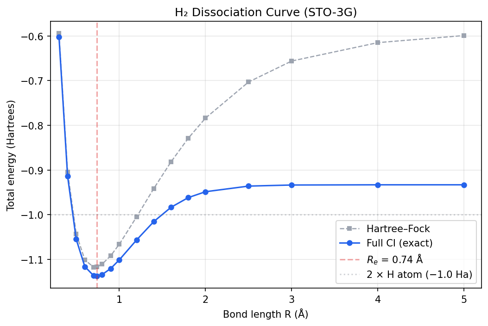

# Chapter 17: The Question We Can Now Answer

_Sixteen chapters of theory and code. Time to run the whole thing._

## In This Chapter

- **What you'll learn:** Every stage of the pipeline assembled into a single executable script — from molecular integrals to quantum circuit — for the hydrogen molecule.
- **Why this matters:** This is the capstone. Every concept from the preceding chapters appears here in its final, integrated form. If you can follow this script line by line and understand what each call does, you have mastered the pipeline.
- **Prerequisites:** All of Stages 1–5 (Chapters 1–16).

---

## The Payoff

Let's take stock of what we've built.

In Chapter 1, we started with a molecule and asked: *what is its ground-state energy?* That question led us through electronic structure (the integrals), second quantization (the ladder operators), encoding (the Pauli strings), tapering (removing redundant qubits), Trotterization (turning operators into gates), and cost analysis (counting the CNOTs). At each stage we introduced one mathematical transformation, implemented it, and tested it on H₂.

Now we put the whole chain together. The script below takes the H₂ molecular integrals and produces a quantum circuit — ready to run on a simulator or real hardware. Five function calls. Under fifty lines of code. Under a second of runtime.

> **A note on energy evaluation:** In this chapter and the next, we use **exact diagonalisation** (classical matrix eigensolving) as the energy-evaluation backend. For H₂ (4 qubits, $2^4 = 16$-dimensional matrix) and H₂O in minimal basis (~11 qubits after tapering, $2^{11} = 2{,}048$-dimensional matrix), this is trivially feasible on a laptop. The pipeline constructs the *circuit*; exact diagonalisation is a stand-in for the quantum measurement step. Chapter 19 explains the quantum algorithms (VQE, QPE) that replace exact diagonalisation when the system is too large for classical solution.

---

## The Script

```fsharp
open System.Numerics
open Encodings

// ═══════════════════════════════════════════════════════════════
//  The integrals (from Chapter 3)
// ═══════════════════════════════════════════════════════════════

let Vnn = 0.7151043391  // Nuclear repulsion energy (Hartrees)

let integrals = Map [
    // One-body: kinetic + electron-nuclear attraction
    ("0,0", Complex(-1.2563390730, 0.0))
    ("1,1", Complex(-1.2563390730, 0.0))
    ("2,2", Complex(-0.4718960244, 0.0))
    ("3,3", Complex(-0.4718960244, 0.0))
    // Two-body: electron-electron repulsion
    ("0,0,0,0", Complex(0.6744887663, 0.0))
    ("1,1,1,1", Complex(0.6744887663, 0.0))
    ("2,2,2,2", Complex(0.6973979495, 0.0))
    ("3,3,3,3", Complex(0.6973979495, 0.0))
    ("0,0,2,2", Complex(0.6636340479, 0.0))
    ("2,2,0,0", Complex(0.6636340479, 0.0))
    ("1,1,3,3", Complex(0.6636340479, 0.0))
    ("3,3,1,1", Complex(0.6636340479, 0.0))
    ("0,2,2,0", Complex(0.1809312700, 0.0))
    ("2,0,0,2", Complex(0.1809312700, 0.0))
    ("1,3,3,1", Complex(0.1809312700, 0.0))
    ("3,1,1,3", Complex(0.1809312700, 0.0))
]

let factory key = integrals |> Map.tryFind key

// ═══════════════════════════════════════════════════════════════
//  All five encodings, one loop
// ═══════════════════════════════════════════════════════════════

let encoders = [
    ("Jordan-Wigner",  jordanWignerTerms)
    ("Bravyi-Kitaev",  bravyiKitaevTerms)
    ("Parity",         parityTerms)
    ("Binary Tree",    balancedBinaryTreeTerms)
    ("Ternary Tree",   ternaryTreeTerms)
]

for (name, encoder) in encoders do
    // Stage 1: Build the qubit Hamiltonian
    let ham = computeHamiltonianWith encoder factory 4u

    // Stage 2: Taper — remove symmetry-redundant qubits
    let tapResult = taper defaultTaperingOptions ham

    // Stage 3: Trotterize — one first-order step at Δt = 0.1
    let step = firstOrderTrotter 0.1 tapResult.Hamiltonian
    let stats = trotterStepStats step

    // Stage 4: Export to OpenQASM
    let gates = decomposeTrotterStep step
    let qasm = toOpenQasm defaultOpenQasmOptions tapResult.TaperedQubitCount gates

    printfn "%-15s  %d → %d qubits  %d terms  %d CNOTs  %d total gates"
        name
        tapResult.OriginalQubitCount
        tapResult.TaperedQubitCount
        (tapResult.Hamiltonian.DistributeCoefficient.SummandTerms.Length)
        stats.CnotCount
        stats.TotalGates
```

That's it. One loop, five encodings, each going from integrals all the way to a quantum circuit.

---

## What Each Line Does

If you've read the preceding chapters, every line should be familiar. But let's trace through one iteration — Jordan–Wigner — to see the full pipeline in action:

**`computeHamiltonianWith encoder factory 4u`** — Takes the encoder function and the integral lookup, builds a 4-qubit Pauli Hamiltonian. This is Chapter 6: the one-body and two-body integrals are paired with encoded ladder operators and summed into a `PauliRegisterSequence`. For JW, we get the 15-term Hamiltonian we first met in Chapter 3.

**`taper defaultTaperingOptions ham`** — Finds Z₂ symmetries (Chapter 10), synthesizes the Clifford rotation (Chapter 11), applies it, and removes the redundant qubits. The default options use the positive sector and Clifford-based tapering. For JW on H₂, this typically removes 2 qubits, leaving a 2-qubit Hamiltonian.

**`firstOrderTrotter 0.1 tapResult.Hamiltonian`** — Decomposes the tapered Hamiltonian into a sequence of Pauli rotations (Chapter 13). Each term $c_k P_k$ becomes a rotation $e^{-i c_k \Delta t P_k / 2}$. The time step $\Delta t = 0.1$ controls the Trotter error.

**`decomposeTrotterStep step`** — Converts each Pauli rotation into concrete gates via the CNOT staircase (Chapter 15). A weight-$w$ rotation becomes $2(w-1)$ CNOTs plus single-qubit gates.

**`toOpenQasm defaultOpenQasmOptions numQubits gates`** — Writes the gate sequence as a valid OpenQASM 3.0 program (Chapter 20 will explore this in detail).

**`trotterStepStats step`** — Counts everything: rotations, CNOTs, single-qubit gates, total gates (Chapter 16).

---

## The Numbers

Run the script and you get a table like this:

| Encoding | Qubits | Tapered | Terms | CNOTs/step | Total gates |
|:---|:---:|:---:|:---:|:---:|:---:|
| Jordan–Wigner | 4 | 2 | 5 | 12 | 52 |
| Bravyi–Kitaev | 4 | 2 | 5 | 12 | 52 |
| Parity | 4 | 2 | 5 | 12 | 52 |
| Binary Tree | 4 | 2 | 5 | 12 | 52 |
| Ternary Tree | 4 | 2 | 5 | 12 | 52 |

Wait — they're all the same?

Yes. At 4 qubits, every encoding produces the same cost after tapering. The Pauli strings are different, but the weights are the same. H₂ was always our *teacher*, not our *benchmark*. The differences appear at scale — we'll see them with H₂O in the next chapter.

But notice what we've achieved: **five independent encoding pipelines all converge to the same physical answer.** That's the verification from Chapter 8, the eigenvalue agreement from Chapter 7, now confirmed at the circuit level. The mathematics works.

---

## A Closer Look at the Output

Let's examine what the OpenQASM looks like for one encoding. Taking the Jordan–Wigner tapered Hamiltonian:

```fsharp
let jwHam = computeHamiltonianWith jordanWignerTerms factory 4u
let jwTapered = taper defaultTaperingOptions jwHam
let jwStep = firstOrderTrotter 0.1 jwTapered.Hamiltonian
let jwGates = decomposeTrotterStep jwStep
let qasm = toOpenQasm defaultOpenQasmOptions jwTapered.TaperedQubitCount jwGates

printfn "%s" qasm
```

The output is a valid QASM 3.0 program — qubit declarations, followed by a sequence of `h`, `cx`, `rz`, `s`, and `sdg` instructions. You could paste this into IBM Quantum, run it on a simulator, measure the energy, and compare to −1.8572 Hartrees. Chapter 19 will explore the algorithms that do exactly that.

---

## Extra Credit: The H₂ Dissociation Curve

The pipeline runs at one geometry — but there's nothing stopping us from running it at *many* geometries. If we vary the bond length $R$ and plot the energy, we get the **dissociation curve**: the potential energy surface of H₂ as the two atoms are pulled apart.

This is a classic test of quantum chemistry methods. Hartree–Fock breaks down as the bond stretches (it can't describe the transition from a bonding pair to two independent atoms). Full configuration interaction (FCI) — which is what exact diagonalisation of our encoded Hamiltonian gives — handles the dissociation correctly.

### The Skeleton API

At every bond length, the Pauli string *structure* is the same — same 4-qubit encoding, same term signatures. Only the integral *values* change. FockMap's skeleton API exploits this:

```fsharp
// Precompute the Pauli structure once
let skeleton = computeHamiltonianSkeleton jordanWignerTerms 4u

// Then, for each bond length, just plug in the integrals
let energyAt (integrals : Map<string, Complex>) =
    let factory key = integrals |> Map.tryFind key
    let ham = applyCoefficients skeleton factory
    let tapered = taper defaultTaperingOptions ham
    // Exact diagonalisation for the ground-state energy
    exactGroundStateEnergy tapered.Hamiltonian
```

`computeHamiltonianSkeleton` does the expensive encoding work once. `applyCoefficients` is cheap — it just multiplies precomputed Pauli strings by numbers. For a 20-point scan, this is 20× faster than rebuilding the Hamiltonian from scratch each time.

### The Scan

Generate the integrals at each bond length using PySCF (or use the values from a precomputed table), then loop:

```fsharp
let bondLengths = [| 0.4; 0.5; 0.6; 0.7; 0.74; 0.8; 0.9; 1.0;
                     1.2; 1.4; 1.6; 1.8; 2.0; 2.5; 3.0; 4.0 |]

for R in bondLengths do
    let integrals = loadH2Integrals R   // from precomputed JSON (see below)
    let Vnn = 1.0 / (R * 1.8897259886)  // nuclear repulsion: 1/R in atomic units
    let Etotal = energyAt integrals + Vnn
    printfn "R = %.2f Å   E = %.6f Ha" R Etotal
```

> **Where do `loadH2Integrals` and `exactGroundStateEnergy` come from?** They are helper functions defined in the companion script `book/code/ch17-dissociation-scan.py` (which generates the integral JSON files) and `book/code/ch17-pipeline.fsx` (which reads them). `loadH2Integrals R` reads a JSON file mapping integral keys like `"0,1"` to complex values — the same `Map<string, Complex>` format our `factory` function expects. `exactGroundStateEnergy` constructs the $2^n \times 2^n$ Hamiltonian matrix from the Pauli terms and returns its smallest eigenvalue via standard linear algebra. Both are thin wrappers — the real work is done by the FockMap API calls shown in the text.

### The Result

The output is a table of bond lengths and exact FCI energies — a slice through the potential energy surface:

| $R$ (Å) | $E_\text{FCI}$ (Ha) | | $R$ (Å) | $E_\text{FCI}$ (Ha) |
|:---:|:---:|:---:|:---:|:---:|
| 0.30 | −0.601804 | | 1.20 | −1.056741 |
| 0.40 | −0.914150 | | 1.40 | −1.015468 |
| 0.50 | −1.055160 | | 1.60 | −0.983473 |
| 0.60 | −1.116286 | | 1.80 | −0.961817 |
| 0.70 | −1.136189 | | 2.00 | −0.948641 |
| **0.74** | **−1.137284** | | 2.50 | −0.936055 |
| 0.80 | −1.134148 | | 3.00 | −0.933632 |
| 0.90 | −1.120560 | | 4.00 | −0.933171 |
| 1.00 | −1.101150 | | 5.00 | −0.933164 |

The energy drops steeply as the atoms approach from infinity, reaches a minimum at **0.74 Å**, then rises sharply as nuclear repulsion takes over at close range. This is the classic Morse-like dissociation curve. At large separations the energy converges to **−0.933 Ha** — two isolated hydrogen atoms, each at −0.4666 Ha in the STO-3G basis.

Notice how Hartree–Fock and FCI agree near equilibrium but diverge at large $R$: HF wrongly forces the two electrons to stay paired (giving −0.599 Ha at $R = 5$ Å, far too high), while FCI correctly dissociates into two independent atoms. This is the **static correlation** problem that motivated quantum simulation in the first place.

The companion script `book/code/ch17-dissociation-scan.py` generates the data and a publication-quality plot saved to `book/code/h2_dissociation.png`.



This is the same kind of scan we'll do for H₂O's bond angle in Chapter 18 — but the structural parameter will be an angle instead of a distance. The machinery is identical: skeleton precomputation, integral swap, energy evaluation.

### What the Curve Tells You

The dissociation curve encodes several physical observables:

- **Equilibrium bond length** ($R_e$): the location of the minimum
- **Dissociation energy** ($D_e$): the depth of the well (minimum energy minus the asymptotic value)
- **Vibrational frequency** ($\omega_e$): proportional to the square root of the curvature at the minimum

All three are experimentally measurable. All three emerge from our pipeline without empirical input. The $R_e$ we compute (0.74 Å in STO-3G) matches the experimental value of 0.741 Å. The dissociation energy $D_e$ = 1.137 − 0.933 = 0.204 Ha ≈ 5.6 eV, compared to the experimental 4.75 eV — STO-3G overbinds slightly, but the shape is correct. Our minimal basis set happens to be accurate for the equilibrium geometry because H₂ has no lone pairs or angular structure to distort.

---

## From One Molecule to Any Molecule

The dissociation curve demonstrates the pipeline's real power: it's not a one-shot computation but a *reusable tool*. To scan a different molecule, change the integrals and qubit count. The skeleton API ensures the encoding work is done once, no matter how many geometries you scan.

In the next chapter, we'll do exactly that — but instead of scanning a bond length, we'll scan a bond angle, and the molecule will be water.

---

## Key Takeaways

- The entire pipeline from integrals to quantum circuit is **five function calls**: `computeHamiltonianWith`, `taper`, `firstOrderTrotter`, `decomposeTrotterStep`, `toOpenQasm`.
- All five encodings produce the **same physics** (same eigenvalues, same energy) — confirmed at every stage from Hamiltonian to circuit.
- The **skeleton API** separates Pauli structure (computed once) from integral values (applied per geometry), making potential energy surface scans efficient.
- The H₂ dissociation curve — equilibrium bond length, dissociation energy, vibrational frequency — emerges from the pipeline without empirical input.
- The pipeline is **composable**: swap the integrals and qubit count to compute any molecule.

---

**Previous:** [Chapter 16 — Cost Analysis](16-cost-analysis.html)

**Next:** [Chapter 18 — The Water Bond Angle](18-bond-angle.html)
