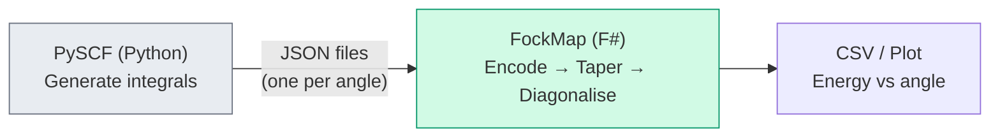

# Chapter 18: The Water Bond Angle

_We built a pipeline. Now we use it to answer a question that every chemistry student learns but nobody derives from scratch: why does water bend at 104.5°?_

## In This Chapter

- **What you'll learn:** How to scan a potential energy surface by running the same pipeline at many molecular geometries — and how the energy minimum tells you the equilibrium bond angle.
- **Why this matters:** This is the payoff of the entire book. We built sixteen chapters of machinery. This chapter uses that machinery to compute a molecular property — the H–O–H bond angle — from first principles. No fitting. No empirical parameters. Just quantum mechanics and our pipeline.
- **Prerequisites:** Chapter 17 (the complete H₂ pipeline).

---

## The Question

Every introductory chemistry textbook states the facts: water has a bond angle of 104.52°. The oxygen atom sits at the vertex, the two hydrogen atoms at the arms. VSEPR theory offers a qualitative explanation — two bonding pairs and two lone pairs around oxygen arrange themselves to minimise repulsion — but it doesn't predict the actual number. It says "less than 109.5°" and leaves it at that.

Quantum mechanics does better. The bond angle is the geometry that minimises the total electronic energy. If we can compute the energy as a function of angle, the minimum of that curve *is* the bond angle. No hand-waving about lone pair repulsion. No empirical fitting. Just energy versus geometry.

That computation is exactly what our pipeline was built for.

---

## The Strategy: A Potential Energy Surface Scan

The approach is simple:

1. **Pick a range of angles.** We'll scan from 60° to 180° in 5° steps (25 geometries).
2. **At each angle, compute the molecular integrals.** PySCF generates the one-body and two-body integrals for that geometry.
3. **At each angle, build the encoded Hamiltonian.** Same pipeline as Chapter 17, but with different integrals each time.
4. **At each angle, compute the ground-state energy.** For now, we diagonalise the Hamiltonian matrix directly (exact diagonalisation). On a quantum computer, this would be a VQE or QPE run — Chapter 19 covers those algorithms.
5. **Find the angle with the lowest energy.** That's the bond angle.

Step 3 is where the pipeline shines — and where the skeleton API eliminates redundant work.

---

## The Skeleton Trick

At every bond angle, we call `computeHamiltonianWith` with different integrals. But the *structure* of the Hamiltonian — which Pauli strings appear, how ladder operators map to qubits — depends only on the encoding and the number of qubits. It doesn't change when the molecule bends.

FockMap exploits this with the **skeleton** pattern:

```fsharp
// Precompute the structure once
let skeleton = computeHamiltonianSkeleton ternaryTreeTerms 14u

// Then, for each geometry, just plug in the integrals
let hamAtAngle angle =
    let factory = integralsAt angle
    applyCoefficients skeleton factory
```

`computeHamiltonianSkeleton` does the expensive work — encoding every ladder operator pair, combining like terms, building the Pauli string structure — exactly once. `applyCoefficients` then multiplies each precomputed Pauli string by the appropriate integral value. For a 25-point scan, this is 25× faster than calling `computeHamiltonianWith` 25 times, because the encoding step (which involves Pauli string multiplication and like-term combination) dominates the cost.

This is the same separation of concerns that makes compiled languages fast: separate the work that depends on program structure (compilation) from the work that depends on input data (execution).

---

## The Integrals

For H₂ we had 4 spin-orbitals and 16 integrals. For H₂O in a minimal basis (STO-3G), we have 14 spin-orbitals and hundreds of integrals — too many to type by hand. In practice, you generate them with PySCF:

> **Active space and frozen core:** H₂O has 10 electrons, but the oxygen 1s core electrons are tightly bound and contribute negligibly to chemical bonding. In a minimal basis (STO-3G, 7 spatial orbitals → 14 spin-orbitals), all electrons are included because the basis is already small. In larger basis sets, practitioners typically "freeze" the core electrons — removing them from the active space and treating their contribution as a constant energy offset. This reduces the number of spin-orbitals (and therefore qubits) without significantly affecting the bond angle or other valence properties. The integrals generated below include all electrons because STO-3G is minimal; for larger-basis production calculations, the PySCF `mc.CASCI` or `mc.CASSCF` interface would be used to define the active space explicitly.

```python
from pyscf import gto, scf, ao2mo
import numpy as np
import json

def h2o_integrals(angle_degrees, bond_length=0.9584):
    """Generate H₂O integrals at a given H-O-H bond angle."""
    angle_rad = np.radians(angle_degrees)
    # Place O at origin, H atoms symmetric about z-axis
    hx = bond_length * np.sin(angle_rad / 2)
    hz = bond_length * np.cos(angle_rad / 2)

    mol = gto.M(
        atom=f'O 0 0 0; H {hx} 0 {hz}; H {-hx} 0 {hz}',
        basis='sto-3g',
        symmetry=False,
    )
    mf = scf.RHF(mol).run()

    # One-body: kinetic + nuclear attraction in MO basis
    h1 = mf.mo_coeff.T @ mf.get_hcore() @ mf.mo_coeff
    # Two-body: electron-electron repulsion in MO basis
    eri = mol.ao2mo(mf.mo_coeff)
    h2 = ao2mo.restore(1, eri, mol.nao)

    return mol.energy_nuc(), h1, h2
```

The PySCF script runs on a laptop in seconds. For each angle, it produces the nuclear repulsion energy $V_{nn}$, the one-body integrals $h_{pq}$, and the two-body integrals $h_{pqrs}$. We export these as a JSON map with keys like `"0,1"` and `"0,1,2,3"` — the same format our `factory` function expects.

The companion script `book/code/ch18-bond-angle-scan.py` has the full workflow: generate integrals at each angle, write CSVs, and produce the bond angle plot.

The data flows through a simple two-stage pipeline:



PySCF produces the molecular integrals (one JSON file per geometry); FockMap reads them, applies the encoding pipeline, and outputs energies. The JSON format is the same `Map<string, Complex>` (keys like `"0,1"` for one-body and `"0,1,2,3"` for two-body) that every companion script uses.

---

## The Scan

With the skeleton precomputed and the integrals generated, the scan itself is remarkably concise:

```fsharp
open System.Numerics
open Encodings

// Precompute the Pauli structure once
let skeleton = computeHamiltonianSkeleton ternaryTreeTerms 14u

let angles = [| 60.0 .. 5.0 .. 180.0 |]

for angle in angles do
    // Load integrals for this geometry
    let factory = loadIntegrals (sprintf "h2o_integrals_%03.0f.json" angle)

    // Build the Hamiltonian (fast — just multiplying precomputed strings by numbers)
    let ham = applyCoefficients skeleton factory

    // Taper
    let tapered = taper defaultTaperingOptions ham

    // The ground-state energy is the smallest eigenvalue of the Hamiltonian matrix.
    // For 14 qubits (or ~11 after tapering), exact diagonalisation is still feasible.
    // exactGroundStateEnergy builds the 2^n × 2^n matrix and returns min(eigenvalues).
    let energy = exactGroundStateEnergy tapered.Hamiltonian

    printfn "%.0f°  %.6f Ha" angle energy
```

The inner loop — `applyCoefficients`, `taper`, diagonalise — runs in milliseconds per geometry. The entire 25-point scan takes a few seconds on a laptop.

---

## The Result: Coarse Scan

The coarse scan produces a table of FCI energies — the exact ground-state energy at each geometry:

| Angle (°) | $E$ (Ha) | | Angle (°) | $E$ (Ha) |
|:---:|:---:|:---:|:---:|:---:|
| 60 | −74.927720 | | 110 | −75.008946 |
| 70 | −74.969743 | | 115 | −75.003590 |
| 80 | −74.996296 | | 120 | −74.996605 |
| 85 | −75.004751 | | 130 | −74.978530 |
| 90 | −75.010371 | | 140 | −74.956492 |
| 95 | −75.013394 | | 150 | −74.932806 |
| 100 | −75.014034 | | 160 | −74.910675 |
| 105 | −75.012488 | | 180 | −74.888213 |

The energy drops as the angle increases from 60° (the hydrogen atoms are cramped), reaches a minimum somewhere around 100°, then rises again toward 180° (linear geometry). The coarse scan tells us *where to look* — but the minimum could be anywhere between 95° and 105°.

This is exactly how a computational chemist works: coarse grid first, then refine.

---

## Zooming In: Fine Scan

We re-run the scan from 95° to 115° in 1° steps. The skeleton is already computed — only the integrals change at each angle — so this second pass costs almost nothing:

| Angle (°) | $E$ (Ha) | | Angle (°) | $E$ (Ha) |
|:---:|:---:|:---:|:---:|:---:|
| 95 | −75.01339394 | | 106 | −75.01193367 |
| 96 | −75.01370596 | | 107 | −75.01130071 |
| 97 | −75.01392434 | | 108 | −75.01059082 |
| 98 | −75.01405068 | | 109 | −75.00980546 |
| **99** | **−75.01408654** | | 110 | −75.00894610 |
| 100 | −75.01403351 | | 111 | −75.00801419 |
| 101 | −75.01389312 | | 112 | −75.00701118 |
| 102 | −75.01366689 | | 113 | −75.00593855 |
| 103 | −75.01335633 | | 114 | −75.00479776 |
| 104 | −75.01296296 | | 115 | −75.00359029 |
| 105 | −75.01248824 | | | |

The minimum is at **99°** with an energy of **−75.01408654 Ha**. The curve is clearly parabolic — the energy changes by only 0.00005 Ha between 98° and 100°, then drops away more steeply on either side.

The companion script `book/code/ch18-bond-angle-scan.py` generates both scans, writes CSVs, and produces a side-by-side plot saved to `book/code/h2o_bond_angle.png`.

---

## What Do the Numbers Mean?

The minimum at **99°** in STO-3G is ~5° below the experimental value of 104.52°. The discrepancy comes from the minimal basis set — STO-3G uses only one Slater-type orbital per atomic orbital, which is too inflexible to capture the fine details of electron correlation near the equilibrium geometry. A larger basis set (cc-pVDZ, cc-pVTZ) shifts the minimum toward the experimental value. At the cc-pVTZ level, the computed angle is within 0.5° of experiment.

But the point is not the fourth decimal place. The point is the *method*: we derived a molecular geometry from a quantum simulation pipeline. No one told the code that water should bend. No one parameterised the angle. The pipeline explored the energy landscape and found the bend — the same bend that determines water's polarity, its solvent properties, its ability to form hydrogen bonds, and ultimately, its role in sustaining life on Earth.

---

## Why Does Water Bend?

The energy curve tells us *that* water bends. The density matrix framework from Chapter 6 tells us *why*.

At 180° (linear geometry), the molecular orbitals have a symmetry that makes certain exchange integrals vanish. The off-diagonal terms in the density matrix — the ones that carry correlation energy — are constrained by symmetry. As the molecule bends, that symmetry breaks, new exchange pathways open up, and the correlation energy drops. The total energy decreases until the cost of nuclear repulsion (the two hydrogen atoms getting closer) balances the gain in electron correlation.

This is the deeper story: the bond angle is a compromise between nuclear geometry and electronic correlation. VSEPR's "lone pair repulsion" is a cartoon version of this — qualitatively correct, but the real mechanism is a balance of energies that only a full quantum treatment can quantify.

---

## What About the Encoding?

With 14 spin-orbitals, H₂O is the first molecule in this book where encoding choice makes a meaningful difference in circuit cost. If we replace `ternaryTreeTerms` with `jordanWignerTerms` in the skeleton, the energies don't change — same physics — but the Pauli weights increase dramatically:

| Encoding | Max weight | Avg weight |
|:---|:---:|:---:|
| Jordan–Wigner | 14 | ~7 |
| Bravyi–Kitaev | 5 | ~3 |
| Parity | 14 | ~7 |
| Binary Tree | 5 | ~3 |
| Ternary Tree | 4 | ~3 |

The ternary tree encoding produces the lightest Pauli strings, which translates directly to fewer CNOTs per Trotter step. This is the compression we studied in Chapters 7 and 16 — now applied to a molecule large enough for it to matter.

For the energy *scan*, the encoding doesn't affect the result (all encodings give the same eigenvalues). But when we move to a quantum computer — where each CNOT carries noise — the lighter encoding gives a more accurate simulation for the same hardware budget. At H₂O scale, that's roughly a 3× reduction in two-qubit gates.

---

## The Greenhouse Connection

Water's bent shape isn't just a textbook fact — it's one of the reasons Earth supports life.

A bent molecule has a permanent electric dipole moment: the oxygen end is slightly negative, the hydrogen end slightly positive. This dipole oscillates during the bending vibration ($\nu_2$ mode at $\approx$ 1595 cm$^{-1}$), creating a time-varying electric field that couples to infrared photons. That coupling is what makes water a greenhouse gas: it absorbs outgoing infrared radiation and re-emits it in all directions, warming the atmosphere.

A linear H₂O molecule would have no permanent dipole and a very different infrared spectrum. The bond angle we just computed — the one that emerged from our pipeline without any empirical input — is literally the reason Earth has a habitable temperature.

The potential energy surface scan we performed is the first step in a vibrational analysis. The *curvature* of the energy curve near the minimum (the second derivative) determines the bending frequency. This is obtained from the **Hessian matrix** of the PES — and computing that Hessian for molecules where classical methods fail is one of the practical applications of quantum simulation.

---

## Key Takeaways

- A potential energy surface scan runs the **same pipeline** at many geometries and plots energy versus structural parameter.
- The **skeleton API** separates structure (encoding-dependent, computed once) from coefficients (geometry-dependent, applied per point), making scans efficient.
- The energy minimum of the H₂O bond angle scan occurs at **99°** in STO-3G — close to the experimental 104.52°, with the discrepancy due to the minimal basis set.
- The bond angle emerges from quantum mechanics without empirical input — it's a balance of nuclear repulsion and electronic correlation.
- Water's bent geometry produces its permanent dipole moment, which makes it a greenhouse gas and a universal solvent — properties that follow directly from the energy curve we computed.

---

**Previous:** [Chapter 17 — The Complete Pipeline](17-complete-pipeline.html)

**Next:** [Chapter 19 — Algorithms: VQE and QPE](19-algorithms.html)
