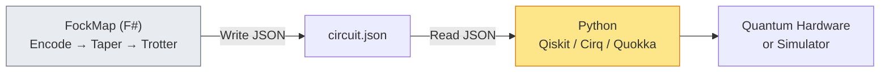

# Chapter 18: Python Bridge

_FockMap is an F# library. The quantum computing ecosystem is largely Python. This chapter bridges the gap._

## In This Chapter

- **What you'll learn:** How to export FockMap circuits as JSON and consume them from Python, with backends for Qiskit, Cirq, and Quokka.
- **Why this matters:** Most quantum hardware providers have Python SDKs. The Python bridge lets you use FockMap's symbolic pipeline for Hamiltonian construction and tapering, then switch to Python for execution.
- **Prerequisites:** Chapters 16–17 (circuit output concepts).

---

## The Architecture

FockMap runs as an F# process. The Python bridge uses a **JSON interchange format** — no network, no IPC, just a file:



### The JSON Format

```json
{
  "num_qubits": 4,
  "gates": [
    {"type": "h", "qubit": 0},
    {"type": "cx", "control": 0, "target": 1},
    {"type": "rz", "qubit": 1, "angle": 0.5},
    {"type": "cx", "control": 0, "target": 1},
    {"type": "h", "qubit": 0}
  ],
  "metadata": {
    "source": "FockMap",
    "encoding": "Jordan-Wigner",
    "trotter_order": 1,
    "time_step": 0.1,
    "molecule": "H2",
    "basis": "STO-3G"
  }
}
```

---

## F# Side: Exporting

```fsharp
let json = toCircuitJson 4 gates
writeCircuitJson "h2_circuit.json" 4 gates
```

The metadata is optional but useful for provenance tracking.

---

## Python Side: Importing

A companion Python package `fockmap` provides backend adapters:

```python
from fockmap import load_circuit, to_qiskit, to_cirq

# Load the circuit
circuit = load_circuit("h2_circuit.json")

# Convert to Qiskit
qc = to_qiskit(circuit)
print(qc.draw())

# Or Cirq
cirq_circuit = to_cirq(circuit)
print(cirq_circuit)

# Run a simulation
from qiskit_aer import AerSimulator
result = AerSimulator().run(qc).result()
```

### Quokka Integration

For the Australian Quokka quantum computing platform:

```python
from fockmap import to_quokka

quokka_circuit = to_quokka(circuit)
# Submit to Quokka hardware or simulator
```

The Quokka adapter depends on the Quokka SDK (installed separately).

---

## Workflow: Best of Both Worlds

The recommended workflow combines F#'s symbolic strength with Python's ecosystem:

| Step | Language | Why |
|:---|:---:|:---|
| Integral computation | Python (PySCF) | PySCF is the standard |
| Encoding + tapering | F# (FockMap) | Exact symbolic algebra, typed safety |
| Trotterization | F# (FockMap) | Gate decomposition with cost analysis |
| Circuit export | F# → JSON | Language-neutral interchange |
| Simulation / hardware | Python (Qiskit/Cirq/Quokka) | Access to all backends |

This is not a compromise — it uses each language for what it does best.

---

## Key Takeaways

- FockMap exports circuits as JSON — a universal interchange format.
- The `fockmap` Python package adapts JSON circuits to Qiskit, Cirq, and Quokka.
- The recommended workflow: F# for symbolic pipeline, Python for execution.
- No network or IPC needed — just a JSON file on disk.

---

**Previous:** [Chapter 17 — Q# Integration](17-qsharp.html)

**Next:** [Chapter 19 — The Complete Pipeline](19-complete-pipeline.html)
