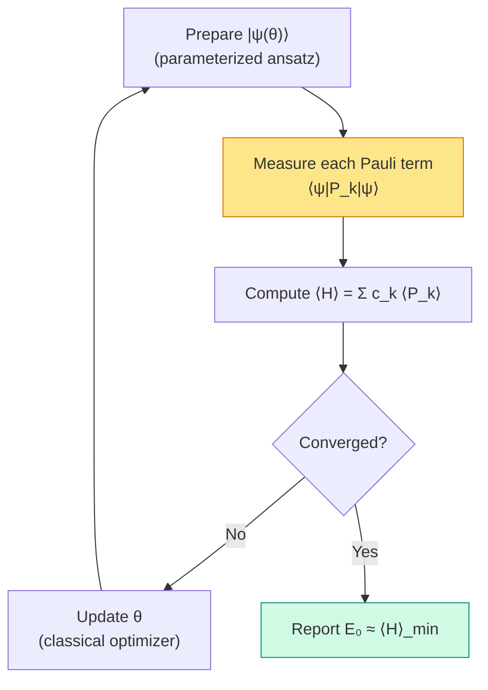

# Chapter 19: Algorithms — VQE and QPE

_Chapters 17 and 18 used exact diagonalisation as a stand-in energy oracle. This chapter replaces that stand-in with the quantum algorithms that run on real hardware._

## In This Chapter

- **What you'll learn:** How the two major quantum chemistry algorithms — VQE (variational, near-term) and QPE (phase estimation, fault-tolerant) — consume the encoded Hamiltonian, and what measurement infrastructure they require.
- **Why this matters:** FockMap produces the *input* to these algorithms. Understanding what the algorithms need helps you make better encoding and tapering choices — and understand why the CNOT counts from Chapter 16 matter so much.
- **Prerequisites:** Chapters 16–18 (cost analysis, pipeline, bond angle scan).

---

## Two Algorithms, One Input

In Chapters 17 and 18, we computed ground-state energies by exact diagonalisation — building the Hamiltonian as a matrix and finding its smallest eigenvalue classically. For H₂ ($2^4 = 16$-dimensional matrix) and H₂O in minimal basis ($2^{11} = 2{,}048$-dimensional after tapering), exact diagonalisation is trivially feasible on a laptop. But for larger systems — N₂ (20 qubits → $2^{20} \approx 10^6$) or FeMo-co (108 qubits → $2^{108} \approx 10^{32}$) — the matrix does not fit in any existing memory.

This is where quantum algorithms enter. Instead of building the exponentially large matrix, a quantum computer prepares the state directly in $n$ qubits and extracts the energy through measurement. The pipeline output — the Pauli Hamiltonian $\hat{H} = \sum_k c_k P_k$ — is exactly what these algorithms consume.

There are two main approaches, and they make very different demands on the hardware.

**VQE** (Variational Quantum Eigensolver) uses short circuits and many measurements. It's designed for *near-term* quantum computers — noisy devices with limited circuit depth but reasonable qubit counts. The quantum computer prepares a trial state and measures Pauli expectation values; a classical computer optimises the state parameters.

**QPE** (Quantum Phase Estimation) uses deep circuits and few measurements. It's designed for *fault-tolerant* quantum computers — devices with error correction, where circuit depth is not the bottleneck. The quantum computer extracts the ground-state energy directly via phase kickback.

Both algorithms consume the same object: a Pauli Hamiltonian $\hat{H} = \sum_k c_k P_k$ — exactly what our pipeline produces.

---

## VQE: The Near-Term Algorithm

### The Loop

VQE is fundamentally an optimisation loop. The quantum computer serves as a function evaluator — it takes parameters $\boldsymbol{\theta}$ and returns an energy estimate $\langle\hat{H}\rangle_\theta$. The classical computer adjusts $\boldsymbol{\theta}$ to minimize the energy.



The yellow box is where FockMap's output matters most. Measuring $\langle P_k \rangle$ for each Pauli term in the Hamiltonian requires a separate circuit — or, better, measuring several commuting terms simultaneously.

### Measurement Grouping

Not every Pauli term needs its own circuit. Two Pauli operators can be measured simultaneously if they **qubit-wise commute** — that is, if they commute on every individual qubit position. For example, $ZI$ and $ZZ$ qubit-wise commute (both have $Z$ or $I$ at each position), so a single $Z$-basis measurement of all qubits yields both expectation values.

FockMap groups the Hamiltonian terms automatically:

```fsharp
let program = groupCommutingTerms hamiltonian
printfn "Total terms: %d" program.TotalTerms
printfn "Measurement groups: %d" program.GroupCount
```

For the 15-term H₂ Hamiltonian, this typically produces 5 measurement groups — a 3× reduction in the number of distinct circuits needed.

The grouping matters because each distinct circuit must be run many times (to accumulate statistics), and each additional group multiplies the total measurement time. Fewer groups = faster VQE iterations.

### Shot Counts

Each measurement gives a binary outcome ($\pm 1$). To estimate the expectation value $\langle P_k \rangle$ to precision $\delta$, you need approximately $1/\delta^2$ repetitions ("shots"). The total shot count for estimating $\langle\hat{H}\rangle$ to energy precision $\epsilon$ is:

$$N_\text{shots} \sim \frac{1}{\epsilon^2}\left(\sum_k \lvert c_k\rvert\right)^2$$

The sum $\sum_k |c_k|$ is called the **1-norm** of the Hamiltonian, and it determines the measurement cost. This estimate assumes each Pauli term is measured independently (or in qubit-wise commuting groups) and that the dominant error source is finite sampling. In practice, correlated measurement strategies (classical shadows, derandomisation) can improve the scaling, but the 1-norm estimate provides a useful and widely-cited baseline (Wecker et al., Phys. Rev. A 92, 042303, 2015).

Tapering reduces this norm (fewer terms, smaller coefficients), which is yet another benefit that compounds with the qubit reduction.

```fsharp
let shots = estimateShots 0.0016 hamiltonian  // chemical accuracy = 1.6 mHa
printfn "Estimated shots for chemical accuracy: %d" shots
```

For H₂: $\sum|c_k| \approx 3.7$ Ha, giving ~5 million shots at chemical accuracy. For H₂O: the 1-norm is larger, and the shot count grows accordingly. This is the practical bottleneck of VQE — not circuit depth, but measurement overhead.

### Where FockMap Fits

FockMap's contribution to VQE is everything *before* the measurement loop:

1. **The Hamiltonian** $\{c_k, P_k\}$ — the list of Pauli terms and coefficients
2. **The measurement program** — which terms to group and measure together
3. **The shot budget** — how many measurements each group needs
4. **The Trotter circuit** — used as the ansatz or as part of the state preparation

The actual VQE loop — parameter optimisation, circuit execution, shot collection — is handled by execution frameworks like Qiskit, Cirq, or Quokka. FockMap produces the input they consume.

---

## QPE: The Fault-Tolerant Algorithm

### The Idea

QPE doesn't optimise — it *reads out* the ground-state energy directly, like a quantum spectrometer. The key insight: if we can implement the time-evolution operator $e^{-i\hat{H}t}$ as a quantum circuit, then phase kickback extracts the eigenvalue.

This is where Trotterization becomes essential. The operator $e^{-i\hat{H}t}$ is approximated by a product of Pauli rotations — exactly the Trotter step from Chapter 13. QPE applies this operation repeatedly, controlled by ancilla qubits, and reads the energy from the ancilla register.

### The Circuit

The QPE circuit has two registers. The **ancilla register** ($m$ qubits, initialised to $\lvert 0\rangle$, each put into superposition with a Hadamard gate) controls repeated applications of the time-evolution operator on the **system register** (which holds the trial state $\lvert\psi\rangle$):

1. Ancilla qubit $j$ controls the application of $U^{2^j}$ to the system register, where $U = e^{-i\hat{H}t}$ is one Trotter step.
2. After all controlled operations, an inverse QFT on the ancilla register converts the accumulated phases into a binary representation of the energy eigenvalue.
3. Measuring the ancilla register yields $m$ bits of the energy.

The controlled-$U^{2^j}$ operation applies $2^j$ Trotter steps — so the highest ancilla qubit controls $2^{m-1}$ steps. This is where the circuit depth comes from — and why QPE demands fault-tolerant hardware.

The cost is dominated by the controlled Trotter steps. Each step requires the same gates as a regular Trotter step (Chapter 15), plus control logic — roughly doubling the CNOT count per step.

### Resource Estimation

For a target energy precision $\epsilon$:

- **System qubits**: $n$ (from the encoding, after tapering)
- **Ancilla qubits**: $m = \lceil\log_2(1/\epsilon)\rceil$ (one bit per digit of precision)
- **Trotter steps per controlled-$U$**: enough to keep the Trotter error below $\epsilon$

```fsharp
let resources = qpeResources 10 hamiltonian 0.1
printfn "System qubits:  %d" resources.SystemQubits
printfn "Ancilla qubits: %d" resources.AncillaQubits
printfn "Total CNOTs:    %d" resources.TotalCnots
printfn "Circuit depth:  %d" resources.CircuitDepth
```

For H₂ at chemical accuracy (~10 bits of precision):
- System: 2–4 qubits (depending on tapering)
- Ancilla: 10 qubits
- Total: ~14 qubits, ~10,000 CNOTs

For H₂O at chemical accuracy:
- System: ~11 qubits (after tapering)
- Ancilla: 10 qubits
- Total: ~21 qubits, ~500,000 CNOTs

The 50× jump from H₂ to H₂O is driven by two factors: more qubits (more terms, heavier strings) and more Trotter steps (to keep the error small for a larger Hamiltonian norm). This is why encoding choice and tapering matter — they reduce both factors.

---

## VQE vs QPE: A Summary

| | VQE | QPE |
|:---|:---|:---|
| **Hardware** | Near-term (noisy) | Fault-tolerant |
| **Circuit depth** | Short (one ansatz layer) | Deep (many Trotter steps) |
| **Measurements** | Many ($\sim 10^6$ shots) | Few (one readout) |
| **Classical cost** | Optimisation loop | QFT + readout |
| **Bottleneck** | Shot count, barren plateaus | Circuit depth, error correction |
| **FockMap provides** | Hamiltonian + measurement groups | Hamiltonian + Trotter circuits |

For the bond angle scan in Chapter 18, we used exact diagonalisation to obtain the same target quantity that an ideal QPE calculation would produce: the ground-state energy at each geometry. On real near-term hardware, you would use VQE at each angle, accumulating enough shots to estimate the energy to chemical accuracy. The structure of the scan is the same; only the energy-evaluation subroutine changes.

---

## The Measurement Program in Practice

Let's look at the measurement infrastructure for H₂ in detail. The 15-term Hamiltonian groups into measurement bases:

```fsharp
let ham = computeHamiltonianWith jordanWignerTerms h2Factory 4u
let program = groupCommutingTerms ham

for i in 0 .. program.Bases.Length - 1 do
    let basis = program.Bases.[i]
    printfn "Group %d: %d terms  (basis: %s)"
        (i + 1)
        basis.Terms.Length
        (basis.BasisRotation |> Array.map string |> String.concat "")
```

A typical grouping might look like:

| Group | Terms | Measurement basis |
|:---:|:---:|:---|
| 1 | 5 | ZZZZ (computational basis) |
| 2 | 3 | XXXX |
| 3 | 3 | XXYY |
| 4 | 2 | YXXY |
| 5 | 2 | YYXX |

Group 1 contains all the diagonal (Z-only) terms — they can all be measured in the standard computational basis. The off-diagonal groups each require basis rotations (Hadamard and S gates) before measurement.

This is the bridge between FockMap's algebraic output and the experimental reality of a quantum computer: each group becomes a circuit variant, each circuit runs thousands of times, and the statistics are combined to estimate the energy.

---

## What FockMap Does — and What It Doesn't

FockMap's scope ends at circuit generation. It is important to be clear about what lies *outside* that scope:

- **Ansatz design**: VQE requires a parameterized circuit (ansatz). FockMap does not design ansätze — it provides Trotter circuits and Pauli operator pools that downstream tools (Qiskit, tket, PennyLane) can use as building blocks.
- **Classical optimisation**: the VQE optimisation loop (choosing $\boldsymbol{\theta}$, handling barren plateaus, selecting an optimizer like L-BFGS or COBYLA) is handled by the execution framework, not FockMap.
- **Hardware execution**: submitting circuits to real devices, managing job queues, handling device calibration — all downstream.
- **Error mitigation**: ZNE, PEC, symmetry verification — these operate on measurement outcomes and are handled by execution frameworks. (FockMap's tapering symmetries are useful *inputs* to symmetry verification, but FockMap doesn't implement the mitigation itself.)
- **Noise modelling**: hardware noise interacts with both Trotter error and measurement error. FockMap's cost estimates are for *ideal* (noiseless) circuits; real performance depends on device characteristics.

> **Barren plateaus**, briefly: as the number of qubits grows, randomly initialized VQE ansätze tend to produce cost function landscapes where the gradient vanishes exponentially — a phenomenon called a barren plateau. This is a fundamental challenge for VQE at scale, and it is one reason why adaptive methods (ADAPT-VQE) and physically motivated ansätze (e.g., UCCSD) are preferred over hardware-efficient random circuits.

---

## Key Takeaways

- **VQE** uses FockMap's Hamiltonian for measurement-based energy estimation. Fewer Pauli terms and lower 1-norm (from tapering) directly reduce the shot count.
- **QPE** uses FockMap's Trotter circuits for phase estimation. Lower CNOT counts (from encoding choice) directly reduce the circuit depth.
- **Measurement grouping** reduces the number of distinct circuits by combining qubit-wise commuting terms. FockMap does this automatically.
- Both algorithms consume the same input — the Pauli Hamiltonian — but make different demands on the hardware. Encoding and tapering choices help both.

---

**Previous:** [Chapter 18 — The Water Bond Angle](18-bond-angle.html)

**Next:** [Chapter 20 — Speaking the Hardware's Language](20-circuit-export.html)
