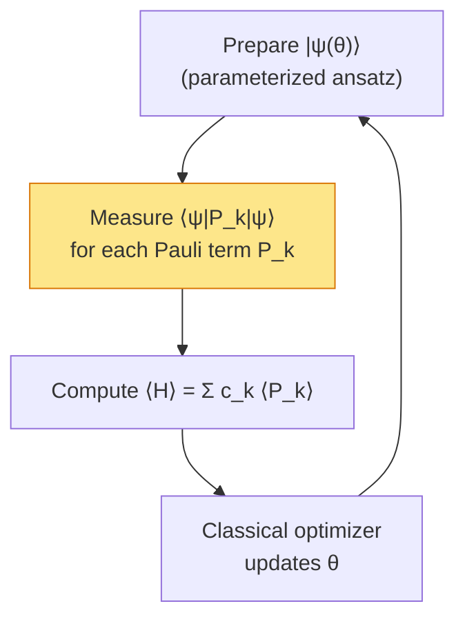
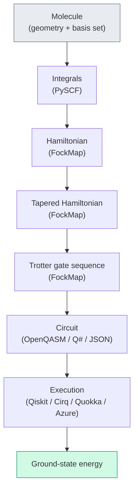

# Chapter 22: VQE, QPE, and Beyond

_The Hamiltonian is encoded, tapered, Trotterized, and exported. Now what? This chapter connects the pipeline to the quantum algorithms that use it._

## In This Chapter

- **What you'll learn:** How VQE and QPE consume the encoded Hamiltonian, what measurement programs look like, and what resource estimation tells you about hardware requirements.
- **Why this matters:** FockMap produces the *input* to quantum algorithms. Understanding what the algorithms need helps you make better encoding and tapering choices.
- **Prerequisites:** Chapters 12–18 (Trotterization and circuit output).

---

## Variational Quantum Eigensolver (VQE)

VQE is the near-term algorithm: short circuits, classical optimization, tolerant of noise.

### How it works



1. Prepare a parameterized quantum state $\lvert\psi(\boldsymbol{\theta})\rangle$
2. Measure each Pauli term $P_k$ separately to estimate $\langle P_k \rangle$
3. Compute $\langle\hat{H}\rangle = \sum_k c_k \langle P_k \rangle$
4. Classical optimizer adjusts $\boldsymbol{\theta}$ to minimize $\langle\hat{H}\rangle$
5. Repeat until convergence

### Where FockMap fits

FockMap provides step 2's measurement program:
- The list of Pauli terms $\{P_k\}$ and their coefficients $\{c_k\}$
- **Measurement grouping**: Pauli terms that qubit-wise commute can be measured simultaneously, reducing the number of distinct circuits
- **Shot allocation**: terms with larger $\lvert c_k\rvert$ need more measurement shots for the same precision

```fsharp
let program = groupCommutingTerms hamiltonian
printfn "Groups: %d (from %d terms)" program.GroupCount program.TotalTerms
// E.g., 15 terms → 5 measurement groups
```

### Shot counts

The total number of measurement shots needed for energy precision $\epsilon$:

$$N_\text{shots} \sim \frac{1}{\epsilon^2}\left(\sum_k \lvert c_k\rvert\right)^2$$

For H₂ ($\sum \lvert c_k\rvert \approx 3.7$ Ha) at chemical accuracy ($\epsilon = 1.6 \times 10^{-3}$ Ha):

$$N_\text{shots} \approx \frac{3.7^2}{(1.6 \times 10^{-3})^2} \approx 5 \times 10^6 \text{ shots}$$

Tapering reduces $\sum\lvert c_k\rvert$ (fewer and lighter terms), which reduces shot count. This is yet another benefit of tapering that compounds with qubit reduction.

---

## Quantum Phase Estimation (QPE)

QPE is the fault-tolerant algorithm: deeper circuits, but exponentially faster than any classical alternative.

### How it works

QPE applies controlled time-evolution $e^{-i\hat{H}t}$ to extract eigenvalues directly via phase kickback. The precision is determined by the number of ancilla qubits: $m$ ancilla bits give $m$ bits of energy precision.

### Resource estimation

For a target energy precision $\epsilon$:

$$\text{System qubits} = n \quad \text{(from the encoding)}$$
$$\text{Ancilla qubits} = \lceil\log_2(1/\epsilon)\rceil$$
$$\text{Trotter steps} \approx \frac{\lVert\hat{H}\rVert \cdot t}{\epsilon^{1/p}} \quad \text{(order-}p\text{ Trotter)}$$

```fsharp
let resources = qpeResources precisionBits hamiltonian timeStep
printfn "System qubits: %d" resources.SystemQubits
printfn "Ancilla qubits: %d" resources.AncillaQubits
printfn "Total CNOTs: %d" resources.TotalCnots
```

For H₂ at chemical accuracy:
- System: 4 qubits (or 2–3 after tapering)
- Ancilla: ~10 qubits
- Total: ~14 qubits, ~10,000 CNOTs

For H₂O at chemical accuracy:
- System: 12 qubits (or ~9 after tapering)
- Ancilla: ~10 qubits
- Total: ~22 qubits, ~500,000 CNOTs

---

## What Comes After This Book

The pipeline we've built — integrals → encoding → tapering → Trotterization → circuit output — is the foundation. Several extensions are natural next steps:

### Near-term extensions
- **Circuit optimization:** Gate cancellation, commutation-based reordering, template matching. FockMap currently produces unoptimized gate sequences; transpilation tools (Qiskit, tket) can reduce depth further.
- **Error mitigation:** Zero-noise extrapolation, probabilistic error cancellation. These operate on the circuit output and don't change the Hamiltonian construction.
- **Adaptive ansätze:** ADAPT-VQE, qubit-ADAPT, where the ansatz is grown operator by operator. FockMap's Pauli-level representation is ideal for this.

### Longer-term directions
- **Bosonic simulation:** FockMap already supports bosonic ladder operators and three bosonic-to-qubit encodings. Extending the pipeline to vibronic (electron-phonon) Hamiltonians is a natural application.
- **Lattice models:** Hubbard, Heisenberg, and other condensed-matter models use the same second-quantized framework. The encoding and tapering infrastructure applies directly.
- **Quantum error correction:** Logical qubit encodings for fault-tolerant computation are a different kind of "encoding" — but the algebraic tools (stabiliser groups, Clifford circuits) are the same ones we used for tapering.

---

## The Full Pipeline: One Last Look



Every box in this diagram has been covered in this book. Every arrow is a function call in FockMap (or a JSON handoff to Python). The pipeline is real, tested, and open-source.

---

## Key Takeaways

- **VQE** measures each Pauli term separately; grouping commuting terms reduces the number of circuits; tapering reduces shot counts.
- **QPE** uses controlled Trotter steps; resource requirements grow with system size and target precision.
- FockMap's role ends at circuit generation — the algorithms and execution are handled by downstream platforms (Qiskit, Q#, Quokka).
- The same pipeline applies to any fermionic or bosonic system — not just molecules.

---

**Previous:** [Chapter 20 — Scaling](20-scaling.html)

**Back to:** [Table of Contents](foreword.html)
