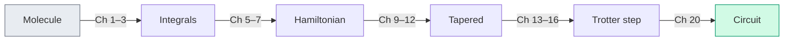

# Chapter 22: What Comes Next

_The pipeline is complete. The book is almost over. But the field is just getting started._

## In This Chapter

- **What you'll learn:** What lies beyond this book — the extensions, open problems, and emerging directions that build on the foundation we've laid.
- **Why this matters:** A pipeline is only as useful as the questions it can answer. This chapter maps out where those questions lead.
- **Prerequisites:** The whole book (but especially Chapters 17–21).

---

## What We Built

Let's take a final inventory. Over twenty-one chapters, we constructed a complete pipeline:

Every arrow is a function call in FockMap. Every box has been tested on H₂ and applied to H₂O. The pipeline is real, open-source, and published on NuGet.

But a pipeline is an instrument, not a destination. Here's where the instrument gets used.

---

## Near-Term Extensions

### Circuit Optimisation

FockMap currently produces *unoptimised* gate sequences — each Pauli rotation becomes a CNOT staircase exactly as described in Chapter 15. Real quantum compilers (Qiskit's transpiler, Cambridge Quantum's tket, BQSKit) apply additional transformations:

- **Gate cancellation**: adjacent CNOT pairs cancel. Identity-equivalent sequences are removed.
- **Commutation-based reordering**: Pauli rotations that commute can be reordered to bring cancellable gates adjacent.
- **Template matching**: known circuit identities replace expensive subcircuits with cheaper equivalents.
- **Hardware-aware routing**: map logical qubits to physical qubits, inserting SWAP gates as needed for limited connectivity.

These optimisations typically reduce CNOT count by 20–40% beyond what FockMap produces. They operate on the gate-level output (QASM, Q#, or JSON) and don't require changes to the Hamiltonian construction.

### Error Mitigation

Near-term quantum computers are noisy. Error mitigation techniques extract better estimates from noisy circuits without the overhead of full error correction:

- **Zero-noise extrapolation (ZNE)**: run the circuit at several artificial noise levels, then extrapolate to the zero-noise limit.
- **Probabilistic error cancellation (PEC)**: represent the ideal circuit as a linear combination of noisy circuits and sample the combination.
- **Symmetry verification**: post-select on measurement outcomes that satisfy known symmetries of the Hamiltonian (our tapering symmetries from Chapter 10 are ideal for this).

FockMap's contribution is the symmetry information: the Z₂ generators, Clifford rotations, and parity sectors from the tapering analysis provide exactly the symmetry constraints that verification-based mitigation needs.

### Adaptive Ansätze

VQE (Chapter 19) uses a fixed ansatz — a predetermined circuit structure with adjustable parameters. Adaptive methods grow the ansatz one operator at a time:

- **ADAPT-VQE**: at each iteration, select the Pauli operator from the Hamiltonian pool that gives the steepest energy gradient, add it to the ansatz, and re-optimise.
- **Qubit-ADAPT**: same idea, but using single-qubit and two-qubit operators instead of full Pauli strings.

FockMap's Pauli-level representation of the Hamiltonian provides the operator pool that ADAPT-VQE selects from. The encoding choice affects the pool — lighter Pauli strings make better ADAPT operators, which is another argument for ternary tree encoding at scale.

---

## Bosonic Simulation

FockMap already supports bosonic ladder operators and three bosonic-to-qubit encodings (unary, binary, Gray code — see the API documentation). The natural extension is **vibronic simulation**: mixed electron-phonon systems where both fermions and bosons are present.

Applications include:
- **Molecular vibrations**: the bond angle scan in Chapter 18 gives the equilibrium geometry; the *curvature* of the PES gives vibrational frequencies, and the vibrational wavefunctions determine infrared spectra.
- **Polaron physics**: electron-phonon coupling in materials science, where an electron "dressed" by lattice distortions has different effective mass and mobility.
- **Photochemistry**: conical intersections and non-adiabatic dynamics, where nuclear and electronic motion couple strongly.

The encoding pipeline for bosonic modes parallels the fermionic one: ladder operators → Pauli strings → Hamiltonian assembly. The main difference is that bosonic modes require a truncation parameter $d$ (the maximum occupation number per mode), and the encoding choice affects how many qubits each mode costs.

---

## Lattice Models

The second-quantised framework isn't limited to molecules. Lattice models in condensed matter physics use the same operator algebra:

- **Hubbard model**: electrons hopping on a lattice with on-site repulsion. The same ladder operators, the same encodings, the same tapering — different integrals.
- **Heisenberg model**: spin-spin interactions on a lattice. Already expressed in Pauli operators — no encoding step needed.
- **Fermi-Hubbard at half-filling**: a testing ground for quantum advantage, where classical methods (DMRG, QMC) have known limitations in 2D.

FockMap's encoding and tapering infrastructure applies directly to these systems. The Hamiltonian assembly step simplifies (lattice models have regular structure), but the downstream pipeline — Trotter decomposition, cost analysis, circuit export — is identical.

---

## Quantum Error Correction

The tapering machinery from Chapters 9–12 is, at its core, stabiliser theory: finding commuting Pauli operators that generate a symmetry group, and using Clifford rotations to diagonalise them. This is precisely the mathematical framework of quantum error-correcting codes.

- **Stabiliser codes** (surface code, Steane code, etc.) encode logical qubits into physical qubits using a stabiliser group — a set of commuting Pauli operators whose simultaneous eigenspace defines the code space.
- **Syndrome measurement** detects errors by measuring the stabilisers, exactly as our tapering step measures the Z₂ generators.
- **Logical operators** act within the code space, just as our tapered Hamiltonian acts within the symmetry sector.

The algebra is the same. The difference is intent: tapering exploits physical symmetries to reduce qubit count, while error correction engineers artificial symmetries to detect and correct errors. A reader who has understood Chapters 9–12 has already learned half of quantum error correction theory.

---

## Open Problems

Some questions this book doesn't answer — because nobody has yet:

1. **Optimal encoding**: is there a provably optimal encoding for a given Hamiltonian? The ternary tree encoding achieves $O(\log_3 n)$ worst-case weight, which matches a known lower bound for balanced trees. But the best encoding might depend on the Hamiltonian's structure (sparsity, symmetry, locality), not just $n$.

2. **Tapering beyond Z₂**: our tapering removes symmetries that square to the identity (Z₂ symmetries). What about higher-order symmetries — U(1) particle number conservation, SU(2) spin symmetry? These could remove more qubits, but the Clifford rotation synthesis is harder.

3. **Trotter error bounds**: how many Trotter steps do you actually need? Tight error bounds for product formulas are an active area of research. Tighter bounds mean shorter circuits, which means earlier quantum advantage.

4. **Classical simulation limits**: where exactly does classical simulation become infeasible? DMRG and tensor network methods keep improving. The crossover point — where quantum simulation beats the best classical method — shifts with every algorithmic advance on both sides.

---

## The Pipeline Is Ready

We'll end where we began. Chapter 1 asked: *given a molecule, what is its ground-state energy?* Twenty-one chapters later, we have a complete, tested, open-source pipeline that answers the question — for any fermionic or bosonic system, with five encoding options, symmetry-based tapering, first and second-order Trotterization, and export to every major quantum platform.

The pipeline runs on a laptop for small molecules (H₂, LiH). It produces circuits that near-term hardware can attempt for medium molecules (H₂O, N₂). And it generates the circuits that fault-tolerant hardware will need for the molecules that actually matter (FeMo-co, transition-metal catalysts, photochemical systems).

The H₂ dissociation curve in Chapter 17 showed the pipeline's correctness. The water bond angle scan in Chapter 18 showed its predictive power — we computed a molecular geometry from first principles. The same machinery, with bigger integrals and more qubits, will someday compute the geometry of a catalyst, the spectrum of a photoactive molecule, or the mechanism of nitrogen fixation.

The quantum computer isn't ready yet. The pipeline is.

---

## Key Takeaways

- **Circuit optimisation**, **error mitigation**, and **adaptive ansätze** build directly on FockMap's output.
- **Bosonic simulation** extends the same pipeline to electron-phonon systems, vibrations, and photochemistry.
- **Lattice models** use the same operator algebra and encoding infrastructure.
- **Quantum error correction** uses the same stabiliser theory as tapering — different intent, same mathematics.
- The pipeline works at every scale. The bottleneck is hardware, not software.

---

**Previous:** [Chapter 21 — Scaling: From H₂ to FeMo-co](21-scaling.html)

**Back to:** [Table of Contents](foreword.html)
