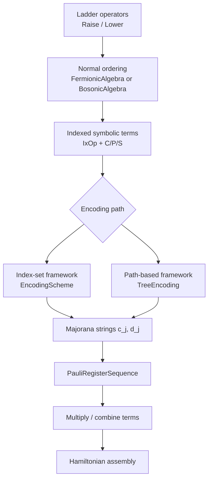

# FockMap Architecture Guide

This guide explains how FockMap is organized so you can quickly locate the right layer for custom encodings, symbolic rewrites, and Hamiltonian assembly.

## Architecture at a Glance

| Layer | Core Types / Modules | Responsibility |
|---|---|---|
| Symbolic terms | `C<'T>`, `P<'T>`, `S<'T>` in `Terms.fs` | Build and normalize symbolic operator expressions |
| Normal ordering | `LadderOperatorSumExpr<'Algebra>` in `LadderOperatorSequence.fs` | Apply CAR/CCR rewrite rules |
| Algebra semantics | `FermionicAlgebra`, `BosonicAlgebra` in `CombiningAlgebra.fs` | Define swap/sign/identity behavior |
| Fermion→qubit mapping | `EncodingScheme`, `TreeEncoding` | Produce Majorana and ladder encodings |
| Pauli representation | `PauliRegister`, `PauliRegisterSequence` | Exact symbolic Pauli arithmetic |
| Hamiltonian assembly | `Hamiltonian.fs` | Build qubit Hamiltonians from integrals |

## End-to-End Pipeline



## Two Encoding Frameworks

FockMap supports two complementary frameworks that converge to the same output type (`PauliRegisterSequence`).

### 1) Index-Set Framework

`EncodingScheme` defines three functions:

```fsharp
type EncodingScheme =
    { Update     : int -> int -> Set<int>
      Parity     : int -> Set<int>
      Occupation : int -> Set<int> }
```

This framework captures Jordan-Wigner, Bravyi-Kitaev (via Fenwick structure), and Parity as small value-level definitions.

### 2) Path-Based Tree Framework

`TreeEncoding` constructs encodings from labeled rooted trees (X/Y/Z links and legs), then derives Majorana strings from root-to-leg paths.

### When to Use Which

| Use case | Best fit |
|---|---|
| Canonical JW/BK/Parity definitions | Index-set |
| Custom tree topologies | Path-based |
| Balanced ternary for minimal asymptotic weight | Path-based |
| Small explicit set-function experimentation | Index-set |

## Why Both Frameworks Exist

The index-set derivation assumes a monotonicity condition on ancestor indexing. That holds for some structures (for example Fenwick-like forms) but not for all balanced trees. Path-based encoding removes that structural restriction while preserving the same downstream symbolic representation.

## Symbolic Core (No Matrix Construction)

FockMap keeps the pipeline symbolic end-to-end:

- `PauliRegister` stores a Pauli string plus exact phase/coefficient.
- `PauliRegisterSequence` stores sums of such terms.
- Multiplication uses exact Pauli multiplication rules with phase tracking.

This avoids constructing large $2^n \times 2^n$ matrices and keeps intermediate forms inspectable and testable.

## Algebra Layer: CAR and CCR

Normal ordering is algebra-pluggable through `ICombiningAlgebra`:

- `FermionicAlgebra` enforces CAR rewrites.
- `BosonicAlgebra` enforces CCR rewrites.

The term model is shared; only rewrite semantics change.

## Mixed-Sector Workflows

For mixed bosonic/fermionic expressions, use sector-tagged operators and mixed normal ordering:

1. partition terms by sector,
2. apply CAR in fermionic blocks,
3. apply CCR in bosonic blocks,
4. continue with the same symbolic and encoding pipeline.

See the [Mixed Registers guide](mixed-registers.md) for workflow details.

## Practical Navigation

| If you want to... | Start here |
|---|---|
| Add a new encoding via sets | `MajoranaEncoding.fs`, `Encodings.fs` |
| Add a custom tree-based encoding | `TreeEncoding.fs` |
| Change rewrite semantics | `CombiningAlgebra.fs` |
| Inspect symbolic arithmetic | `Terms.fs`, `PauliRegister.fs` |
| Build encoded Hamiltonians | `Hamiltonian.fs` |
