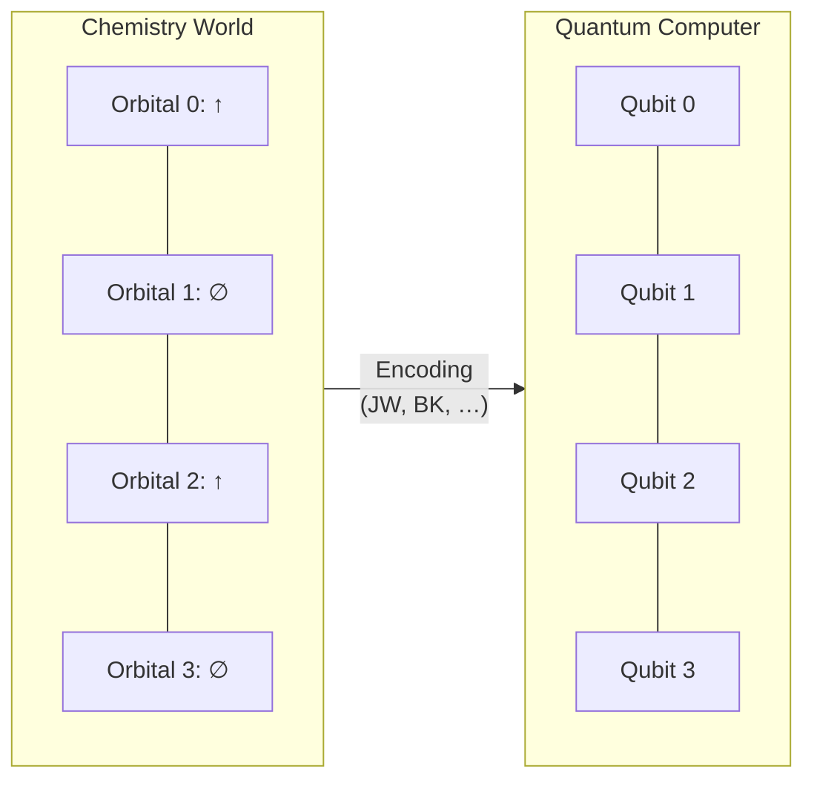
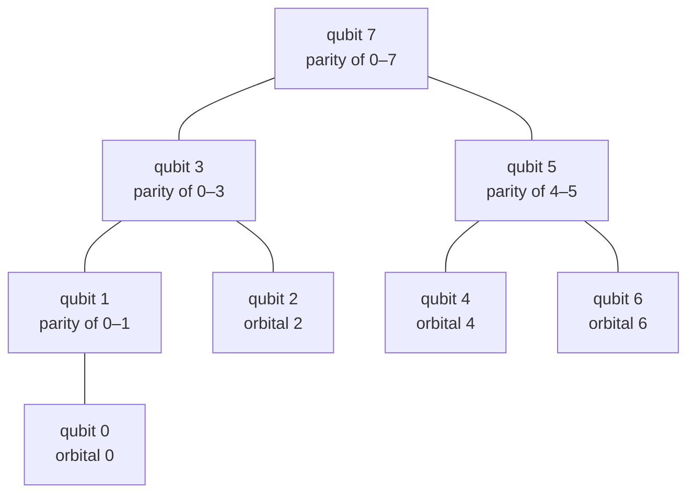
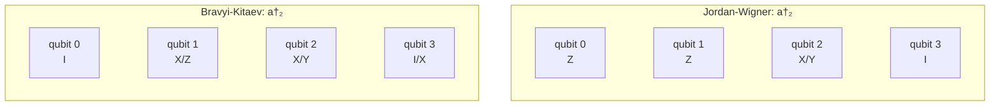
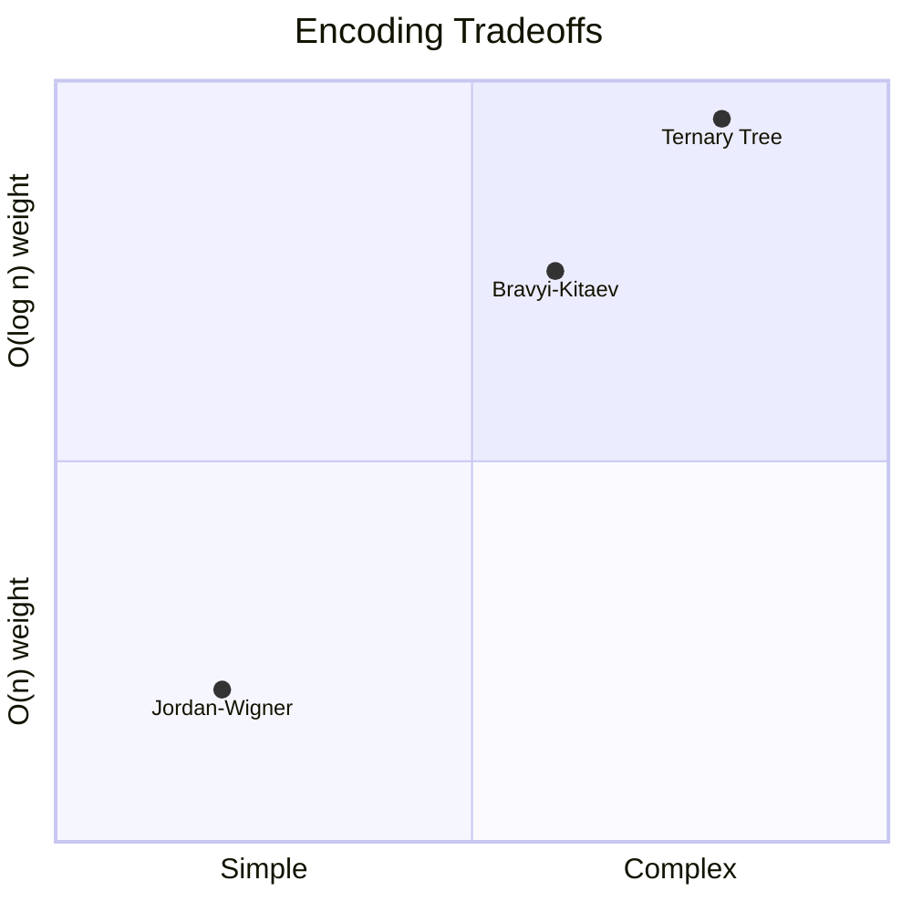
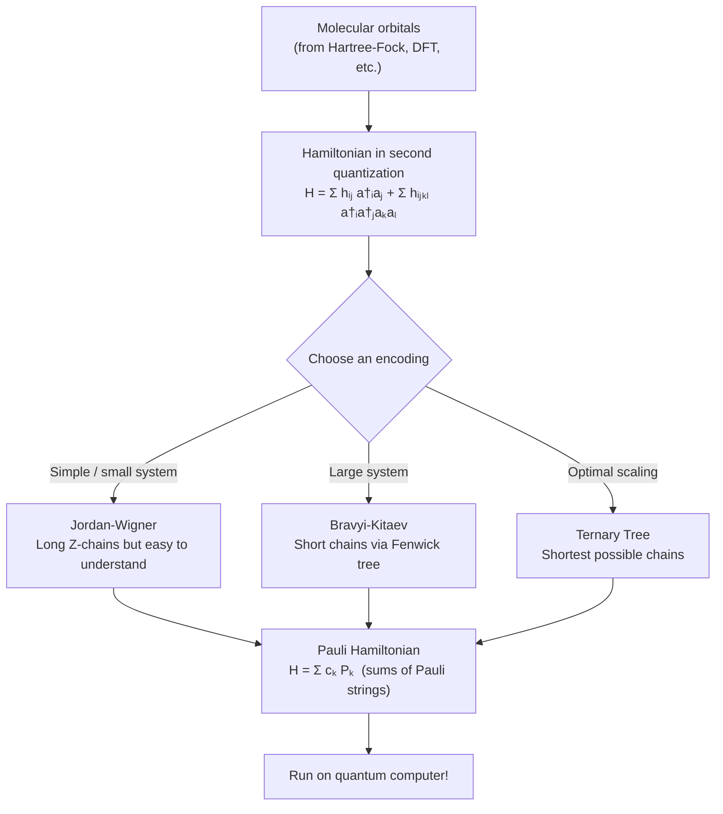

# A Visual Guide to Fermion-to-Qubit Encodings

*For chemists and scientists who know orbitals but not quantum computing.*

---

## The Problem in One Picture

In chemistry you think about **electrons in orbitals**.
A quantum computer only has **qubits** (two-level switches: 0 or 1).

To simulate a molecule on a quantum computer, we must translate the language of orbitals and electrons into the language of qubits and gates. That translation is called a **fermion-to-qubit encoding**.



**Why can't we just say "occupied orbital = qubit 1"?**
Because electrons are *fermions*: swapping two of them flips a minus sign in the quantum state. Qubits don't do that naturally. The encoding must inject those minus signs for us.

---

## Quick Review: What Makes Electrons Special

You already know the **Pauli exclusion principle**: no two electrons can share the same quantum state. This follows from a deeper rule—the **antisymmetry** of fermions.

Imagine two electrons, one in orbital A and one in orbital B. The combined state isn't simply "A and B." It must be antisymmetric:

$$
|\psi\rangle = \frac{1}{\sqrt{2}}\bigl(|A, B\rangle - |B, A\rangle\bigr)
$$

Swap the two electrons and the state picks up a **minus sign**. This sign affects interference, bonding energies, and reaction rates—it's not optional bookkeeping, it's physics.

A valid encoding must faithfully reproduce these minus signs on the quantum computer.

---

## How We Represent Occupations

Throughout this guide, we'll use a 4-orbital system as our running example. An **occupation vector** lists which orbitals have an electron:

```
Orbitals:     0    1    2    3
              ↑    ∅    ↑    ∅
Occupation:  [1,   0,   1,   0]
```

The notation $|1010\rangle$ means orbitals 0 and 2 are occupied, orbitals 1 and 3 are empty.

---

## Jordan-Wigner: The Straightforward Way

### The Idea

Jordan-Wigner (JW), from 1928, is the simplest encoding. Each qubit directly stores the occupation of one orbital:

```
    Orbital    →   Qubit
       0       →     0     (stores occupation of orbital 0)
       1       →     1     (stores occupation of orbital 1)
       2       →     2     (stores occupation of orbital 2)
       3       →     3     (stores occupation of orbital 3)
```

That part is easy. The hard part is handling the minus signs.

### The "Z-Chain": Enforcing Fermion Signs

When we create an electron in orbital $j$, the operation is not just "flip qubit $j$ from 0 to 1." We first need to check how many electrons are in the orbitals *below* $j$ (orbitals $0, 1, \ldots, j{-}1$). If that count is odd, we must apply a minus sign.

Jordan-Wigner achieves this by attaching a chain of $Z$ operators to every creation/annihilation:

```
Creating an electron in orbital j:

    qubit 0   qubit 1   ...   qubit j-1   qubit j
    ┌─────┐   ┌─────┐         ┌─────┐     ┌──────┐
    │  Z  │───│  Z  │── ··· ──│  Z  │─────│ flip │
    └─────┘   └─────┘         └─────┘     └──────┘
    ◄────── "Z-chain" ──────►

    Each Z reads ±1 depending on whether that orbital
    is occupied. The product gives the correct sign.
```

The $Z$ gate acts like a parity detector:
- On an empty orbital (qubit in state $|0\rangle$): $Z$ gives $+1$
- On an occupied orbital (qubit in state $|1\rangle$): $Z$ gives $-1$

So the chain of $Z$ gates multiplies out the **parity** (even/odd count of electrons below orbital $j$), which is exactly the fermion sign.

### Visual: JW for a 4-Orbital System

Here's how creating an electron in each orbital looks with Jordan-Wigner:

```
Create in orbital 0:   [flip][ I  ][ I  ][ I  ]    weight: 1
Create in orbital 1:   [ Z  ][flip][ I  ][ I  ]    weight: 2
Create in orbital 2:   [ Z  ][ Z  ][flip][ I  ]    weight: 3
Create in orbital 3:   [ Z  ][ Z  ][ Z  ][flip]    weight: 4

              I = do nothing     Z = check parity
```

**The problem is visible**: the Z-chain grows linearly. For orbital $j$, we need $j$ extra Z operations. In a molecule with 100 orbitals, creating an electron in the last orbital requires a chain of 99 Z gates.

On a quantum computer, longer chains mean more gates, more noise, and more errors.

### When JW Shines

Despite the growing chain, JW is great when interactions are **local** (between neighboring orbitals). A "hopping" term moving an electron from orbital 2 to orbital 3 only needs a short chain:

```
Hop 2 → 3:    [ I  ][ I  ][flip][flip]    weight: 2  ✓ Short!
Hop 0 → 3:    [flip][ Z  ][ Z  ][flip]    weight: 4  ✗ Long chain
```

For 1D chains of atoms or molecules with sequential orbital numbering, JW is often the best choice.

---

## Bravyi-Kitaev: The Logarithmic Shortcut

### The Key Insight

Instead of asking "check every orbital below me," what if some qubits pre-computed **partial parity sums**? Then you'd only need to read $O(\log n)$ qubits instead of $O(n)$.

This is exactly what Bravyi-Kitaev (BK) does, using a data structure from computer science called a **Fenwick tree** (binary indexed tree).

### How BK Stores Information

In JW, each qubit stores one orbital's occupation directly:

```
Jordan-Wigner storage:
  qubit 0 → occupation of orbital 0
  qubit 1 → occupation of orbital 1
  qubit 2 → occupation of orbital 2
  qubit 3 → occupation of orbital 3
  ...
```

BK is different. Some qubits store **partial parity sums**—the XOR of multiple orbital occupations:

```
Bravyi-Kitaev storage (8 orbitals):
  qubit 0 → orbital 0                          (just orbital 0)
  qubit 1 → orbital 0 ⊕ orbital 1              (parity of 0–1)
  qubit 2 → orbital 2                          (just orbital 2)
  qubit 3 → orbital 0 ⊕ 1 ⊕ 2 ⊕ 3             (parity of 0–3)
  qubit 4 → orbital 4                          (just orbital 4)
  qubit 5 → orbital 4 ⊕ orbital 5              (parity of 4–5)
  qubit 6 → orbital 6                          (just orbital 6)
  qubit 7 → orbital 0 ⊕ 1 ⊕ 2 ⊕ 3 ⊕ 4 ⊕ 5 ⊕ 6 ⊕ 7  (parity of all)

  ⊕ means XOR: 0⊕0=0, 0⊕1=1, 1⊕0=1, 1⊕1=0
```

The pattern comes from a tree:



This is a **Fenwick tree**. Every node stores the parity of the orbitals in its subtree. To find any prefix parity (orbitals 0 through $j{-}1$), you only need to read the nodes on the *path* from node $j$ up to the root—and that path has length at most $\log_2 n$.

### The Three Things BK Needs to Know

For each orbital $j$, the encoding needs three pieces of information:

| Question | JW Answer | BK Answer |
|---|---|---|
| **Parity**: Which qubits tell me the sign? | All qubits $0 \ldots j{-}1$ | $\leq\log_2 n$ qubits on the Fenwick path |
| **Update**: Which qubits must flip when I change orbital $j$? | Just qubit $j$ | $\leq\log_2 n$ ancestor qubits |
| **Occupation**: Which qubits tell me if orbital $j$ is occupied? | Just qubit $j$ | $\leq\log_2 n$ descendant qubits |

Every answer in BK involves at most $\log_2 n$ qubits. That's the magic.

### Visual: BK for an 8-Orbital System

Here's a side-by-side comparison. To create an electron in orbital 5 of an 8-orbital system:

```
Jordan-Wigner:
  qubit:  0    1    2    3    4    5    6    7
         [Z]  [Z]  [Z]  [Z]  [Z] [flip][ I ][ I ]     weight: 6

Bravyi-Kitaev:
  qubit:  0    1    2    3    4    5    6    7
         [ I ][ I ][ I ][Z↓] [Z↓][flip][ I ][X↑]      weight: 4

  Z↓ = parity check (read partial sum from Fenwick tree)
  X↑ = update ancestor (propagate the change up the tree)
```

The BK version is shorter! And the savings grow as the system gets larger:

| Orbitals ($n$) | JW worst-case weight | BK worst-case weight |
|:-:|:-:|:-:|
| 4 | 4 | 3 |
| 8 | 8 | 4 |
| 16 | 16 | 5 |
| 64 | 64 | 7 |
| 100 | 100 | 7 |
| 1000 | 1000 | 10 |

---

## Side-by-Side: The Same Molecule, Two Encodings

Let's encode the creation operator $a^\dagger_2$ ("create an electron in orbital 2") for a 4-orbital system:



**In formulas:**

Jordan-Wigner:

$$
a^\dagger_2 \;\mapsto\; \tfrac{1}{2}(ZZXI) \;-\; \tfrac{i}{2}(ZZYI)
$$

Bravyi-Kitaev:

$$
a^\dagger_2 \;\mapsto\; \tfrac{1}{2}(IXXI) \;-\; \tfrac{i}{2}(XZYI)
$$

Both are correct encodings—they produce the same physics. But JW always puts a Z on every qubit below the target, while BK spreads the work more evenly using the tree structure.

---

## Analogy: Library Cataloguing

Think of it like organising a library:

**Jordan-Wigner** is like putting all books on a single shelf in order. To figure out how many science books are before position 50, you count from the beginning: 1, 2, 3, … , 49. That's an $O(n)$ scan.

```
┌──┬──┬──┬──┬──┬──┬──┬──┬──┬──┐
│B1│B2│B3│B4│B5│B6│B7│B8│B9│…│
└──┴──┴──┴──┴──┴──┴──┴──┴──┴──┘
 ← count all of these to get parity → ■
```

**Bravyi-Kitaev** is like a library with section summaries. Each floor has a sign: "Floor 1: 12 science books." Each section on a floor has a sub-count. To find the count before position 50, you add up at most 3–4 summary signs. That's $O(\log n)$.

```
            ┌──────────────┐
            │ Building total│  ← 1 number covers everything
            └──────┬───────┘
         ┌─────────┴─────────┐
    ┌────┴────┐         ┌────┴────┐
    │ Floor 1 │         │ Floor 2 │    ← partial sums
    └────┬────┘         └────┬────┘
    ┌────┴───┐          ┌────┴───┐
  ┌─┴─┐   ┌─┴─┐      ┌─┴─┐   ┌─┴─┐
  │Sec│   │Sec│      │Sec│   │Sec│     ← individual data
  │ A │   │ B │      │ C │   │ D │
  └───┘   └───┘      └───┘   └───┘
```

---

## The Tradeoff at a Glance



| | Jordan-Wigner | Bravyi-Kitaev | Ternary Tree |
|---|:---:|:---:|:---:|
| **Worst-case weight** | $O(n)$ | $O(\log_2 n)$ | $O(\log_3 n)$ |
| **Conceptual simplicity** | ★★★ | ★★☆ | ★☆☆ |
| **Best for small systems** | ✓ | | |
| **Best for large systems** | | ✓ | ✓ |
| **1D / local Hamiltonians** | ✓ | | |
| **All-to-all connectivity** | | ✓ | ✓ |

---

## What About Number Operators? (Good News)

A common operation in chemistry is counting whether orbital $j$ is occupied: the **number operator** $n_j = a^\dagger_j a_j$.

Under *both* JW and BK, the number operator simplifies to involve only a few qubits (the Z-chains cancel in the product). For JW:

$$
n_j \;\mapsto\; \frac{1}{2}(I - Z_j)
$$

That's weight 1—just read qubit $j$! This is true regardless of how large the system is.

So while *creating* or *moving* electrons gets expensive with JW, simply *counting* them stays cheap. The encoding overhead only hits operations that change the fermion configuration.

---

## Putting It All Together



**The pipeline:**
1. Start with molecular integrals from standard chemistry software
2. Write the Hamiltonian using creation/annihilation operators
3. Pick an encoding to translate into qubit (Pauli) operators
4. Run quantum algorithms (VQE, QPE, etc.) on the encoded Hamiltonian

The encoding step is where JW, BK, and tree-based methods live. They all produce a valid Pauli Hamiltonian—they just differ in how many Pauli operators each term requires.

---

## Summary

| Concept | What it means |
|---|---|
| **Fermion sign problem** | Electrons pick up minus signs when swapped; qubits don't do this naturally |
| **Encoding** | A translation from electron operators to qubit operators that preserves the signs |
| **Jordan-Wigner** | One qubit per orbital, with a growing "Z-chain" to track signs. Simple but $O(n)$ cost. |
| **Bravyi-Kitaev** | Stores partial parity sums in a tree, so sign-checking costs only $O(\log n)$ |
| **Weight** | The number of qubits an encoded operator touches—lower is better for quantum hardware |
| **Number operators** | Counting electrons stays cheap ($O(1)$) in all encodings |

**Rule of thumb:** Use Jordan-Wigner for small molecules or 1D systems. Switch to Bravyi-Kitaev or tree encodings when the orbital count grows large or interactions are non-local.

---

*Next steps: Try encoding a real molecule in the [H₂ lab](../labs/02-h2-molecule.fsx) or compare encodings interactively in the [comparison lab](../labs/03-compare-encodings.fsx).*
