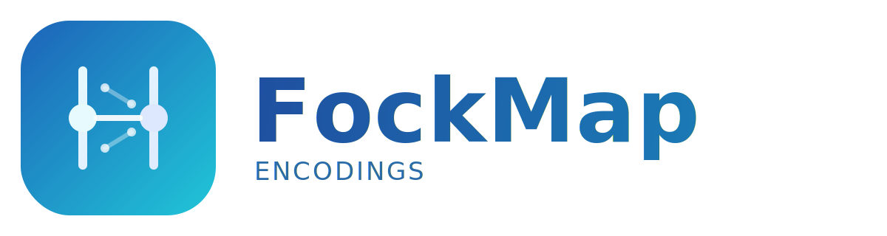

<p align="center">
	
</p>

A composable F# framework for the complete quantum simulation pipeline: operator algebra → encoding → tapering → Trotterization → circuit export.

> Encode, taper, Trotterize, and export quantum circuits from molecular integrals — with five fermionic encodings, three bosonic encodings, symbolic qubit tapering, and output to OpenQASM, Q#, and JSON. Zero dependencies.

## Install

```bash
dotnet add package FockMap
```

## Brand Assets

- [Primary logo (SVG)](content/img/fockmap-logo.svg)
- [Square icon (SVG)](content/img/fockmap-icon.svg)

## 30-Second Example

```fsharp
open Encodings

// Encode the creation operator a†₂ on 4 modes using Jordan-Wigner
let pauli = jordanWignerTerms Raise 2u 4u
// → ½(ZZXI) − ½i(ZZYI)

// Same operator under Bravyi-Kitaev (O(log n) weight)
let pauliBK = bravyiKitaevTerms Raise 2u 4u
```

## Why This Library?

| Feature | OpenFermion | Qiskit Nature | **FockMap** |
|---------|:-----------:|:------------:|:-----------:|
| Define a new encoding | ~200 lines | Not supported | **3–5 lines** |
| Tree → encoding pipeline | ❌ | ❌ | **✅** |
| Type-safe operator algebra | ❌ | ❌ | **✅** |
| Pure functional, zero mutation | ❌ | ❌ | **✅** |
| Symbolic CAR + CCR normal ordering | ❌ | Partial | **✅** |

## Available Encodings

| Encoding | Worst-Case Weight | Function |
|----------|:-----------------:|----------|
| Jordan-Wigner | $O(n)$ | `jordanWignerTerms` |
| Bravyi-Kitaev | $O(\log_2 n)$ | `bravyiKitaevTerms` |
| Parity | $O(n)$ | `parityTerms` |
| Balanced Binary Tree | $O(\log_2 n)$ | `balancedBinaryTreeTerms` |
| Balanced Ternary Tree | $O(\log_3 n)$ | `ternaryTreeTerms` |
| Vlasov (Complete Ternary) | $O(\log_3 n)$ | `vlasovTreeTerms` |

## Cross-Platform

Runs on **Windows**, **macOS**, and **Linux** via [.NET 10](https://dotnet.microsoft.com/) (LTS).
Written in [F#](https://fsharp.org/), fully open-source under the [F# Software Foundation](https://foundation.fsharp.org/) and the [.NET Foundation](https://dotnetfoundation.org/).

## Learn More

- **The Book:** [*From Molecules to Quantum Circuits*](https://github.com/johnazariah/encodings-book) — 22-chapter guide from molecular integrals to quantum circuits, with interactive labs and computed results (H₂ dissociation curve, H₂O bond angle scan)
- **API Cookbook:** [Library Cookbook](guides/cookbook/index.html) — every type and function, step by step
- **Library Internals:** [Architecture Guide](guides/architecture.html) — two-framework design
- **Cross-Platform:** [Running on Windows, macOS, Linux](guides/cross-platform.html)
- **API Reference:** [All types and functions](reference/index.html)

## Documentation

### API Cookbook
A step-by-step guide to every FockMap type and function.
- [Overview](guides/cookbook/index.html)
- [Building Expressions](guides/cookbook/02-building-expressions.html) — the `C`, `P`, `S` type hierarchy
- [Indexed Operators](guides/cookbook/03-indexed-operators.html) — `IxOp` and operator sequences
- [Creation & Annihilation](guides/cookbook/04-creation-annihilation.html) — ladder operators
- [Normal Ordering](guides/cookbook/05-normal-ordering.html) — CAR and CCR algebras
- [Encodings](guides/cookbook/06-first-encoding.html) — JW, BK, Parity, trees
- [Building Hamiltonians](guides/cookbook/10-building-hamiltonian.html) — from integrals to Pauli sums
- [Mixed Systems](guides/cookbook/11-mixed-systems.html) — fermion-boson hybrids
- [Bosonic Encodings](guides/cookbook/14-bosonic-encodings.html) — unary, binary, Gray code
- [Qubit Tapering](guides/cookbook/15-qubit-tapering.html) — Z₂ symmetry reduction

### Guides
- [Architecture](guides/architecture.html) — two-framework design (index-set + path-based)
- [Cross-Platform](guides/cross-platform.html) — .NET 10 and F# on all platforms
